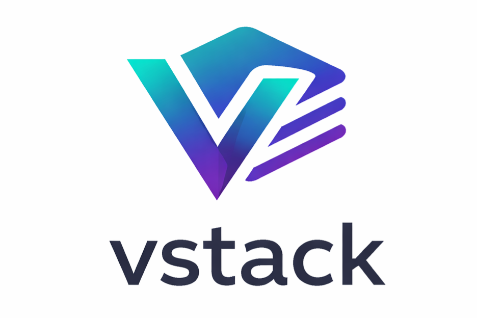

<div align="center">
  <picture>
    <source media="(prefers-color-scheme: dark)" srcset="assets/branding/vstack_dm.png">
    
  </picture>

[](pyproject.toml)
[](https://github.com/eschaar/vstack/actions/workflows/verify.yml)
[](https://github.com/eschaar/vstack/actions/workflows/security.yml)
[](pyproject.toml)
[](LICENSE)

</div>

vstack is a VS Code-native AI engineering workflow system for backend services,
libraries, APIs, and adjacent platform work. It installs structured agents,
skills, instructions, and prompts into `.github/` so GitHub Copilot Agent Mode
has a clear operating model instead of ad hoc chat prompts.

What gets built is determined by the product vision. vstack fixes the delivery
roles and boundaries: `product`, `architect`, `designer`, `engineer`, `tester`,
and `release`.

vstack started as a rethink inspired by [gstack](https://github.com/observiq/gstack),
but was rebuilt around a template-driven, VS Code-first workflow model.

______________________________________________________________________

## Why vstack

- Fixed role model with explicit ownership boundaries
- Template-driven install model from `src/vstack/_templates/`
- Backend-first verification, security, and release discipline
- No runtime dependencies beyond the Python standard library
- Works at project scope or globally in the VS Code user profile

______________________________________________________________________

## Quickstart

Requires **Python 3.11-3.14**.

### Distribution status

vstack is not published to PyPI yet. The current workflow is source-based usage
from this repository.

### 1. Clone and install the development environment

```bash
git clone git@github.com:eschaar/vstack.git
cd vstack
poetry install
```

### 2. Install the artifacts

From the checked-out repository, install artifacts into one repository:

```bash
poetry run vstack install --target /path/to/your/project
```

Or install into your VS Code profile so the artifacts are available across projects:

```bash
poetry run vstack install --global
```

If you prefer, you can also run the package entrypoint after an editable install in
your active environment.

### 3. Open Copilot Agent Mode and invoke a role

```text
@product Review my plan for a payments service
@architect Review the API contracts in src/api/
@tester /security Audit the authentication module
```

No extra VS Code settings are required. Installed role agents are discovered from
workspace `.github/agents/` and from the VS Code user profile.

______________________________________________________________________

## Flow

```mermaid
flowchart LR
		A[Product intent] --> B[@product]
		B --> C[@architect]
		C --> D[@designer]
		D --> E[@engineer]
		E --> F[@tester]
		F --> G[@release]
		B -. focused procedure .-> H[/requirements or vision/]
		F -. focused procedure .-> I[/verify, security, performance/]
```

The exact deliverable can be a microservice, API, package, library, app, or broader
system. The product vision defines scope; vstack defines how the work is carried.

______________________________________________________________________

## Building Blocks

| Artifact type | Purpose                                                    | Typical invocation     |
| ------------- | ---------------------------------------------------------- | ---------------------- |
| Agents        | Main operating interface for role-based work               | `@product`, `@tester`  |
| Skills        | Reusable task procedures                                   | `/verify`, `/security` |
| Instructions  | Baseline policy and repo guardrails                        | auto-loaded by context |
| Prompts       | Reusable prompt artifacts where direct prompting is useful | explicit prompt use    |

Boundary rule:

- Policies belong in instructions.
- Procedures belong in skills.

See [docs/design/instructions.md](docs/design/instructions.md),
[docs/design/skills.md](docs/design/skills.md), and
[docs/architecture/adr/013-instructions-vs-skills-boundary.md](docs/architecture/adr/013-instructions-vs-skills-boundary.md).

______________________________________________________________________

## Roles

| Role      | Invocation   | Primary areas                                           |
| --------- | ------------ | ------------------------------------------------------- |
| product   | `@product`   | vision, requirements, onboarding, docs                  |
| architect | `@architect` | architecture, ADRs                                      |
| designer  | `@designer`  | service design, OpenAPI, DX review                      |
| engineer  | `@engineer`  | implementation, debugging, refactoring, dependency work |
| tester    | `@tester`    | verification, security, incident review, performance    |
| release   | `@release`   | release notes, PR creation, release gating              |

Full skill index: [docs/design/skills.md](docs/design/skills.md)

______________________________________________________________________

## Example Usage

### Idea to release

1. `@product` to lock requirements and success criteria
1. `@architect` to define service boundaries and ADRs
1. `@designer` to define APIs, schemas, and flows
1. `@engineer` to implement
1. `@tester` to verify behavior and risk
1. `@release` to prepare the release path

### Direct skill usage when you want a focused tool

| Goal                | Agent invocation | Optional direct skill |
| ------------------- | ---------------- | --------------------- |
| Requirements        | `@product`       |                       |
| Architecture review | `@architect`     |                       |
| API design          | `@designer`      |                       |
| Code review         | `@engineer`      | `/code-review`        |
| Verification        | `@tester`        | `/verify`             |
| Security audit      | `@tester`        | `/security`           |
| Performance check   | `@tester`        | `/performance`        |

You can also force a skill through an agent when you want the role framing and the
procedure together, for example `@tester /security`.

### Subagent pattern

The product agent can invoke other agents as subagents to orchestrate a complete flow:

```text
@product Deliver a requirements-to-release plan for a new payments service
```

Typical downstream path:

- `@product` -> requirements
- `@architect` -> architecture
- `@designer` -> API contract
- `@engineer` -> implementation
- `@tester` -> verification
- `@release` -> release gating

______________________________________________________________________

## Using vstack in Copilot Agent Mode

### 1. Open Copilot Chat

Use `Ctrl+Shift+I` or `Cmd+Shift+I`, or click the Copilot icon in the sidebar.

### 2. Switch to Agent Mode

In the Copilot Chat panel, switch the mode selector from `Ask` to `Agent`.

### 3. Invoke a role

```text
@product Review my plan for the new payments service
@architect Review the API contracts in src/api/
@tester
@tester Run a security audit
```

Each role agent uses the appropriate skills automatically. You can also ask a role
to use a specific skill:

```text
@tester use the verify skill with regression focus and report findings
@tester run the security skill on the auth module
```

### 4. Available roles and their primary skills

| Role      | Invocation   | Primary skills                                          | Default concise mode |
| --------- | ------------ | ------------------------------------------------------- | -------------------- |
| product   | `@product`   | vision, requirements, onboard, docs                     | compact              |
| architect | `@architect` | architecture, adr                                       | normal               |
| designer  | `@designer`  | design, openapi, consult, docs                          | compact              |
| engineer  | `@engineer`  | code-review, debug, refactor, migrate, dependency, docs | compact              |
| tester    | `@tester`    | verify, inspect, security, incident, dependency, docs   | ultra                |
| release   | `@release`   | release-notes, pr, docs                                 | compact              |

______________________________________________________________________

## Model Guidance

| Use case                 | Recommended model                    |
| ------------------------ | ------------------------------------ |
| `@product`, `@architect` | Claude Sonnet 4.6 or Claude Opus 4.6 |
| `@tester`, `@engineer`   | Claude Sonnet 4.6                    |
| `@release`               | Claude Sonnet 4.6                    |
| Complex debugging        | Claude Opus 4.6 or GPT-5.3 Codex     |
| Quick tasks              | Any model                            |

Claude Sonnet 4.6 is the best balance of speed, quality, and cost for most runs.
Use Claude Opus 4.6 for architecture reviews or complex debugging.

______________________________________________________________________

## Tips

### Give the agent project context

```text
/verify Please first read CONTRIBUTING.md for test commands
```

### Scope the agent's focus

```text
/code-review Review changes in src/api/ only
/security Audit the authentication module in src/auth/
```

### Control response verbosity

Every role agent supports the `concise` skill:

```text
/concise normal    - full explanations
/concise compact   - shorter prose, same technical accuracy
/concise ultra     - maximum brevity
/concise status    - show active mode, session override, and agent default
/concise on        - alias for compact
/concise off       - alias for normal
```

The mode is session-scoped. Security warnings and destructive action prompts always
use `normal` regardless of active mode.

### Typical workflow for a new feature

```text
1. /vision
2. /architecture
3. (implement)
4. /verify
5. /release
```

______________________________________________________________________

## Development

Requires **Poetry** and **Python 3.11-3.14**.

```bash
git clone git@github.com:eschaar/vstack.git
cd vstack
poetry install
```

### Common commands

```bash
make help
make bootstrap
make install
make check
make vstack-install
make ci
poetry run vstack validate
poetry run vstack install
poetry run vstack verify
make test-local
make test
make tox
make tox-all
```

### Multi-version local testing with pyenv

```bash
pyenv install 3.11.14
pyenv install 3.12.12
pyenv install 3.13.12
pyenv install 3.14.3
pyenv local 3.14.3 3.13.12 3.12.12 3.11.14
```

### Editing templates

Source of truth is always under `src/vstack/_templates/`. Do not edit generated
files in `.github/`.

```bash
vim src/vstack/_templates/skills/verify/template.md
vim src/vstack/_templates/agents/engineer/template.md
vim src/vstack/_templates/instructions/python/template.md
poetry run vstack validate
poetry run pytest
poetry run vstack install
```

______________________________________________________________________

## Repository Structure

```text
vstack/
├── src/vstack/                  ← Python package and source of truth
│   ├── artifacts/               ← generic artifact generation and metadata
│   ├── frontmatter/             ← parser, serializer, schema
│   ├── agents/                  ← agent configuration and wrappers
│   ├── skills/                  ← skill configuration and wrappers
│   ├── instructions/            ← instruction configuration and wrappers
│   ├── prompts/                 ← prompt configuration and wrappers
│   ├── cli/                     ← install, verify, uninstall, parser
│   └── _templates/              ← hand-authored templates
├── docs/
│   ├── architecture/            ← architecture docs and ADRs
│   ├── design/                  ← design, workflow, skills, instructions
│   └── product/                 ← vision, requirements, roadmap
├── tests/                       ← unit and integration coverage
├── .github/                     ← generated artifacts and repository automation
├── pyproject.toml               ← packaging and tooling config
└── Makefile                     ← local development tasks
```

______________________________________________________________________

## CI and Release Automation

| Workflow       | Trigger                       | Purpose                                                     |
| -------------- | ----------------------------- | ----------------------------------------------------------- |
| `qa.yml`       | Push to non-main branches     | fast branch feedback for format, lint, typecheck, and tests |
| `commit.yml`   | Push to non-main branches     | commit and branch naming policy enforcement                 |
| `verify.yml`   | Pull request to `main`        | source validation plus install/verify flow checks           |
| `security.yml` | Pull request to `main`        | dependency audit and secret scanning                        |
| `release.yml`  | Merged pull request to `main` | SemVer calculation, tag, release, and distributions         |

Commit policy specifics:

- Type validation is configured via `CCHK_*` variables in `.github/workflows/commit.yml`.
- Commit subject length is limited to 100 characters.
- Branch names use the `type/description` convention.
- Allowed branch types are `feature`, `bugfix`, `hotfix`, `release`, `chore`, `feat`, `fix`, `docs`, `refactor`, `perf`, `test`, `ci`, `build`, `style`, `opt`, `patch`, and `dependabot`.

Recommended branch protection for `main`:

- Require PR before merge.
- Require status checks from `verify.yml` and `security.yml`.
- Disallow force pushes and branch deletion.

______________________________________________________________________

## Troubleshooting

### Agents are not appearing

1. Run `vstack install --global` or `poetry run vstack install --global`
1. Confirm the templates exist under `src/vstack/_templates/agents/`
1. Reload VS Code with `Developer: Reload Window`

### Agent is not running commands

Make sure Copilot is in Agent Mode, not Ask or Edit mode.

### Best-practice local workflow

1. Run `make bootstrap` once per machine or clone.
1. Run `make check` before every commit.
1. Run `make ci` when you want to mirror the main quality gate locally.

### Search results are noisy

Use workspace-local exclusions in VS Code:

```json
{
	"search.exclude": {
		"**/.venv": true,
		"**/venv": true,
		"**/env": true,
		"**/node_modules": true,
		"**/__pycache__": true,
		"**/dist": true,
		"**/build": true,
		"**/.git": true
	},
	"files.watcherExclude": {
		"**/.venv/**": true,
		"**/venv/**": true,
		"**/env/**": true,
		"**/node_modules/**": true,
		"**/__pycache__/**": true,
		"**/dist/**": true,
		"**/build/**": true,
		"**/.git/**": true
	}
}
```

______________________________________________________________________

## Further Reading

- [docs/architecture/architecture.md](docs/architecture/architecture.md)
- [docs/design/design.md](docs/design/design.md)
- [docs/design/workflow.md](docs/design/workflow.md)
- [docs/design/skills.md](docs/design/skills.md)
- [docs/product/roadmap.md](docs/product/roadmap.md)
- [CONTRIBUTING.md](CONTRIBUTING.md)

______________________________________________________________________

## License

MIT. See [LICENSE](LICENSE).
