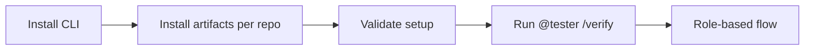
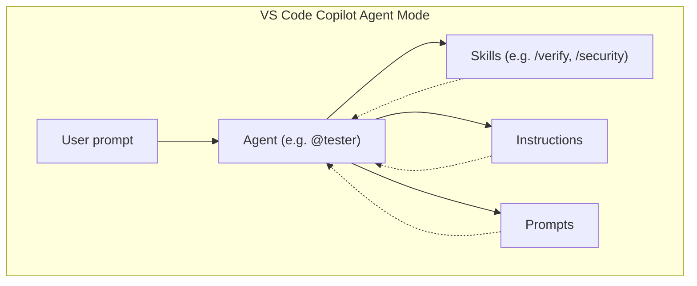
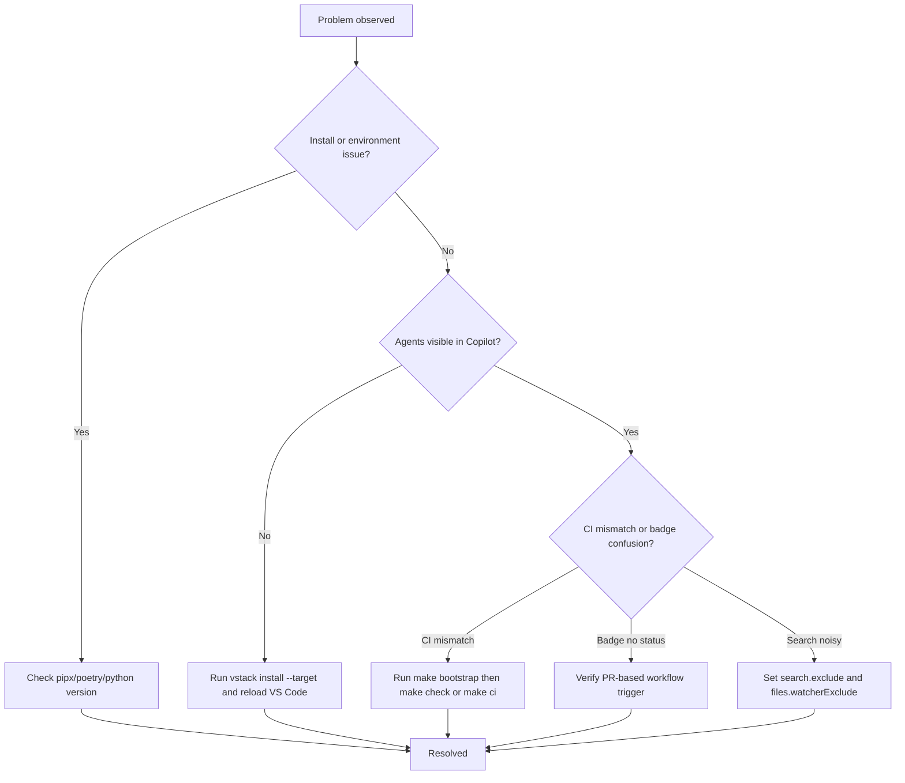
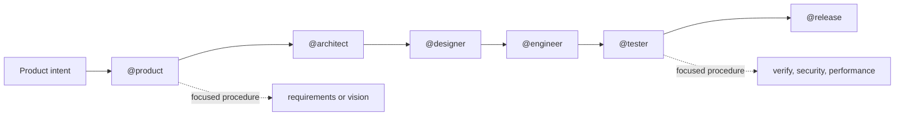

<div align="center">
  <picture>
    <source media="(prefers-color-scheme: dark)" srcset="assets/branding/vstack_dm.png">
    
  </picture>

[](https://pypi.org/project/vstack/)
[](pyproject.toml)
[](https://github.com/eschaar/vstack/actions/workflows/verify.yml)
[](https://github.com/eschaar/vstack/actions/workflows/security.yml)
[](pyproject.toml)
[](LICENSE)
[](https://github.com/eschaar/vstack/discussions)

</div>

> **The VS Code-native AI workflow system for backend engineering.**

vstack is a VS Code-native AI engineering workflow system for backend services,
libraries, APIs, and adjacent platform work. It installs structured agents,
skills, instructions, and prompts into `.github/` so GitHub Copilot Agent Mode
has a clear operating model instead of ad hoc chat prompts.

What gets built is determined by the product vision. vstack fixes the delivery
roles and boundaries: `product`, `architect`, `designer`, `engineer`, `tester`,
and `release`.

vstack started as a rethink inspired by [gstack](https://github.com/observiq/gstack),
but was rebuilt around a template-driven, VS Code-first workflow model.

______________________________________________________________________

## ❔ Why vstack

- Fixed role model with explicit ownership boundaries
- Template-driven install model from `src/vstack/_templates/`
- Backend-first verification, security, and release discipline
- No runtime dependencies beyond the Python standard library
- Works at project scope or globally in the VS Code user profile

______________________________________________________________________

## 🧭 Quick navigation

For new users:

- Quickstart
- Quick check
- Using vstack in Copilot Agent Mode
- Try it now
- Troubleshooting

For experienced users:

- Role summary
- Example usage
- All vstack CLI commands
- Workflow
- Development
- CI and Release Automation

### ⚡ Quick paths

#### New user path (2 minutes)

```bash
pipx install vstack
vstack install --target /path/to/your/project
vstack validate
```

Then in Copilot Agent Mode:

```text
@tester /verify Check this repository and summarize findings
```

#### Power user path (30 seconds)

```bash
vstack install --target /path/to/your/project && vstack verify --target /path/to/your/project
```

Then jump straight into your role workflow:

```text
@architect Review contracts in src/api/
@engineer /code-review
@tester /security
```



______________________________________________________________________

## 🚀 Quickstart

> New here? Start with `pipx install ...`, then run `vstack install --target ...`, then try `@tester /verify` in Copilot Agent Mode.

### ⚡ Install with pipx (recommended)

`pipx` installs vstack in its own isolated environment so it never conflicts with
your project dependencies. The `vstack` command is then available globally across
all projects, regardless of which virtual environment is active.

```bash
pipx install vstack
```

Afterwards, the `vstack` command is available everywhere:

```bash
# Recommended: install vstack artifacts per project/repository
vstack install --target /path/to/your/project

# Optional: install profile-wide defaults for all VS Code projects
vstack install --global
```

### 🐙 Alternative: install directly from GitHub

To install the latest unreleased version directly from the repository without cloning:

```bash
pipx install git+https://github.com/eschaar/vstack.git
```

Or a specific branch or tag:

```bash
pipx install git+https://github.com/eschaar/vstack.git@main
pipx install git+https://github.com/eschaar/vstack.git@1.3.0
```

### 🐙 Alternative: manual clone and install

```bash
git clone git@github.com:eschaar/vstack.git
cd vstack
poetry install
poetry run vstack install --target /path/to/your/project
```

### 🤝 Team setup (recommended for teams)

Use repository-scoped installation so every contributor and CI run uses the same agent setup.

1. Install artifacts into the repository.
1. Commit the generated `.github/` artifacts.
1. Require `verify.yml` and `security.yml` checks before merge.

```bash
# From your repository root
vstack install --target /path/to/your/project
git add .github
git commit -m "chore: install vstack artifacts"
```

Expected outcome:

- Teammates get the same agents and skills after `git pull`.
- CI validates the same repository-level setup.

## 🚦 Quick check: Is vstack working?

After install, run:

```bash
vstack --version
vstack validate
```

If you see the version and no errors, your install is working.

Expected output (example):

```text
vstack 1.3.0
Validation passed: no unresolved template tokens
```

### First use example

Open Copilot Agent Mode and run:

```text
@tester /verify Check this repository and summarize findings
```

You should receive a concise verification summary for your current workspace.

### 💬 Using vstack in Copilot Agent Mode

For new users (first 5 minutes):

- Follow the 3-step flow below exactly once.
- Start with `@tester /verify` to confirm the setup works.

For experienced users:

- Use direct role invocation (`@product`, `@architect`, `@engineer`, etc.) for context-rich execution.
- Use direct skills (`/verify`, `/security`, `/code-review`) for focused, faster runs.

1. **Open Copilot Chat**
   - Use `Ctrl+Shift+I` (Windows/Linux) or `Cmd+Shift+I` (Mac), or click the Copilot icon in the sidebar.
1. **Switch to Agent Mode**
   - In the Copilot Chat panel, change the mode selector from `Ask` to `Agent`.
1. **Invoke a role agent**
   - Type e.g.:
     ```text
     @product Review my plan for a payments service
     @architect Review the API contracts in src/api/
     @tester /security Audit the authentication module
     ```
   - The `@role` prefix selects the corresponding agent. You can add a skill command (e.g. `/security`) after the agent for a focused procedure.

**How it works:**

- When you use `@role` (e.g. `@tester`), the agent loads all relevant skills and instructions for that role. Skills are discovered automatically and routed by the agent based on your request.
- If you use only a skill (e.g. `/verify`), a prompt, or an instruction (without an explicit agent), VS Code Copilot Agent Mode will use the default agent for the context (typically `@tester` for verification-related skills, or the most relevant role based on your workspace and prompt). This means you can use `/verify`, `/security`, or other skills directly, and they will work even without specifying an agent.
- Agents are not invoked automatically; you must use the `@role` prefix to select a specific agent and role context. Skills, prompts, and instructions are always auto-discovered and available in the background.
- For maximum control and clarity, always specify the agent (`@role`) when you want a particular role's framing, default behavior, or skill routing.

______________________________________________________________________

#### 🧩 Visual: How agents, skills, instructions, and prompts interact



**Legend:**

- **Agents** (`@role`): Main entrypoint, routes and coordinates work.
- **Skills** (`/skill`): Reusable procedures, invoked by agents or directly.
- **Instructions**: Baseline policies, always loaded by agents.
- **Prompts**: Reusable prompt artifacts, used as needed.

______________________________________________________________________

## 🧪 Try it now

Open Copilot Agent Mode and enter:

```text
@tester /verify Check this repo
```

You should see a verification summary for your current project.

______________________________________________________________________

## 🧑‍💻 Role summary

| Role      | Emoji | Invocation   | Primary areas                                           | Example invocation                    |
| --------- | ----- | ------------ | ------------------------------------------------------- | ------------------------------------- |
| Product   | 🧑‍💼    | `@product`   | Vision, requirements, onboarding, docs                  | `@product Review my plan`             |
| Architect | 🏗️    | `@architect` | Architecture, ADRs                                      | `@architect Review the API contracts` |
| Designer  | 🎨    | `@designer`  | Service design, OpenAPI, DX review                      | `@designer Review the OpenAPI spec`   |
| Engineer  | 🛠️    | `@engineer`  | Implementation, debugging, refactoring, dependency work | `@engineer /code-review`              |
| Tester    | 🧪    | `@tester`    | Verification, security, incident review, performance    | `@tester /verify`                     |
| Release   | 🚀    | `@release`   | Release notes, PR creation, release gating              | `@release Prepare release notes`      |

### Role-to-skill mapping

| Role      | Invocation   | Primary skills                                          | Default concise mode |
| --------- | ------------ | ------------------------------------------------------- | -------------------- |
| product   | `@product`   | vision, requirements, onboard, docs                     | compact              |
| architect | `@architect` | architecture, adr                                       | normal               |
| designer  | `@designer`  | design, openapi, consult, docs                          | compact              |
| engineer  | `@engineer`  | code-review, debug, refactor, migrate, dependency, docs | compact              |
| tester    | `@tester`    | verify, inspect, security, incident, dependency, docs   | ultra                |
| release   | `@release`   | release-notes, pr, docs                                 | compact              |

______________________________________________________________________

> ℹ️ **Tip:** Use the `@role` prefix for full context and best results. Skills like `/verify` also work directly, but explicit roles give you more control.

______________________________________________________________________

> 💡 **Pro tip:** Try combining agents and skills for focused tasks, e.g. `@tester /security` or `@engineer /code-review`.

______________________________________________________________________

## 📝 Example usage

### Idea to release

1. `@product` to lock requirements and success criteria.
1. `@architect` to define service boundaries and ADRs.
1. `@designer` to define APIs, schemas, and flows.
1. `@engineer` to implement.
1. `@tester` to verify behavior and risk.
1. `@release` to prepare release artifacts and PR flow.

### Direct skill usage

| Goal                | Agent invocation | Optional direct skill |
| ------------------- | ---------------- | --------------------- |
| Requirements        | `@product`       |                       |
| Architecture review | `@architect`     |                       |
| API design          | `@designer`      |                       |
| Code review         | `@engineer`      | `/code-review`        |
| Verification        | `@tester`        | `/verify`             |
| Security audit      | `@tester`        | `/security`           |
| Performance check   | `@tester`        | `/performance`        |

### Subagent orchestration pattern

```text
@product Deliver a requirements-to-release plan for a new payments service
```

Typical downstream path: `@product` -> `@architect` -> `@designer` -> `@engineer` -> `@tester` -> `@release`.

______________________________________________________________________

## ❓ FAQ

**Q: Why don't I see agents in Copilot?**
A: In a specific repository, run `vstack install --target /path/to/your/project` (or run `vstack install` from the repo root), then reload VS Code. Use `--global` only when you want profile-wide defaults.

**Q: Which Python version do I need?**
A: Python 3.11–3.14 (see badges above).

**Q: How do I reset the install?**
A: For one repository, run `vstack uninstall --target /path/to/your/project` and then reinstall with `vstack install --target /path/to/your/project`. Use `--global` only for profile-wide defaults.

**Q: Where can I ask questions or give feedback?**
A: [Start a discussion or ask a question here.](https://github.com/eschaar/vstack/discussions)

______________________________________________________________________

## 🧹 Uninstall / Reset

To remove vstack artifacts from your project or profile, use the CLI:

```bash
# Uninstall vstack artifacts from your current project
vstack uninstall --target /path/to/your/project

# Uninstall vstack artifacts from your global VS Code profile
vstack uninstall --global
```

To remove vstack itself (the CLI):

```bash
# If installed with pipx
pipx uninstall vstack

# If installed with pip in an active environment
pip uninstall vstack

# If installed from a local clone for development
rm -rf .venv
```

You can also manually remove any leftover `.github/agents`, `.github/skills`, etc. if needed.

## ⚡ Essential CLI commands

```bash
vstack --version           # Show vstack version
vstack validate            # Validate current vstack install
vstack install --target .  # Install vstack artifacts into current project
vstack install --global    # Install vstack artifacts globally
vstack uninstall --target . # Uninstall vstack artifacts from current project
vstack uninstall --global  # Uninstall vstack artifacts globally
```

______________________________________________________________________

## 📖 All vstack CLI commands

| Command                         | Description                                          |
| ------------------------------- | ---------------------------------------------------- |
| `vstack --version`              | Show vstack version                                  |
| `vstack validate`               | Validate vstack install and check for issues         |
| `vstack verify`                 | Verify source templates and/or installed output      |
| `vstack verify --target DIR`    | Verify installed artifacts in DIR/.github            |
| `vstack verify --global`        | Verify artifacts in your VS Code global profile      |
| `vstack install --target DIR`   | Install vstack artifacts into a project              |
| `vstack install --global`       | Install vstack artifacts into your VS Code profile   |
| `vstack install --dry-run`      | Preview install actions without writing files        |
| `vstack uninstall --target DIR` | Uninstall vstack artifacts from a project            |
| `vstack uninstall --global`     | Uninstall vstack artifacts from your VS Code profile |
| `vstack uninstall`              | Uninstall from the current directory default target  |

______________________________________________________________________

## 🤝 How to contribute

Contributions are welcome! Please see [CONTRIBUTING.md](CONTRIBUTING.md) for guidelines, code style, and how to get started.

______________________________________________________________________

## 🛠️ Troubleshooting

Quick index:
[Installation and environment](#installation-and-environment) · [Copilot Agent Mode](#copilot-agent-mode) · [CI parity and badges](#ci-parity-and-badges) · [VS Code search noise](#vs-code-search-noise)



### Installation and environment

- Issue: `pipx: command not found`
  Action: Install pipx with `pip install --user pipx`.
- Issue: `poetry: command not found`
  Action: Follow the Poetry install guide at [https://python-poetry.org/docs/#installation](https://python-poetry.org/docs/#installation).
- Issue: `Python version not supported`
  Action: Use Python 3.11-3.14.
- Issue: `Permission denied` during install or uninstall
  Action: Check directory permissions and rerun with appropriate privileges.
- Issue: `Could not detect VS Code user data directory`
  Action: Run `vstack install --global` to install into the VS Code user profile, or run `vstack install --target /path/to/your/project` to install into a specific project instead.

### Copilot Agent Mode

- Issue: Agents do not appear in one repository
  Action: Run `vstack install --target /path/to/your/project` (or run `vstack install` from that repository root), then reload VS Code.
- Issue: Agents appear in one repository but not another
  Action: Install per repository with `vstack install --target ...` in each repo, or use `vstack install --global` for profile-wide defaults.
- Issue: Agents still do not appear
  Action: Confirm templates exist under `src/vstack/_templates/agents/`, then run `Developer: Reload Window` in VS Code.
- Issue: Agent does not execute actions
  Action: Make sure Copilot is in Agent Mode, not Ask or Edit mode.

### CI parity and badges

- Issue: Checks pass in CI but fail locally
  Action: Run `make bootstrap` once per clone, then run `make check`.
- Issue: Need to mirror the CI quality gate locally
  Action: Run `make ci`.
- Issue: Verify or Security badge shows no status
  Action: These workflows are PR-based, so main may not always show a latest status.

### VS Code search noise

- Issue: Search results are noisy
  Action: Exclude `.venv`, `venv`, `env`, `node_modules`, `__pycache__`, `dist`, `build`, and `.git`.
- Issue: Search still feels slow or cluttered
  Action: Configure both `search.exclude` and `files.watcherExclude` in VS Code settings.

______________________________________________________________________

## 🔄 Workflow



The exact deliverable can be a microservice, API, package, library, app, or broader
system. The product vision defines scope; vstack defines how the work is carried.

______________________________________________________________________

## 🧱 Building Blocks

| Artifact type | Purpose                                                    | Typical invocation     |
| ------------- | ---------------------------------------------------------- | ---------------------- |
| Agents        | Main operating interface for role-based work               | `@product`, `@tester`  |
| Skills        | Reusable task procedures                                   | `/verify`, `/security` |
| Instructions  | Baseline policy and repository guardrails                  | auto-loaded by context |
| Prompts       | Reusable prompt artifacts where direct prompting is useful | explicit prompt use    |

Boundary rule:

- Policies belong in instructions.
- Procedures belong in skills.

See [docs/design/instructions.md](docs/design/instructions.md),
[docs/design/skills.md](docs/design/skills.md), and
[docs/architecture/adr/013-instructions-vs-skills-boundary.md](docs/architecture/adr/013-instructions-vs-skills-boundary.md).

______________________________________________________________________

## 🧠 Model Guidance

| Use case                 | Recommended model floor (or higher)                  |
| ------------------------ | ---------------------------------------------------- |
| `@product`, `@architect` | Claude Sonnet 4.6+, GPT-5.3-Codex+, Claude Opus 4.6+ |
| `@tester`, `@engineer`   | Claude Sonnet 4.6+ or GPT-5.3-Codex+                 |
| `@release`               | Claude Sonnet 4.6+                                   |
| Complex debugging        | GPT-5.3-Codex+ or Claude Opus 4.6+                   |
| Quick tasks              | Any model with tool and agent-mode support           |

Why these version floors:

- Reliable tool use and structured instruction following in Agent Mode.
- Better multi-step planning and stronger handling of long procedural prompts.
- Better compatibility with subagent-style orchestration and role handoffs.
- More stable output quality for repository-scale reviews and verification loops.

Practical cost guidance:

- Use Claude Sonnet 4.6+ as the default for most runs (best speed/cost balance).
- Use GPT-5.3-Codex+ for deep code reasoning, debugging, and implementation-heavy tasks.
- Use Claude Opus 4.6+ selectively for high-ambiguity architecture tradeoffs where the extra cost is justified.

______________________________________________________________________

## 💡 Practical Tips

### Give the agent project context

```text
/verify Please first read CONTRIBUTING.md for test commands
```

### Scope the agent's focus

```text
/code-review Review changes in src/api/ only
/security Audit the authentication module in src/auth/
```

### Control response verbosity

Every role agent supports the `concise` skill:

```text
/concise normal    - full explanations
/concise compact   - shorter prose, same technical accuracy
/concise ultra     - maximum brevity
/concise status    - show active mode, session override, and agent default
/concise on        - alias for compact
/concise off       - alias for normal
```

The mode is session-scoped. Security warnings and destructive action prompts always
use `normal` regardless of active mode.

### Typical workflow for a new feature

```text
1. /vision
2. /architecture
3. (implement)
4. /verify
5. /release
```

______________________________________________________________________

More info: [docs/product/roadmap.md](docs/product/roadmap.md), [docs/architecture/architecture.md](docs/architecture/architecture.md)

______________________________________________________________________

## 🛠️ Development

Requires **Poetry** and **Python 3.11-3.14**.

```bash
git clone git@github.com:eschaar/vstack.git
cd vstack
poetry install
```

### Common commands

```bash
make help
make bootstrap
make install
make check
make vstack-install
make ci
poetry run vstack validate
poetry run vstack install
poetry run vstack verify
make test-local
make test
make tox
make tox-all
```

### Multi-version local testing with pyenv

```bash
pyenv install 3.11.14
pyenv install 3.12.12
pyenv install 3.13.12
pyenv install 3.14.3
pyenv local 3.14.3 3.13.12 3.12.12 3.11.14
```

### Editing templates

Source of truth is always under `src/vstack/_templates/`. Do not edit generated
files in `.github/`.

```bash
vim src/vstack/_templates/skills/verify/template.md
vim src/vstack/_templates/agents/engineer/template.md
vim src/vstack/_templates/instructions/python/template.md
poetry run vstack validate
poetry run pytest
poetry run vstack install
```

______________________________________________________________________

## 🗂️ Repository Structure

```text
vstack/
├── src/vstack/                  ← Python package and source of truth
│   ├── artifacts/               ← generic artifact generation and metadata
│   ├── frontmatter/             ← parser, serializer, schema
│   ├── agents/                  ← agent configuration and wrappers
│   ├── skills/                  ← skill configuration and wrappers
│   ├── instructions/            ← instruction configuration and wrappers
│   ├── prompts/                 ← prompt configuration and wrappers
│   ├── cli/                     ← install, verify, uninstall, parser
│   └── _templates/              ← hand-authored templates
├── docs/
│   ├── architecture/            ← architecture docs and ADRs
│   ├── design/                  ← design, workflow, skills, instructions
│   └── product/                 ← vision, requirements, roadmap
├── tests/                       ← unit and integration coverage
├── .github/                     ← generated artifacts and repository automation
├── pyproject.toml               ← packaging and tooling config
└── Makefile                     ← local development tasks
```

______________________________________________________________________

## 🚦 CI and Release Automation

| Workflow       | Trigger                       | Purpose                                                     |
| -------------- | ----------------------------- | ----------------------------------------------------------- |
| `qa.yml`       | Push to non-main branches     | fast branch feedback for format, lint, typecheck, and tests |
| `commit.yml`   | Push to non-main branches     | commit and branch naming policy enforcement                 |
| `verify.yml`   | Pull request to `main`        | source validation plus install/verify flow checks           |
| `security.yml` | Pull request to `main`        | dependency audit and secret scanning                        |
| `release.yml`  | Merged pull request to `main` | SemVer calculation, tag, release, and distributions         |

Commit policy specifics:

- Type validation is configured via `CCHK_*` variables in `.github/workflows/commit.yml`.
- Commit subject length is limited to 100 characters.
- Branch names use the `type/description` convention.
- Allowed branch types are `feature`, `bugfix`, `hotfix`, `release`, `chore`, `feat`, `fix`, `docs`, `refactor`, `perf`, `test`, `ci`, `build`, `style`, `opt`, `patch`, and `dependabot`.

Recommended branch protection for `main`:

- Require PR before merge.
- Require status checks from `verify.yml` and `security.yml`.
- Disallow force pushes and branch deletion.

______________________________________________________________________

## 📚 Further Reading

- [docs/architecture/architecture.md](docs/architecture/architecture.md)
- [docs/design/design.md](docs/design/design.md)
- [docs/design/workflow.md](docs/design/workflow.md)
- [docs/design/skills.md](docs/design/skills.md)
- [docs/product/roadmap.md](docs/product/roadmap.md)
- [CONTRIBUTING.md](CONTRIBUTING.md)

______________________________________________________________________

## 📄 License

MIT. See [LICENSE](LICENSE).
