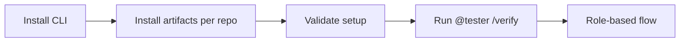
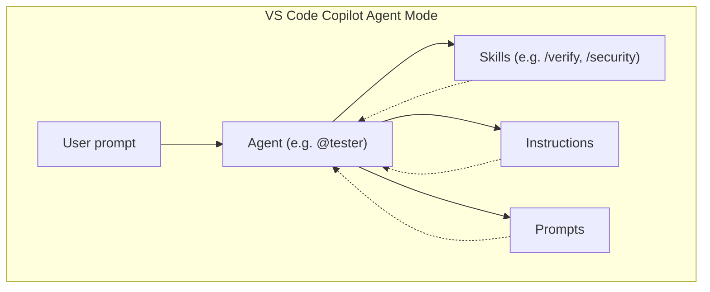
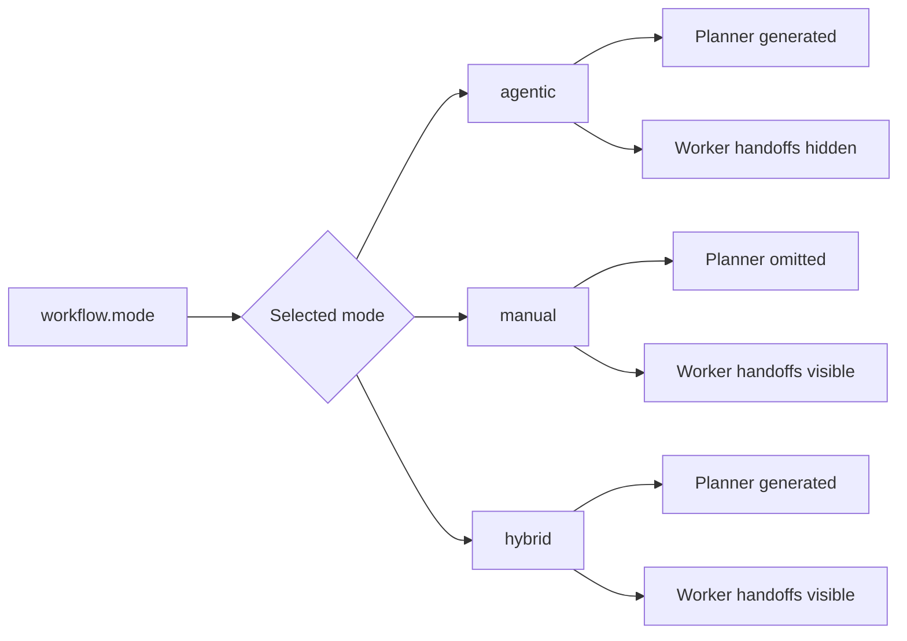
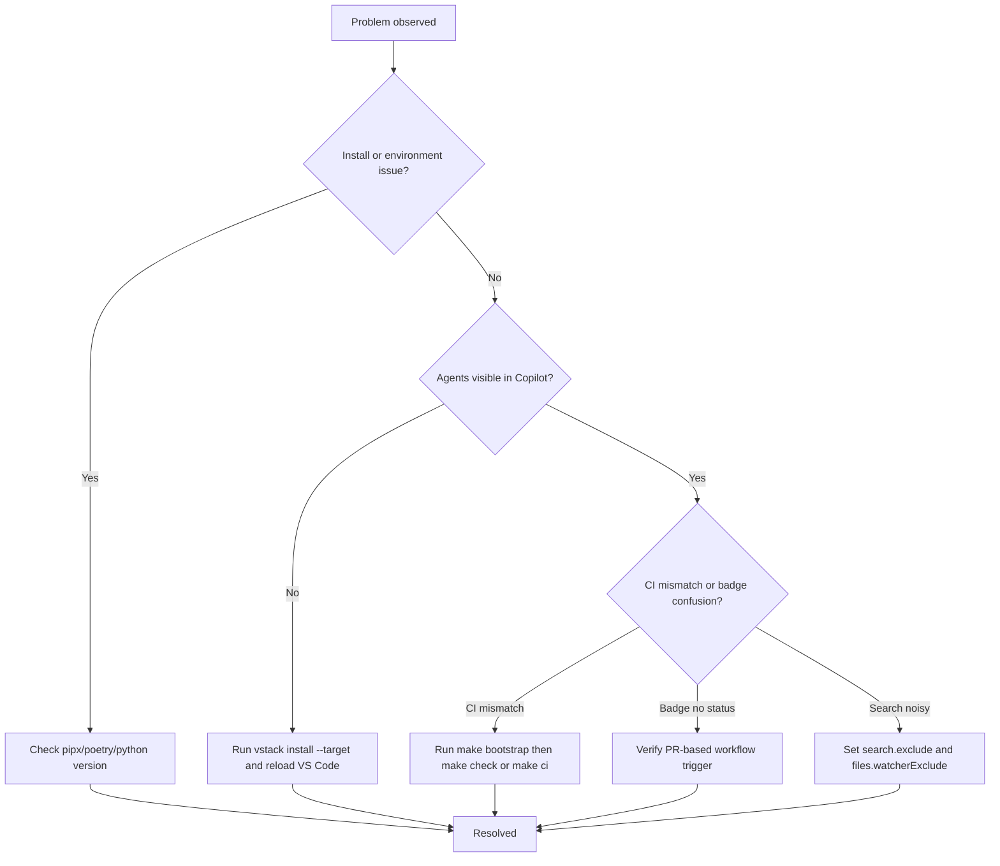
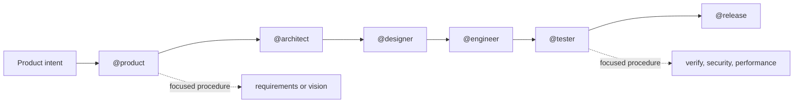

<div align="center">
  <picture>
    <source media="(prefers-color-scheme: dark)" srcset="assets/branding/vstack_dm.png">
    
  </picture>

[](https://pypi.org/project/vstack/)
[](pyproject.toml)
[](https://github.com/eschaar/vstack/actions/workflows/verify.yml)
[](https://github.com/eschaar/vstack/actions/workflows/security.yml)
[](pyproject.toml)
[](LICENSE)
[](https://github.com/eschaar/vstack/discussions)

</div>

> **The VS Code-native AI workflow system for backend engineering.**

vstack is a VS Code-native AI engineering workflow system for backend services,
libraries, APIs, and adjacent platform work. It installs structured agents,
skills, instructions, and prompts into `.github/` so GitHub Copilot Agent Mode
has a clear operating model instead of ad hoc chat prompts.

What gets built is determined by the product vision. vstack fixes the delivery
roles and boundaries: `product`, `architect`, `designer`, `engineer`, `tester`,
and `release`, coordinated by `planner`.

vstack started as a rethink inspired by [gstack](https://github.com/garrytan/gstack),
but was rebuilt around a template-driven, VS Code-first workflow model.

______________________________________________________________________

## ❔ Why vstack

- Fixed role model with explicit ownership boundaries
- Template-driven install model from `src/vstack/_templates/`
- Backend-first verification, security, and release discipline
- One runtime dependency: [PyYAML](https://pypi.org/project/PyYAML/)
- Works at project scope or globally in the VS Code user profile

______________________________________________________________________

## 🧭 Quick navigation

For new users:

- Quickstart
- Quick check
- Using vstack in Copilot Agent Mode
- Try it now
- Troubleshooting

For experienced users:

- Role summary
- Example usage
- All vstack CLI commands
- Install and upgrade guide
- Workflow
- Development
- CI and Release Automation

### ⚡ Quick paths

#### Quickstart — fresh install (2 minutes)

```bash
# 1. Install the CLI once, globally
pipx install vstack

# 2. Move to your repository root — all commands default to the current directory
cd /path/to/your/project
vstack install    # seeds .vstack/config.yaml and generates .github/ here

# 3. Confirm everything is in order
vstack validate
```

When you omit `--target`, vstack uses the current working directory.
The explicit form `vstack install --target /path/to/your/project` is equivalent
and useful when running from a different directory.

Then open Copilot Agent Mode and run:

```text
@tester /verify Check this repository and summarize findings
```

#### Quick upgrade — patch or minor version (same major)

Docs paths never change within a major version. Only `.github/` artifacts are updated.

```bash
# 1. Upgrade the CLI
pipx upgrade vstack

# 2. From your repository root — regenerate .github/ artifacts
cd /path/to/your/project
vstack init
```

#### Quick upgrade — major version (e.g. v2 → v3)

Docs paths may change on a major version bump. Run `vstack migrate` before `vstack init`.

```bash
# 1. Upgrade the CLI
pipx upgrade vstack

# 2. From your repository root
cd /path/to/your/project

# 3. Move any docs files that changed path (reads installed version from .vstack/vstack.json)
vstack migrate

# 4. Regenerate .github/ artifacts
vstack init

# 5. If the manifest schema is outdated (you will see an error message telling you to do this)
vstack manifest upgrade
```

Preview the docs moves without touching any files:

```bash
vstack migrate --dry-run
```



______________________________________________________________________

## 🚀 Quickstart

> New here? Run `pipx install vstack`, move to your repository root, run `vstack install`, then try `@tester /verify` in Copilot Agent Mode.

### ⚡ Install with pipx (recommended)

`pipx` installs vstack in its own isolated environment so it never conflicts with
your project dependencies. The `vstack` command is then available globally across
all projects, regardless of which virtual environment is active.

```bash
pipx install vstack
```

Afterwards, the `vstack` command is available everywhere:

```bash
# Recommended: move to your repository root and install there
cd /path/to/your/project
vstack install          # generates .github/ in the current directory

# Or specify a path explicitly when running from a different directory
vstack install --target /path/to/your/project

# Optional: install profile-wide defaults for all VS Code projects
vstack install --global
```

### 🐙 Alternative: install directly from GitHub

To install the latest unreleased version directly from the repository without cloning:

```bash
pipx install git+https://github.com/eschaar/vstack.git
```

Or a specific branch or tag:

```bash
pipx install git+https://github.com/eschaar/vstack.git@main
pipx install git+https://github.com/eschaar/vstack.git@1.3.0
```

### 🐙 Alternative: manual clone and install

```bash
git clone git@github.com:eschaar/vstack.git
cd vstack
poetry install
poetry run vstack install --target /path/to/your/project
```

### 🤝 Team setup (recommended for teams)

Use repository-scoped installation so every contributor and CI run uses the same agent setup.

1. Install artifacts into the repository.
1. Commit the generated `.github/` artifacts.
1. Require `commit.yml`, `check.yml`, `verify.yml`, and `security.yml` checks before merge.

```bash
cd /path/to/your/project
vstack install
git add .github
git commit -m "chore: install vstack artifacts"
```

Expected outcome:

- Teammates get the same agents and skills after `git pull`.
- CI validates the same repository-level setup.

## 🚦 Quick check: Is vstack working?

After install, run:

```bash
vstack --version
vstack validate
```

If you see the version and no errors, your install is working.

Expected output (example):

```text
vstack X.Y.Z
Validation passed: no unresolved template tokens
```

### First use example

Open Copilot Agent Mode and run:

```text
@tester /verify Check this repository and summarize findings
```

You should receive a concise verification summary for your current workspace.

### 💬 Using vstack in Copilot Agent Mode

For new users (first 5 minutes):

- Follow the 3-step flow below exactly once.
- Start with `@tester /verify` to confirm the setup works.

For experienced users:

- Use direct role invocation (`@product`, `@architect`, `@engineer`, etc.) for context-rich execution.
- Use direct skills (`/verify`, `/security`, `/code-review`) for focused, faster runs.

1. **Open Copilot Chat**
   - Use `Ctrl+Shift+I` (Windows/Linux) or `Cmd+Shift+I` (Mac), or click the Copilot icon in the sidebar.
1. **Switch to Agent Mode**
   - In the Copilot Chat panel, change the mode selector from `Ask` to `Agent`.
1. **Invoke a role agent**
   - Type e.g.:
     ```text
     @product Review my plan for a payments service
     @architect Review the API contracts in src/api/
     @tester /security Audit the authentication module
     ```
   - The `@role` prefix selects the corresponding agent. You can add a skill command (e.g. `/security`) after the agent for a focused procedure.

**How it works:**

- When you use `@role` (e.g. `@tester`), the agent loads all relevant skills and instructions for that role. Skills are discovered automatically and routed by the agent based on your request.
- If you use only a skill (e.g. `/verify`), a prompt, or an instruction (without an explicit agent), VS Code Copilot Agent Mode will use the default agent for the context (typically `@tester` for verification-related skills, or the most relevant role based on your workspace and prompt). This means you can use `/verify`, `/security`, or other skills directly, and they will work even without specifying an agent.
- Agents are not invoked automatically; you must use the `@role` prefix to select a specific agent and role context. Skills, prompts, and instructions are always auto-discovered and available in the background.
- For maximum control and clarity, always specify the agent (`@role`) when you want a particular role's framing, default behavior, or skill routing.

______________________________________________________________________

#### 🧩 Visual: How agents, skills, instructions, and prompts interact



**Legend:**

- **Agents** (`@role`): Main entrypoint, routes and coordinates work.
- **Skills** (`/skill`): Reusable procedures, invoked by agents or directly.
- **Instructions**: Baseline policies, always loaded by agents.
- **Prompts**: Reusable prompt artifacts, used as needed.

______________________________________________________________________

## 🧪 Try it now

Open Copilot Agent Mode and enter:

```text
@tester /verify Check this repo
```

You should see a verification summary for your current project.

______________________________________________________________________

## 🧑‍💻 Role summary

| Role      | Emoji | Invocation   | Primary areas                                           | Example invocation                    |
| --------- | ----- | ------------ | ------------------------------------------------------- | ------------------------------------- |
| Product   | 🧑‍💼    | `@product`   | Vision, requirements, onboarding, docs                  | `@product Review my plan`             |
| Architect | 🏗️    | `@architect` | Architecture, ADRs                                      | `@architect Review the API contracts` |
| Designer  | 🎨    | `@designer`  | Service design, OpenAPI, DX review                      | `@designer Review the OpenAPI spec`   |
| Engineer  | 🛠️    | `@engineer`  | Implementation, debugging, refactoring, dependency work | `@engineer /code-review`              |
| Tester    | 🧪    | `@tester`    | Verification, security, incident review, performance    | `@tester /verify`                     |
| Release   | 🚀    | `@release`   | Release notes, PR creation, release gating              | `@release Prepare release notes`      |

### Role-to-skill mapping

| Role      | Invocation   | Primary skills                                          | Default concise mode |
| --------- | ------------ | ------------------------------------------------------- | -------------------- |
| product   | `@product`   | vision, requirements, onboard, docs                     | compact              |
| architect | `@architect` | architecture, adr                                       | normal               |
| designer  | `@designer`  | design, openapi, consult, docs                          | compact              |
| engineer  | `@engineer`  | code-review, debug, refactor, migrate, dependency, docs | compact              |
| tester    | `@tester`    | verify, inspect, security, incident, dependency, docs   | ultra                |
| release   | `@release`   | release-notes, pr, docs                                 | compact              |

______________________________________________________________________

> ℹ️ **Tip:** Use the `@role` prefix for full context and best results. Skills like `/verify` also work directly, but explicit roles give you more control.

______________________________________________________________________

> 💡 **Pro tip:** Try combining agents and skills for focused tasks, e.g. `@tester /security` or `@engineer /code-review`.

______________________________________________________________________

## 📝 Example usage

### Idea to release

1. `@product` to lock requirements and success criteria.
1. `@architect` to define service boundaries and ADRs.
1. `@designer` to define APIs, schemas, and flows.
1. `@engineer` to implement.
1. `@tester` to verify behavior and risk.
1. `@release` to prepare release artifacts and PR flow.

### Direct skill usage

| Goal                | Agent invocation | Optional direct skill |
| ------------------- | ---------------- | --------------------- |
| Requirements        | `@product`       |                       |
| Architecture review | `@architect`     |                       |
| API design          | `@designer`      |                       |
| Code review         | `@engineer`      | `/code-review`        |
| Verification        | `@tester`        | `/verify`             |
| Security audit      | `@tester`        | `/security`           |
| Performance check   | `@tester`        | `/performance`        |

### Subagent orchestration pattern

```text
@product Deliver a requirements-to-release plan for a new payments service
```

Typical downstream path: `@product` -> `@architect` -> `@designer` -> `@engineer` -> `@tester` -> `@release`.

______________________________________________________________________

## ❓ FAQ

**Q: Why don't I see agents in Copilot?**
A: In a specific repository, run `vstack install --target /path/to/your/project` (or run `vstack install` from the repo root), then reload VS Code. Use `--global` only when you want profile-wide defaults.

**Q: Which Python version do I need?**
A: Python 3.11–3.14 (see badges above).

**Q: How do I reset the install?**
A: Move to your repository root and run `vstack uninstall`, then `vstack install`. You can also use `vstack uninstall --target /path/to/your/project` from any directory. Use `--global` only for profile-wide defaults.

**Q: Where can I ask questions or give feedback?**
A: [Start a discussion or ask a question here.](https://github.com/eschaar/vstack/discussions)

______________________________________________________________________

## 🧹 Uninstall / Reset

To remove vstack artifacts from your project or profile, use the CLI:

```bash
# Move to your repository root and uninstall
cd /path/to/your/project
vstack uninstall

# Or specify a path explicitly from any directory
vstack uninstall --target /path/to/your/project

# Uninstall vstack artifacts from your global VS Code profile
vstack uninstall --global
```

To remove vstack itself (the CLI):

```bash
# If installed with pipx
pipx uninstall vstack

# If installed with pip in an active environment
pip uninstall vstack

# If installed from a local clone for development
rm -rf .venv
```

You can also manually remove any leftover `.github/agents`, `.github/skills`, etc. if needed.

## ⚡ Essential CLI commands

```bash
vstack --version           # Show vstack version
vstack validate            # Validate source templates only
vstack manifest status --target .   # Check installed files against manifest checksums
vstack manifest verify --target .   # Verify installed output against manifest ownership/checksums
vstack manifest upgrade --target .  # Upgrade legacy vstack.json schema
vstack install --target .  # Install vstack artifacts into current project
vstack install --global    # Install vstack artifacts globally
vstack uninstall --target . # Uninstall vstack artifacts from current project
vstack uninstall --global  # Uninstall vstack artifacts globally
```

______________________________________________________________________

## 📖 All vstack CLI commands

| Command                                | Description                                                                              |
| -------------------------------------- | ---------------------------------------------------------------------------------------- |
| `vstack --version`                     | Show vstack version                                                                      |
| `vstack validate`                      | Validate source templates only                                                           |
| `vstack verify`                        | Verify source templates and installed output, including checksum drift                   |
| `vstack status --target DIR`           | Report which installed artifacts still match `.vstack/vstack.json`                       |
| `vstack manifest status --target DIR`  | Manifest-scoped status for installed output and ownership                                |
| `vstack manifest verify --target DIR`  | Manifest-scoped verify for installed output only                                         |
| `vstack manifest upgrade --target DIR` | Upgrade a legacy `.vstack/vstack.json` schema to current format                          |
| `vstack verify --target DIR`           | Verify installed artifacts in DIR/.github                                                |
| `vstack verify --global`               | Verify artifacts in your VS Code global profile                                          |
| `vstack install --target DIR`          | First-run setup: seeds `.vstack/`, then generates `.github/` artifacts from templates    |
| `vstack install`                       | Same as above, using the current directory as target                                     |
| `vstack install --global`              | Install vstack artifacts into your VS Code profile, preserving local edits unless forced |
| `vstack install --dry-run`             | Preview install actions without writing files                                            |
| `vstack init --target DIR`             | Idempotent regeneration: reads `.vstack/config.yaml` and updates `.github/` artifacts    |
| `vstack init`                          | Same as above, using the current directory as target                                     |
| `vstack uninstall --target DIR`        | Uninstall tracked artifacts that still match the manifest                                |
| `vstack uninstall --global`            | Uninstall vstack artifacts from your VS Code profile                                     |
| `vstack uninstall`                     | Uninstall from the current directory default target                                      |
| `vstack migrate --target DIR`          | Move docs files from old paths to new paths after a major vstack upgrade                 |
| `vstack migrate --from M --to N`       | Migrate docs paths across major versions M through N (chains intermediate steps)         |
| `vstack migrate --dry-run`             | Preview docs path moves without touching any files                                       |

By default, `vstack install` is conservative: if a target file already exists but is not tracked by `vstack`, it is left in place. For tracked files, `--update` only rewrites artifacts whose on-disk content still matches the SHA-256 checksum of the last installed version recorded in `.vstack/vstack.json`. Use `--force` to overwrite everything, `--force-name <name>` to overwrite one specific managed artifact, or `--adopt-name <name>` to start tracking one existing unmanaged file without overwriting it.

If you already have agents, skills, or other files in `.github/`, run a dry-run first to see what would be preserved before committing:

```bash
# Preview what install would do — no files are written (run from your repository root)
vstack install --dry-run
```

The summary shows every preserved file as a `type/name` selector (e.g. `agent/engineer`, `skill/verify`). You can then resolve each conflict selectively:

```bash
# Overwrite a specific preserved artifact
vstack install --force-name agent/engineer

# Take ownership of an existing file without overwriting it
vstack install --adopt-name agent/engineer

# Overwrite everything
vstack install --force
```

When multiple artifact types share the same name (e.g. an `agent` and a `skill` both named `engineer`), use the `type/name` form to target one precisely.

`vstack uninstall` is conservative as well: it removes only tracked artifacts whose current checksum still matches the manifest. If a tracked file was edited locally, it is preserved unless you explicitly pass `--force` or `--force-name`. Use `vstack manifest status` (or `vstack status`) for a read-only overview of managed, modified, missing, and conflicting files.

When a legacy manifest schema is detected, verification/status/install paths now fail fast with an upgrade hint. Run `vstack manifest upgrade --target ...` once, then retry your normal commands.

For smaller terminals, `vstack manifest status` (and `vstack status`) defaults to a compact issues-focused text view with color markers. For tooling or exports, use `--format json` or `--format yaml`. Add `--verbose` to include managed entries, and `--no-color` when plain text is preferred.

### install vs init

`vstack install` and `vstack init` are complementary:

| Command          | When to use                                     | What it does                                                                      |
| ---------------- | ----------------------------------------------- | --------------------------------------------------------------------------------- |
| `vstack install` | Once per project (or when onboarding a machine) | Seeds `.vstack/config.yaml` if missing (never overwrites), then runs `init`       |
| `vstack init`    | On every vstack upgrade, or in CI               | Idempotent regeneration — reads `.vstack/config.yaml` and applies it on every run |

Both commands default to the current working directory when `--target` is omitted — run them from the repository root. Both accept the same flags (`--only`, `--force`, `--update`, `--dry-run`, etc.).

### `.vstack/config.yaml` — project configuration

When you run `vstack install`, a `.vstack/config.yaml` file is seeded in your project. This file is yours: vstack never overwrites it. Commit it to version control — it expresses stable project preferences that apply on every future `vstack init` run.

How to read this file:

- Lines starting with `#` are comments, explanation, or example configuration and are not active.
- Only uncommented YAML keys are active configuration.
- To enable an example block, remove `#` from that block and keep valid YAML indentation.
- After any config change, run `vstack init` to apply it to generated `.github/` artifacts.

The two most useful settings:

**Exclude specific artifacts** — skip artifact types or individual artifacts you do not need:

```yaml
exclude:
  skills:
    - terraform
    - helm
    - k8s
  instructions: all   # skip the entire instructions type
  prompts: all        # skip the entire prompts type
```

Type-level entries (`all`) remove the type from generation entirely. Name-level entries skip individual artifacts within a type while keeping the rest.

**Override the docs root path** — change where agent work-item paths point (default: `docs`):

```yaml
items:
  root: documentation   # use a different path prefix in generated agent files
```

Legacy compatibility: `artifacts.root` is still supported as a fallback for older configs.

Migration path:

1. Keep existing `artifacts.root` configs unchanged — current versions continue to read them.
1. Move to `items.root` when convenient; `items.root` takes precedence when both are present.
1. For teams with mixed versions, either key is accepted until all projects standardize on `items.root`.

**Select workflow mode** — control whether users progress manually, via planner orchestration, or both:

```yaml
workflow:
  mode: agentic  # default
```

After changing `workflow.mode`, regenerate artifacts:

```bash
vstack init
```

Supported values:

| Mode      | Behavior                                 | Planner file  | Worker handoff buttons |
| --------- | ---------------------------------------- | ------------- | ---------------------- |
| `agentic` | Planner orchestrates stages as subagents | generated     | omitted                |
| `manual`  | User progresses stage-by-stage manually  | not generated | shown                  |
| `hybrid`  | Both patterns are available              | generated     | shown                  |

Execution semantics:

- `workflow.stages` order is the canonical progression order.
- `agentic` is stage-sequential by default: planner advances one stage at a time in configured order.
- Parallelization is still possible inside a stage (independent subtasks), but cross-stage progression remains ordered.

Handoff target semantics:

- `handoffs.prompt` is the transition prompt text.
- If `handoffs.agent` is omitted, the target defaults to the next role in `workflow.stages`.
- You can set `handoffs.agent` explicitly to override that default target in `manual`/`hybrid`.
- In `agentic`, worker handoff buttons are hidden; planner controls progression.

Mode quickstart in Copilot Agent Mode:

| Mode      | Start here               | First prompt example                                    |
| --------- | ------------------------ | ------------------------------------------------------- |
| `agentic` | `@planner`               | `@planner Run the workflow for this repository change.` |
| `manual`  | `@product`               | `@product Define requirements for this change.`         |
| `hybrid`  | `@planner` or `@product` | `@planner Run the workflow for this repository change.` |

Hybrid operating rule:

- Choose one path per session (planner-led or manual handoffs) and stay on it.
- Mixing both paths in one session increases the chance of duplicate stage transitions.

Hybrid mode warning:

- In `hybrid`, users can continue via planner orchestration and via handoff buttons.
- This dual-path UX can create unintended jumps or duplicate progression in teams that expect a single strict path.
- If you want one deterministic flow, prefer `agentic`.



All fields are optional. An absent or commented-out block restores the default behaviour.

______________________________________________________________________

## ⬆️ Install and upgrade guide

vstack manages two separate layers. Knowing which layer each command touches prevents mistakes:

| Layer                 | What it contains                                                                 | Updated by                       |
| --------------------- | -------------------------------------------------------------------------------- | -------------------------------- |
| `.github/`            | Agent, skill, instruction, and prompt files that Copilot reads                   | `vstack install` / `vstack init` |
| `docs/`               | Docs files that agents read and write (paths may change on a major version bump) | `vstack migrate`                 |
| `.vstack/vstack.json` | Manifest — tracks which `.github/` files are managed and stores their checksums  | `vstack manifest upgrade`        |

### Scenario 1 — Fresh install (no previous vstack)

```bash
# Install the CLI once, globally
pipx install vstack

# Move to your repository root
cd /path/to/your/project
vstack install    # seeds .vstack/config.yaml and generates .github/ in the current directory
vstack validate   # confirm no errors
```

All commands default to the current working directory when `--target` is omitted.
Run them from the repository root. The explicit form `vstack install --target /path/to/your/project`
is equivalent and useful when running from a different directory.

### Scenario 2 — Fresh install over an existing version (force)

Replace all managed artifacts, even if you have made local edits:

```bash
# Preview what would happen first
vstack install --dry-run

# Overwrite everything
vstack install --force
```

Or target a single artifact without touching the rest:

```bash
vstack install --force-name agent/engineer
vstack install --force-name skill/verify
```

To take ownership of an existing unmanaged file without overwriting it:

```bash
vstack install --adopt-name agent/architect
```

### Scenario 3 — Patch or minor upgrade (e.g. v3.1 → v3.2, same major)

Docs paths never change within a major version. Only `.github/` artifacts need updating.

```bash
pipx upgrade vstack

cd /path/to/your/project
vstack init           # idempotent regeneration — safe to run in CI
```

`vstack init` is safe to re-run at any time. It reads `.vstack/config.yaml` and regenerates `.github/` artifacts without touching anything else.

### Scenario 4 — Major upgrade, single step (e.g. v2 → v3)

Docs paths may change on a major version bump. Run `vstack migrate` before `vstack init`.

```bash
pipx upgrade vstack

cd /path/to/your/project

# Preview what migrate would move (no files are touched)
vstack migrate --dry-run

# Apply the docs path moves (auto-detects your installed version from .vstack/vstack.json)
vstack migrate

# Regenerate .github/ artifacts
vstack init

# Only needed if you see: "Legacy manifest schema detected" in the output above
vstack manifest upgrade
vstack init
```

### Scenario 5 — Major upgrade, multiple steps (e.g. v1 → v3)

`vstack migrate` chains all intermediate steps automatically. You do not need to run it once per version.

```bash
pipx upgrade vstack

cd /path/to/your/project

# Auto-detects v1 from manifest, chains v1→v2→v3 automatically
vstack migrate

# Or specify the range explicitly if auto-detection fails
vstack migrate --from 1 --to 3

vstack init
```

If no migration record exists for an intermediate step (for example v1 → v2), that step is silently skipped.

### Scenario 6 — Manifest schema is outdated

If a command fails with:

```text
Legacy manifest schema detected in vstack.json. Run: vstack manifest upgrade
```

Run:

```bash
vstack manifest upgrade
vstack init
```

### Common mistakes to avoid

| Mistake                                                          | Symptom                                                   | Fix                                                                   |
| ---------------------------------------------------------------- | --------------------------------------------------------- | --------------------------------------------------------------------- |
| Running `vstack init` before `vstack migrate` on a major upgrade | Agents reference docs paths that no longer exist          | Run `vstack migrate` first, then `vstack init`                        |
| Running `vstack migrate` without a manifest                      | `ERROR: could not detect installed version from manifest` | Run `vstack migrate --from <major>` to specify explicitly             |
| Local edits not overwritten                                      | `vstack init` skips modified files silently               | Use `vstack install --force-name type/name` to overwrite one artifact |
| Manifest schema error after upgrade                              | `vstack init` fails with a schema error                   | Run `vstack manifest upgrade` first                                   |

______________________________________________________________________

## 🤝 How to contribute

Contributions are welcome! Please see [CONTRIBUTING.md](CONTRIBUTING.md) for guidelines, code style, and how to get started.

______________________________________________________________________

## 🛠️ Troubleshooting

Quick index:
[Installation and environment](#installation-and-environment) · [Copilot Agent Mode](#copilot-agent-mode) · [CI parity and badges](#ci-parity-and-badges) · [VS Code search noise](#vs-code-search-noise)



### Installation and environment

- Issue: `pipx: command not found`
  Action: Install pipx with `pip install --user pipx`.
- Issue: `poetry: command not found`
  Action: Follow the Poetry install guide at [https://python-poetry.org/docs/#installation](https://python-poetry.org/docs/#installation).
- Issue: `Python version not supported`
  Action: Use Python 3.11-3.14.
- Issue: `Permission denied` during install or uninstall
  Action: Check directory permissions and rerun with appropriate privileges.
- Issue: `Could not detect VS Code user data directory`
  Action: Run `vstack install --global` to install into the VS Code user profile, or run `vstack install --target /path/to/your/project` to install into a specific project instead.

### Copilot Agent Mode

- Issue: Agents do not appear in one repository
  Action: Run `vstack install --target /path/to/your/project` (or run `vstack install` from that repository root), then reload VS Code.
- Issue: Agents appear in one repository but not another
  Action: Install per repository with `vstack install --target ...` in each repo, or use `vstack install --global` for profile-wide defaults.
- Issue: Agents still do not appear
  Action: Confirm templates exist under `src/vstack/_templates/agents/`, then run `Developer: Reload Window` in VS Code.
- Issue: Agent does not execute actions
  Action: Make sure Copilot is in Agent Mode, not Ask or Edit mode.
- Issue: Files were preserved during install and vstack agents are not visible
  Action: Run `vstack install --dry-run --target .` to see which files were preserved. Then use `--force-name type/name` to overwrite a specific file (e.g. `--force-name agent/engineer`), `--adopt-name type/name` to take ownership without overwriting, or `--force` to overwrite everything.

### CI parity and badges

- Issue: Checks pass in CI but fail locally
  Action: Run `make bootstrap` once per clone, then run `make check`.
- Issue: Need to mirror the CI quality gate locally
  Action: Run `make ci`.
- Issue: Verify or Security badge shows no status
  Action: These workflows are PR-based, so main may not always show a latest status.

### VS Code search noise

- Issue: Search results are noisy
  Action: Exclude `.venv`, `venv`, `env`, `node_modules`, `__pycache__`, `dist`, `build`, and `.git`.
- Issue: Search still feels slow or cluttered
  Action: Configure both `search.exclude` and `files.watcherExclude` in VS Code settings.

______________________________________________________________________

## 🔄 Workflow



The exact deliverable can be a microservice, API, package, library, app, or broader
system. The product vision defines scope; vstack defines how the work is carried.

______________________________________________________________________

## 🧱 Building Blocks

| Artifact type | Purpose                                                    | Typical invocation     |
| ------------- | ---------------------------------------------------------- | ---------------------- |
| Agents        | Main operating interface for role-based work               | `@product`, `@tester`  |
| Skills        | Reusable task procedures                                   | `/verify`, `/security` |
| Instructions  | Baseline policy and repository guardrails                  | auto-loaded by context |
| Prompts       | Reusable prompt artifacts where direct prompting is useful | explicit prompt use    |

### Prompt catalog

Prompts are `.prompt.md` files installed to `.github/prompts/`. Use them when you want a focused,
structured output for a specific task without a full agent session.

**How to invoke:**

- **Command palette:** `Chat: Run Prompt File` → select the prompt by name.
- **Copilot Chat attach button:** click the paperclip icon → select "Prompt Files".
- Some prompts accept an argument — pass it as the first message after selecting the prompt.

| Prompt              | Purpose                                                   | Agent        | Argument                                         |
| ------------------- | --------------------------------------------------------- | ------------ | ------------------------------------------------ |
| `api-design-review` | Review an API design or OpenAPI spec for correctness      | `@designer`  | OpenAPI spec file, design doc, or endpoint scope |
| `architecture-risk` | Identify architectural risks and mitigation priorities    | `@architect` | design doc, ADR, or architecture scope           |
| `code-review`       | Review a change for bugs, regressions, and missing tests  | `@engineer`  | scope or files to review                         |
| `dependency-audit`  | Audit dependencies for vulnerabilities and licence risks  | `@tester`    | dependency manifest, lockfile, or package scope  |
| `incident-timeline` | Build an evidence-based incident timeline and post-mortem | `@tester`    | logs, alerts, timeline notes, or incident ID     |
| `migration-safety`  | Review DB migration safety, rollback, and zero-downtime   | `@engineer`  | migration files, schema, or rollout plan         |
| `release-readiness` | Evaluate release readiness from reports and open blockers | `@release`   | scope, release date, or branch                   |

Boundary rule:

- Policies belong in instructions.
- Procedures belong in skills.

See [docs/design/instructions.md](docs/design/instructions.md),
[docs/design/skills.md](docs/design/skills.md), and
[docs/architecture/adr/013-instructions-vs-skills-boundary.md](docs/architecture/adr/013-instructions-vs-skills-boundary.md).

______________________________________________________________________

## 🧠 Model Guidance

| Use case                 | Recommended model floor (or higher)                  |
| ------------------------ | ---------------------------------------------------- |
| `@product`, `@architect` | Claude Sonnet 4.6+, GPT-5.3-Codex+, Claude Opus 4.6+ |
| `@tester`, `@engineer`   | Claude Sonnet 4.6+ or GPT-5.3-Codex+                 |
| `@release`               | Claude Sonnet 4.6+                                   |
| Complex debugging        | GPT-5.3-Codex+ or Claude Opus 4.6+                   |
| Quick tasks              | Any model with tool and agent-mode support           |

Why these version floors:

- Reliable tool use and structured instruction following in Agent Mode.
- Better multi-step planning and stronger handling of long procedural prompts.
- Better compatibility with subagent-style orchestration and role handoffs.
- More stable output quality for repository-scale reviews and verification loops.

Practical cost guidance:

- Use Claude Sonnet 4.6+ as the default for most runs (best speed/cost balance).
- Use GPT-5.3-Codex+ for deep code reasoning, debugging, and implementation-heavy tasks.
- Use Claude Opus 4.6+ selectively for high-ambiguity architecture tradeoffs where the extra cost is justified.

______________________________________________________________________

## 💡 Practical Tips

### Give the agent project context

```text
/verify Please first read CONTRIBUTING.md for test commands
```

### Scope the agent's focus

```text
/code-review Review changes in src/api/ only
/security Audit the authentication module in src/auth/
```

### Control response verbosity

Every role agent supports the `concise` skill:

```text
/concise normal    - full explanations
/concise compact   - shorter prose, same technical accuracy
/concise ultra     - maximum brevity
/concise status    - show active mode, session override, and agent default
/concise on        - alias for compact
/concise off       - alias for normal
```

The mode is session-scoped. Security warnings and destructive action prompts always
use `normal` regardless of active mode.

### Typical workflow for a new feature

```text
1. /vision
2. /architecture
3. (implement)
4. /verify
5. /release
```

______________________________________________________________________

More info: [docs/product/roadmap.md](docs/product/roadmap.md), [docs/architecture/overview.md](docs/architecture/overview.md)

______________________________________________________________________

## 🛠️ Development

Requires **Poetry** and **Python 3.11-3.14**.

```bash
git clone git@github.com:eschaar/vstack.git
cd vstack
poetry install
```

### Common commands

```bash
make help
make bootstrap
make install
make check
make vstack-install
make ci
poetry run vstack validate
poetry run vstack install
poetry run vstack verify
make test-local
make test
make tox
make tox-all
```

### Multi-version local testing with pyenv

```bash
pyenv install 3.11.14
pyenv install 3.12.12
pyenv install 3.13.12
pyenv install 3.14.3
pyenv local 3.14.3 3.13.12 3.12.12 3.11.14
```

### Editing templates

Source of truth is always under `src/vstack/_templates/`. Do not edit generated
files in `.github/`.

```bash
vim src/vstack/_templates/skills/verify/template.md
vim src/vstack/_templates/agents/engineer/template.md
vim src/vstack/_templates/instructions/python/template.md
vim src/vstack/_templates/instructions/typescript/template.md
poetry run vstack validate
poetry run pytest
poetry run vstack install
```

______________________________________________________________________

## 🗂️ Repository Structure

```text
vstack/
├── src/vstack/                  ← Python package and source of truth
│   ├── artifacts/               ← generic artifact generation and metadata
│   ├── frontmatter/             ← parser, serializer, schema
│   ├── agents/                  ← agent configuration and wrappers
│   ├── skills/                  ← skill configuration and wrappers
│   ├── instructions/            ← instruction configuration and wrappers
│   ├── prompts/                 ← prompt configuration and wrappers
│   ├── cli/                     ← install, verify, uninstall, parser
│   └── _templates/              ← hand-authored templates
├── docs/
│   ├── architecture/            ← architecture docs and ADRs
│   ├── design/                  ← design, workflow, skills, instructions
│   └── product/                 ← vision, requirements, roadmap
├── tests/                       ← unit and integration coverage
├── .github/                     ← generated artifacts and repository automation
├── pyproject.toml               ← packaging and tooling config
└── Makefile                     ← local development tasks
```

______________________________________________________________________

## 🚦 CI and Release Automation

| Workflow        | Trigger                                       | Purpose                                                             |
| --------------- | --------------------------------------------- | ------------------------------------------------------------------- |
| `commit.yml`    | Push to non-main branches and PR to `main`    | commit/branch policy and lint/typecheck gate                        |
| `check.yml`     | Push to non-main branches and PR to `main`    | single-version unit tests (py3.11)                                  |
| `verify.yml`    | Pull request to `main`                        | cross-version test matrix (py3.11–3.14) and artifact install/verify |
| `security.yml`  | Pull request to `main`                        | dependency audit and secret scanning                                |
| `codeql.yml`    | Push/pull request to `main` + weekly schedule | code scanning for GitHub Actions and Python                         |
| `automerge.yml` | Pull request target to `main`                 | safe Dependabot auto-merge policy                                   |
| `release.yml`   | Push to `main`                                | Release Please orchestration (release PR, changelog, tags)          |
| `publish.yml`   | GitHub release `published`                    | build from release tag and publish to PyPI                          |

Commit policy specifics:

- Type validation is configured via `cchk.toml` and enforced by `commit-check` in `commit.yml`.
- Commit subject length is limited to 100 characters.
- Branch names use the `type/description` convention.
- Allowed branch types are `feature`, `bugfix`, `hotfix`, `release`, `chore`, `feat`, `fix`, `docs`, `refactor`, `perf`, `test`, `ci`, `build`, `style`, `opt`, `patch`, and `dependabot`.

Recommended branch protection for `main`:

- Require PR before merge.
- Require status checks from `commit.yml`, `check.yml`, `verify.yml`, `security.yml`, and `codeql.yml`.
- Disallow force pushes and branch deletion.

Full pipeline documentation: [docs/design/cicd.md](docs/design/cicd.md)

______________________________________________________________________

## 📚 Further Reading

- [docs/architecture/overview.md](docs/architecture/overview.md)
- [docs/design/overview.md](docs/design/overview.md)
- [docs/design/cicd.md](docs/design/cicd.md)
- [docs/design/workflow.md](docs/design/workflow.md)
- [docs/design/skills.md](docs/design/skills.md)
- [docs/product/roadmap.md](docs/product/roadmap.md)
- [CONTRIBUTING.md](CONTRIBUTING.md)

______________________________________________________________________

## 📄 License

MIT. See [LICENSE](LICENSE).
