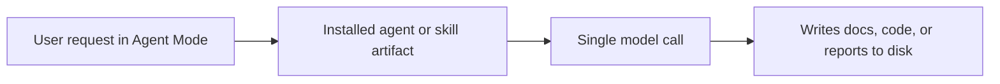
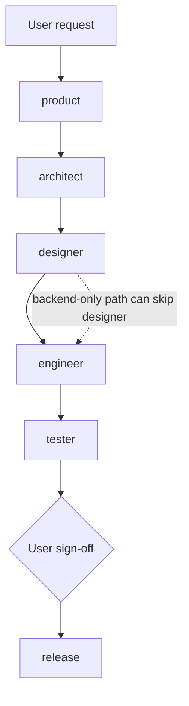

# vstack — architecture

> Maintained by: **architect** role\
> Last updated: 2026-04-26

## overview

vstack is a VS Code–native AI engineering workflow system. It provides template-driven
skills, agents, instructions, and prompts for planning, reviewing, verifying, and
releasing software via GitHub Copilot Agent Mode.

**System style:** `platform` — a standalone CLI tool and SDK. vstack installs
structured role artifacts into a project's `.github/` directory; it does not itself
implement the software being built.

______________________________________________________________________

## system structure

```text
vstack/
├── src/vstack/                  ← Python package (source of truth)
│   ├── frontmatter/             ← parser, serializer, schema
│   ├── artifacts/               ← GenericArtifactGenerator, ArtifactTypeConfig
│   ├── skills/                  ← SKILL_SCHEMA, SKILL_TYPE
│   ├── agents/                  ← AGENT_SCHEMA, AGENT_TYPE
│   ├── instructions/            ← instruction config and wrappers
│   ├── prompts/                 ← prompt config and wrappers
│   ├── manifest/                ← Manifest, ManifestFile, ArtifactEntry, checksums
│   ├── cli/                     ← interface, registry, service, per-command handlers, helpers
│   └── _templates/              ← source templates for all artifact types
├── docs/
│   ├── architecture/            ← architecture docs + ADRs
│   ├── design/                  ← design, workflow, skills, instructions
│   └── product/                 ← roadmap, requirements, vision
├── tests/
│   └── vstack/
├── .github/                     ← generated output (never edit directly)
│   ├── skills/<name>/SKILL.md
│   ├── agents/<name>.agent.md
│   ├── instructions/<name>.instructions.md
│   ├── prompts/<name>.prompt.md
│   └── vstack.json
└── README.md
```

______________________________________________________________________

## components

### 1. template system (`src/vstack/_templates/`)

Each skill is a directory under `src/vstack/_templates/skills/<name>/` containing a `config.yaml`
and a `template.md` body. Each agent is a directory under `src/vstack/_templates/agents/<name>/`
containing a `template.md` (body only) and a `config.yaml` (frontmatter fields).

Shared partial snippets live in `src/vstack/_templates/skills/_partials/*.md` and are injected
via `{{TOKEN}}` substitution at generation time.

Templates are the source of truth. No generated files live in `src/vstack/_templates/`.

### 2. generator (`src/vstack/artifacts/generator.py`)

`GenericArtifactGenerator` discovers template directories, validates frontmatter
against the artifact schema, resolves `{{PLACEHOLDER}}` tokens from partials, and
writes output files. All type-specific behaviour is expressed through an
`ArtifactTypeConfig` descriptor.

Run at install time: `vstack install`

### 3. resolver system

Key resolvers defined inline in the generator:

| Placeholder                   | Purpose                                                             |
| ----------------------------- | ------------------------------------------------------------------- |
| `{{SKILL_CONTEXT}}`           | Shared context block: role, completeness principle, question format |
| `{{BASE_BRANCH}}`             | Shell snippet to detect git base branch                             |
| `{{RUN_TESTS}}`               | Detect test framework and run tests                                 |
| `{{OBSERVABILITY_CHECKLIST}}` | Observability coverage checklist                                    |
| `{{API_CONTRACT_CHECKLIST}}`  | API contract review checklist                                       |

### 4. role model

vstack uses 6 fixed agent roles. Each role has defined skill access and artifact ownership.
See `docs/architecture/adr/009-role-model.md` for the decision record.

| Role      | Artifact ownership                                                                  |
| --------- | ----------------------------------------------------------------------------------- |
| product   | `docs/product/vision.md`, `docs/product/requirements.md`, `docs/product/roadmap.md` |
| architect | `docs/architecture/architecture.md`, `docs/architecture/adr/*.md`                   |
| designer  | `docs/design/design.md`, `docs/design/ux.md` (frontend scope), API specs            |
| engineer  | code, unit tests                                                                    |
| tester    | `docs/test-report.md`, `docs/security-report.md`, `docs/performance-baseline.md`    |
| release   | `docs/releases/{date}.md`, `CHANGELOG.md`, release PR                               |

### 5. manifest (`vstack.json`)

Generated at install time in the target directory. Tracks every artifact installed
by `vstack install` (skills, agents, instructions, and prompts), including a per-file
SHA-256 checksum, version, and algorithm so that:

- `vstack uninstall` removes exactly the files it installed.
- `install --update` detects local modifications before rewriting.
- `verify` / `status` report checksum drift and ownership state.
- `manifest upgrade` migrates legacy schema to the current version.

The manifest schema is versioned (`manifest_version` field). Operations that require
the current schema fail fast with an upgrade hint rather than silently misbehaving.
See ADR-014 and ADR-015.

Writes are atomic: content is staged to a sibling `.tmp` file and promoted with
`os.replace` so a crash or `KeyboardInterrupt` cannot produce a partially-written
manifest. See ADR-016.

### 6. VS Code agent files (`.github/agents/<name>.agent.md`)

Generated output — one file per role (6 total: product, architect, designer, engineer,
tester, release). Installed to `.github/agents/` in a project.

```yaml
---
name: "architect"
description: "Senior software architect…"
tools:
  - read
  - search
  - edit
  - web
  - vscode
  - todo
  - agent
agents: ["*"]
target: vscode
user-invocable: true
---
```

Each agent body describes: responsibilities, workflow steps, artifact ownership,
and which skills to invoke.

### 7. CLI layer (`src/vstack/cli/`)

The CLI layer translates argparse input into domain operations through a small set of
focused components. See `docs/design/design.md` for the full component table and
dispatch flow.

| Component                | Responsibility                                                                      |
| ------------------------ | ----------------------------------------------------------------------------------- |
| `CommandLineInterface`   | Facade: parser construction, service creation, target/scope resolution, dispatch    |
| `CommandService`         | Shared coordinator: generators, path labelling, manifest access, artifact state     |
| `build_command_registry` | Maps command names to `BaseCommand` instances                                       |
| `BaseCommand`            | ABC contract: all handlers implement `run(args, install_dir, only) → int`           |
| Per-command modules      | `install`, `verify`, `status`, `uninstall`, `validate`, `manifest` — one class each |
| `helpers.py`             | Shared install/uninstall utilities (name normalization, manifest preservation)      |

______________________________________________________________________

## non-functional requirements

These bind architecture decisions. Full list in `docs/product/requirements.md`.

| ID    | Requirement                                                                       | Architectural binding                     |
| ----- | --------------------------------------------------------------------------------- | ----------------------------------------- |
| NFR-1 | No runtime dependencies beyond the Python standard library                        | ADR-006, ADR-007                          |
| NFR-2 | Python 3.11–3.14 compatibility                                                    | ADR-007                                   |
| NFR-3 | Manifest writes are atomic                                                        | ADR-016                                   |
| NFR-4 | All public behavior covered by automated tests; CI enforces test pass             | `tests/` structure, `verify.yml` workflow |
| NFR-5 | CLI operates standalone; no VS Code process required for CLI operations           | ADR-006, stdlib-only runtime              |
| NFR-6 | Lint and type checking pass on every commit; CI gate enforces zero violations     | `pyproject.toml` ruff + mypy config       |
| NFR-7 | Generated output lives under `.github/` only; templates never modified at runtime | ADR-012                                   |

______________________________________________________________________

## execution model

### current execution model — single-call

Copilot executes the selected role or skill in a single context window.



### possible future model — orchestrated role pipeline

Each role makes its own model call. Output artifacts are passed to the next role.



See `docs/architecture/adr/004-option-a-to-b-pipeline.md` and `docs/design/workflow.md` for pipeline detail.

______________________________________________________________________

## decision records

All significant architectural decisions are recorded in `docs/architecture/adr/`.
See individual files for context, decision, alternatives, and rationale.

| ADR | Title                                                | Status   |
| --- | ---------------------------------------------------- | -------- |
| 001 | VS Code-native variant                               | accepted |
| 002 | Artifact naming and compatibility policy             | accepted |
| 003 | Backend-first verify                                 | accepted |
| 004 | Option A to B pipeline                               | accepted |
| 005 | VS Code prompt format                                | accepted |
| 006 | No runtime dependency on external binaries           | accepted |
| 007 | Python runtime                                       | accepted |
| 008 | Agents over prompts                                  | accepted |
| 009 | 6-role agent model                                   | accepted |
| 010 | Artifact flow                                        | accepted |
| 011 | Skill restructure                                    | accepted |
| 012 | Flat templates and install-time generation           | accepted |
| 013 | Policy vs procedure boundary for instructions/skills | accepted |
| 014 | Manifest schema versioning and explicit upgrade gate | accepted |
| 015 | Conservative install-by-default                      | accepted |
| 016 | Atomic manifest writes                               | accepted |
