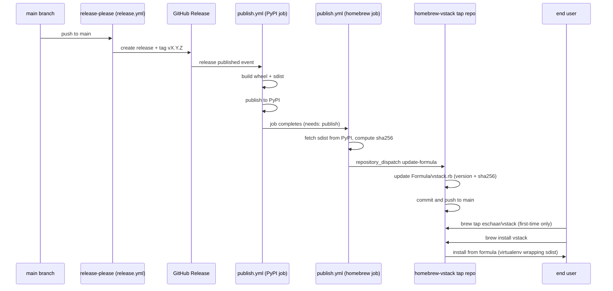

# Homebrew Distribution Plan

> Maintained by: **architect** role\
> Created: 2026-06-02\
> Status: **accepted** (ADR-030)

## objective

Extend vstack's distribution to Homebrew so that macOS and Linux users can install the CLI
with `brew install` without requiring Python or pip awareness. PyPI remains the primary
source of truth for the package; Homebrew wraps it inside an isolated virtualenv.

______________________________________________________________________

## decision: private tap vs homebrew-core

| Factor | Private tap | homebrew-core |
|---|---|---|
| Setup time | Hours | Days–weeks (PR review) |
| Release automation | Full control | Maintainers must submit bump PRs or use bots |
| Acceptance bar | None | 30-day PyPI history, notable adoption, strict criteria |
| Install UX | `brew tap eschaar/vstack && brew install vstack` | `brew install vstack` |
| Formula ownership | Maintainer-owned | Homebrew project |
| Update autonomy | Immediate | Subject to Homebrew review cycles |
| Blast radius on mistake | Isolated tap repo | Homebrew-core infrastructure |

**Recommendation: private tap now, homebrew-core later.**

Start with a private tap (`github.com/eschaar/homebrew-vstack`). Automate formula updates
from the existing publish pipeline. Graduate to homebrew-core only when the project has
demonstrated stable release cadence, broad adoption, and the formula is well-tested.

______________________________________________________________________

## end-to-end release architecture

The current release pipeline has two stages:

1. `release.yml` — merge to `main` triggers release-please; on release PR merge, creates
   the SemVer tag and GitHub Release.
2. `publish.yml` — triggered on `release: published`; builds and publishes the wheel and
   sdist to PyPI.

Homebrew publishing inserts as a third, sequential stage after PyPI publish succeeds.



  Install UX constraints in this phase:

  - The private tap path supports plain `brew install vstack` after a one-time `brew tap eschaar/vstack`.
  - The fully-qualified fallback `brew install eschaar/vstack/vstack` remains valid without a prior tap.
  - Universal plain `brew install vstack` for users who never tapped requires formula acceptance in `Homebrew/homebrew-core`.

______________________________________________________________________

## required repositories and artifacts

### tap repo

- Repository: `github.com/eschaar/homebrew-vstack`
- Formula path: `Formula/vstack.rb`
- Branch: `main`
- Naming convention: `homebrew-<tap-name>` is required by Homebrew's tap resolution.

### source artifact

- Use the **sdist tarball** published to PyPI (`vstack-X.Y.Z.tar.gz`).
- PyPI is the canonical download URL embedded in the formula; Homebrew fetches from there
  at install time.
- URL pattern: `https://files.pythonhosted.org/packages/source/v/vstack/vstack-X.Y.Z.tar.gz`

### checksum

- SHA-256 of the sdist tarball. Homebrew rejects the install if the checksum does not match.
- Computed at publish time from the tarball downloaded from PyPI JSON API
  (`https://pypi.org/pypi/vstack/X.Y.Z/json`).

### version and tag constraints

- Only plain SemVer `X.Y.Z` tags trigger publishing (already enforced in `publish.yml`).
- Pre-releases (`github.event.release.prerelease == true`) must be excluded; add the same
  guard already used in the PyPI job to the homebrew job.

### formula structure (reference)

```ruby
class Vstack < Formula
  include Language::Python::Virtualenv

  desc "VS Code-native AI engineering workflow system"
  homepage "https://github.com/eschaar/vstack"
  url "https://files.pythonhosted.org/packages/source/v/vstack/vstack-X.Y.Z.tar.gz"
  sha256 "<sha256-of-sdist>"
  license "MIT"
  head "https://github.com/eschaar/vstack.git", branch: "main"

  depends_on "python@3.11"

  resource "pyyaml" do
    url "https://files.pythonhosted.org/packages/source/P/PyYAML/PyYAML-6.0.2.tar.gz"
    sha256 "<sha256-of-pyyaml-sdist>"
  end

  def install
    virtualenv_install_with_resources
  end

  test do
    assert_match "vstack", shell_output("#{bin}/vstack --version")
    system bin/"vstack", "--help"
  end
end
```

Dependencies listed in the `resource` blocks must track `pyproject.toml`'s runtime
`dependencies`. Currently only `pyyaml>=6.0` is required.

______________________________________________________________________

## security and supply-chain controls

### trusted actors

- The homebrew publish job runs only after the PyPI job succeeds in the same workflow run.
- Apply the same `TRUSTED_RELEASE_ACTORS` actor check already used in `publish.yml`.
- The `repository_dispatch` event sent to the tap repo must carry a `sha256` value computed
  by the workflow, not user-supplied; the tap workflow must not accept version or sha256 as
  user input from an untrusted source.

### token scope (least privilege)

- Create a dedicated fine-grained PAT or a scoped GitHub App installation token with
  `contents: write` on `homebrew-vstack` only.
- Store as `HOMEBREW_TAP_TOKEN` in the `pypi` Actions environment (same environment
  already used for PyPI).
- Do not reuse the release-please app token; that token has write access to this repo.
- The tap repo workflow (`formula-update.yml`) must require the `repository_dispatch`
  event to carry a matching secret or HMAC header to prevent external triggering.

### checksum verification

1. The publish workflow fetches the sdist tarball from PyPI.
2. It computes `sha256sum` locally and also reads the sha256 from the PyPI JSON API.
3. The two values must match before the workflow proceeds.
4. The tap formula embeds the verified sha256; Homebrew verifies it again at install time.

### supply-chain hardening

- Pin all third-party GitHub Actions in the homebrew job and tap repo workflows to full
  commit SHAs (matching the practice in `release.yml` and `publish.yml`).
- No `curl | bash` patterns in any workflow step; use Actions or `brew` directly.
- The tap repo should have branch protection on `main`: require status checks to pass
  before commits land (the formula test workflow acts as the gate).

______________________________________________________________________

## CI/CD workflow changes

### this repo (`publish.yml`)

Add a second job `publish-homebrew` in `publish.yml`:

```yaml
publish-homebrew:
  name: Update Homebrew Tap
  needs: publish          # runs after PyPI publish succeeds
  if: github.event.release.prerelease == false
  runs-on: ubuntu-latest
  environment: pypi       # same environment; HOMEBREW_TAP_TOKEN stored here

  steps:
    - name: Validate release actor
      # reuse same actor check as the publish job

    - name: Fetch sdist from PyPI and verify checksum
      shell: bash
      run: |
        VERSION="${{ github.event.release.tag_name }}"
        PYPI_JSON=$(curl -fsSL "https://pypi.org/pypi/vstack/${VERSION}/json")
        SDIST_URL=$(echo "$PYPI_JSON" | jq -r \
          '.urls[] | select(.packagetype=="sdist") | .url')
        PYPI_SHA=$(echo "$PYPI_JSON" | jq -r \
          '.urls[] | select(.packagetype=="sdist") | .digests.sha256')
        curl -fsSL "$SDIST_URL" -o vstack.tar.gz
        LOCAL_SHA=$(sha256sum vstack.tar.gz | awk '{print $1}')
        if [[ "$LOCAL_SHA" != "$PYPI_SHA" ]]; then
          echo "ERROR: sha256 mismatch between PyPI metadata and downloaded tarball."
          exit 1
        fi
        echo "sdist_url=$SDIST_URL" >> "$GITHUB_OUTPUT"
        echo "sdist_sha256=$LOCAL_SHA" >> "$GITHUB_OUTPUT"

    - name: Dispatch formula update to tap repo
      uses: peter-evans/repository-dispatch@<SHA>
      with:
        token: ${{ secrets.HOMEBREW_TAP_TOKEN }}
        repository: eschaar/homebrew-vstack
        event-type: update-formula
        client-payload: |
          {
            "version": "${{ github.event.release.tag_name }}",
            "sdist_url": "${{ steps.verify.outputs.sdist_url }}",
            "sha256": "${{ steps.verify.outputs.sdist_sha256 }}"
          }
```

### tap repo (`homebrew-vstack`)

#### `formula-update.yml`

```yaml
on:
  repository_dispatch:
    types: [update-formula]

jobs:
  update:
    runs-on: ubuntu-latest
    steps:
      - uses: actions/checkout@<SHA>
      - name: Update formula version and sha256
        shell: bash
        run: |
          VERSION="${{ github.event.client_payload.version }}"
          SHA256="${{ github.event.client_payload.sha256 }}"
          URL="${{ github.event.client_payload.sdist_url }}"
          sed -i "s|url \".*\"|url \"${URL}\"|" Formula/vstack.rb
          sed -i "s|sha256 \".*\"|sha256 \"${SHA256}\"|" Formula/vstack.rb
      - name: Commit and push
        run: |
          git config user.name "vstack-release-bot"
          git config user.email "bot@users.noreply.github.com"
          git commit -am "chore: bump vstack to ${{ github.event.client_payload.version }}"
          git push
```

#### `test.yml`

```yaml
on:
  push:
    paths: [Formula/vstack.rb]
  pull_request:
    paths: [Formula/vstack.rb]

jobs:
  test:
    runs-on: macos-latest
    steps:
      - uses: actions/checkout@<SHA>
      - run: brew install --build-from-source Formula/vstack.rb
      - run: brew test vstack
```

______________________________________________________________________

## operational runbook

### initial bootstrap

1. Create `github.com/eschaar/homebrew-vstack` as a public repository.
2. Add `Formula/` directory and commit the initial `Formula/vstack.rb` for the latest
   released version. Compute the sha256 with:
   ```bash
   curl -fsSL https://files.pythonhosted.org/packages/source/v/vstack/vstack-X.Y.Z.tar.gz \
     | sha256sum
   ```
3. Add and enable `formula-update.yml` and `test.yml` workflows in the tap repo.
4. Set branch protection on `main`: require `test.yml` to pass.
5. Create a fine-grained PAT with `contents: write` scope limited to `homebrew-vstack`.
   Store it as secret `HOMEBREW_TAP_TOKEN` in the `pypi` Actions environment of this repo.
6. Pin the `peter-evans/repository-dispatch` action to a full commit SHA in `publish.yml`.
7. Merge the `publish-homebrew` job into `publish.yml` behind a feature flag
   (`HOMEBREW_TAP_ENABLED: "true"` env var) for safe rollout.
8. Run a manual test: publish a dry-run release (or trigger `workflow_dispatch`) and
   verify the tap formula is updated correctly.
9. Document install instructions in `README.md` once bootstrap is validated.

### recurring release flow (maintainer view)

Every release follows the existing process unchanged. The only additions are:

1. After `release.yml` creates the GitHub Release, `publish.yml` runs as before.
2. The new `publish-homebrew` job triggers automatically after PyPI publish succeeds.
3. Monitor the tap repo's `formula-update.yml` run to confirm success.
4. `brew update && brew upgrade vstack` on the release engineer's machine to confirm
   the new version installs correctly.

### rollback and fix-forward

| Scenario | Action |
|---|---|
| Formula update committed with wrong sha256 | Manually push a corrected formula commit to the tap repo; no effect on PyPI |
| `formula-update.yml` fails mid-run | Re-run the workflow from the tap repo Actions UI; it is idempotent |
| Tap formula test fails | Push a fix commit to `Formula/vstack.rb`; the test workflow re-runs |
| PyPI publish succeeds but Homebrew dispatch fails | Trigger `publish-homebrew` job via `workflow_dispatch` on `publish.yml` with the release tag |
| Wrong version formula is live | Push a corrected formula commit; advise users to `brew update && brew upgrade vstack` |
| `HOMEBREW_TAP_TOKEN` expires | Rotate PAT, update secret; no user-visible impact until next release |

______________________________________________________________________

## risk register

| Risk | Likelihood | Impact | Mitigation |
|---|---|---|---|
| PyPI tarball URL changes format | Low | High | Read URL from PyPI JSON API dynamically, not hardcoded |
| Tap dispatch token leaked | Low | Medium | Fine-grained PAT scoped to tap repo only; rotate on any exposure |
| sha256 mismatch at install (supply chain attack) | Very low | Critical | Double-verify: PyPI metadata vs downloaded tarball; Homebrew verifies again |
| `formula-update.yml` pushes a broken formula | Low | Medium | Branch protection + `test.yml` gate on `main`; fix-forward is low-friction |
| PyPI publish succeeds but tap update fails silently | Medium | Low | Add required status check or Slack/issue notification on failure |
| Homebrew-core submission rejected later | Low | Low | Private tap provides immediate value; core submission is optional |
| PyYAML resource block falls out of sync | Medium | Medium | Add a release checklist item: verify tap resource versions match `pyproject.toml` |
| Rate limiting on PyPI JSON API from CI | Very low | Low | Cache the JSON response in the workflow step; retry once |

______________________________________________________________________

## acceptance criteria

- [ ] `brew tap eschaar/vstack && brew install vstack` installs the correct version on macOS.
- [ ] With tap preconfigured, `brew install vstack` installs the correct version on macOS and Linux.
- [ ] Without tap preconfiguration, `brew install eschaar/vstack/vstack` remains a valid install path.
- [ ] `vstack --version` outputs the expected release tag after install.
- [ ] `brew test vstack` passes.
- [ ] A new release to PyPI automatically updates the tap formula within one workflow run.
- [ ] The tap formula sha256 matches the PyPI sdist checksum.
- [ ] `publish-homebrew` job does not run for pre-releases.
- [ ] All Actions in `publish.yml` and tap workflows are pinned to full commit SHAs.
- [ ] `HOMEBREW_TAP_TOKEN` is scoped to the tap repo only.
- [ ] The tap repo `main` branch is protected; direct pushes require the `test.yml` check.
- [ ] Install and uninstall leaves no orphan files.

______________________________________________________________________

## phased rollout

### phase 1 — private tap (target: next release cycle)

- [ ] Create `homebrew-vstack` tap repo with initial formula.
- [ ] Add `publish-homebrew` job to `publish.yml` behind `HOMEBREW_TAP_ENABLED` flag.
- [ ] Enable `HOMEBREW_TAP_ENABLED` and validate on the next release.
- [ ] Update `README.md` with Homebrew install instructions.
- [ ] Document tap bootstrap and rotation in `CONTRIBUTING.md`.

### phase 2 — homebrew-core submission (optional, post-adoption)

- [ ] Verify project meets homebrew-core criteria (30-day PyPI history, no dual install
  conflicts, notable usage).
- [ ] Run `brew audit --strict Formula/vstack.rb` against the private tap formula.
- [ ] Submit a formula PR to `Homebrew/homebrew-core`.
- [ ] Once accepted, remove the private tap or redirect users to core.
- [ ] Decide whether to keep the tap formula in sync as a fallback or deprecate it.
