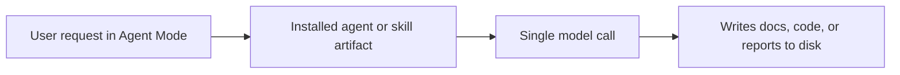
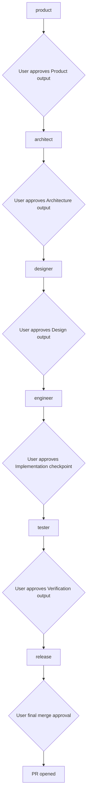

# vstack — architecture

> Maintained by: **architect** role\
> Last updated: 2026-04-26

## overview

vstack is a VS Code–native AI engineering workflow system. It provides template-driven
skills, agents, instructions, and prompts for planning, reviewing, verifying, and
releasing software via GitHub Copilot Agent Mode.

**System style:** `platform` — a standalone CLI tool and SDK. vstack installs
structured role artifacts into a project's `.github/` directory; it does not itself
implement the software being built.

______________________________________________________________________

## system structure

```text
vstack/
├── src/vstack/                  ← Python package (source of truth)
│   ├── frontmatter/             ← parser, serializer, schema
│   ├── artifacts/               ← GenericArtifactGenerator, ArtifactTypeConfig
│   ├── skills/                  ← SKILL_SCHEMA, SKILL_TYPE
│   ├── agents/                  ← AGENT_SCHEMA, AGENT_TYPE
│   ├── instructions/            ← instruction config and wrappers
│   ├── prompts/                 ← prompt config and wrappers
│   ├── manifest/                ← Manifest, ManifestFile, ArtifactEntry, checksums
│   ├── cli/                     ← interface, registry, service, per-command handlers, helpers
│   └── _templates/              ← source templates for all artifact types
│       ├── skills/, agents/, instructions/, prompts/
│       ├── docs/                ← baseline doc stubs (seeded by vstack install)
│       └── project/             ← .vstack/ config and artifact starter templates
├── docs/
│   ├── architecture/            ← architecture docs + ADRs
│   ├── design/                  ← design, workflow, skills, instructions
│   └── product/                 ← roadmap, requirements, vision
├── tests/
│   └── vstack/
├── .vstack/                     ← project-scope vstack state (committed)
│   ├── config.yaml              ← human-authored project config (YAML)
│   ├── vstack.json              ← machine-generated manifest (JSON)
│   └── templates/               ← project-owned artifact starter templates (seeded by vstack install)
├── .github/                     ← generated Copilot artifacts (never edit directly)
│   ├── skills/<name>/SKILL.md
│   ├── agents/<name>.agent.md
│   ├── instructions/<name>.instructions.md
│   └── prompts/<name>.prompt.md
└── README.md
```

______________________________________________________________________

## components

### 1. template system (`src/vstack/_templates/`)

Each skill is a directory under `src/vstack/_templates/skills/<name>/` containing a `config.yaml`
and a `template.md` body. Each agent is a directory under `src/vstack/_templates/agents/<name>/`
containing a `template.md` (body only) and a `config.yaml` (frontmatter fields).

Shared partial snippets live in `src/vstack/_templates/skills/_partials/*.md` and are injected
via `{{TOKEN}}` substitution at generation time.

Templates are the source of truth. No generated files live in `src/vstack/_templates/`.

### 2. generator (`src/vstack/artifacts/generator.py`)

`GenericArtifactGenerator` discovers template directories, validates frontmatter
against the artifact schema, resolves `{{PLACEHOLDER}}` tokens from partials, and
writes output files. All type-specific behaviour is expressed through an
`ArtifactTypeConfig` descriptor.

Run at install time: `vstack install`

### 3. resolver system

Key resolvers defined inline in the generator:

| Placeholder                   | Purpose                                                             |
| ----------------------------- | ------------------------------------------------------------------- |
| `{{SKILL_CONTEXT}}`           | Shared context block: role, completeness principle, question format |
| `{{BASE_BRANCH}}`             | Shell snippet to detect git base branch                             |
| `{{RUN_TESTS}}`               | Detect test framework and run tests                                 |
| `{{OBSERVABILITY_CHECKLIST}}` | Observability coverage checklist                                    |

### 4. role model

vstack uses six delivery roles plus a planner coordinator agent. Delivery roles
have defined skill access and artifact ownership. See
`docs/architecture/adr/009-role-model.md` for the role-model decision and
`docs/architecture/adr/024-subagent-orchestration.md` for planner orchestration.

| Role      | Artifact ownership                                                                                       |
| --------- | -------------------------------------------------------------------------------------------------------- |
| product   | `docs/product/vision.md`, `docs/product/requirements.md`, `docs/product/roadmap.md`                      |
| architect | `docs/architecture/overview.md`, `docs/architecture/adr/*.md`                                            |
| designer  | `docs/design/` (overview.md, ux.md, agents.md, skills.md, instructions.md, workflow.md, cicd.md)         |
| engineer  | code, unit tests                                                                                         |
| tester    | `docs/reports/test-report.md`, `docs/reports/security-report.md`, `docs/reports/performance-baseline.md` |
| release   | `docs/releases/YYYYMMDDNN.md`, `CHANGELOG.md`, release PR                                                |
| planner   | none (coordination only; reads workflow config and stage outputs)                                        |

### 5. manifest (`.vstack/vstack.json`)

Generated at install time at `.vstack/vstack.json`. Tracks every `.github/` artifact
installed by `vstack init` (skills, agents, instructions, and prompts), including a
per-file SHA-256 checksum, version, and algorithm so that:

- `vstack uninstall` removes exactly the files it installed.
- `init --update` detects local modifications before rewriting.
- `verify` / `status` report checksum drift and ownership state.
- `manifest upgrade` migrates legacy schema and file location to the current version.

The manifest uses JSON format (machine-generated, not hand-edited). Project
configuration uses YAML (`config.yaml`). The format difference signals ownership.
See ADR-019.

The manifest schema is versioned (`manifest_version` field). Operations that require
the current schema fail fast with an upgrade hint rather than silently misbehaving.
See ADR-014 and ADR-020.

Writes are atomic: content is staged to a sibling `.tmp` file and promoted with
`os.replace` so a crash or `KeyboardInterrupt` cannot produce a partially-written
manifest. See ADR-016.

### 6. VS Code agent files (`.github/agents/<name>.agent.md`)

Generated output — mode-dependent role set in `.github/agents/`.

- `workflow.mode=agentic` (default): 7 files (`planner` + 6 worker roles)
- `workflow.mode=manual`: 6 files (worker roles only; planner omitted)
- `workflow.mode=hybrid`: 7 files (`planner` + 6 worker roles)

```yaml
---
name: "architect"
description: "Senior software architect…"
tools:
  - read
  - search
  - edit
  - web
  - vscode
  - todo
  - agent
agents: ["*"]
target: vscode
user-invocable: true
---
```

Each agent body describes: responsibilities, workflow steps, artifact ownership,
and which skills to invoke.

### 7. CLI layer (`src/vstack/cli/`)

The CLI layer translates argparse input into domain operations through a small set of
focused components. See `docs/design/design.md` for the full component table and
dispatch flow.

| Component                | Responsibility                                                                              |
| ------------------------ | ------------------------------------------------------------------------------------------- |
| `CommandLineInterface`   | Facade: parser construction, service creation, target/scope resolution, dispatch            |
| `CommandService`         | Shared coordinator: generators, path labelling, manifest access, artifact state             |
| `build_command_registry` | Maps command names to `BaseCommand` instances                                               |
| `BaseCommand`            | ABC contract: all handlers implement `run(*, context: CommandContext) → int`                |
| Per-command modules      | `install`, `init`, `verify`, `status`, `uninstall`, `validate`, `manifest` — one class each |
| `helpers.py`             | Shared install/uninstall utilities (name normalization, manifest preservation)              |

______________________________________________________________________

## non-functional requirements

These bind architecture decisions. Full list in `docs/product/requirements.md`.

| ID    | Requirement                                                                       | Architectural binding                                      |
| ----- | --------------------------------------------------------------------------------- | ---------------------------------------------------------- |
| NFR-1 | No external binary dependencies in skill template content                         | ADR-006; one pip dependency (`pyyaml`) allowed per ADR-025 |
| NFR-2 | Python 3.11–3.14 compatibility                                                    | ADR-007                                                    |
| NFR-3 | Manifest writes are atomic                                                        | ADR-016                                                    |
| NFR-4 | All public behavior covered by automated tests; CI enforces test pass             | `tests/` structure, `verify.yml` workflow                  |
| NFR-5 | CLI operates standalone; no VS Code process required for CLI operations           | ADR-006; only `pyyaml` required at runtime (ADR-025)       |
| NFR-6 | Lint and type checking pass on every commit; CI gate enforces zero violations     | `pyproject.toml` ruff + mypy config                        |
| NFR-7 | Generated output lives under `.github/` only; templates never modified at runtime | ADR-012                                                    |

______________________________________________________________________

## execution model

### execution models by workflow mode

Manual mode executes selected roles/skills in single calls; agentic mode adds
planner-led orchestration.



### planner-orchestrated model — stage-gated role pipeline

Each role is a separate model call. Output artifacts from one role become the input context
for the next, and progression only happens after explicit user approval at each stage gate.



See `docs/architecture/adr/023-workflow-contract.md`, `docs/architecture/adr/024-subagent-orchestration.md`,
`docs/architecture/adr/010-artifact-flow.md`, and `docs/design/workflow.md` for pipeline and gate detail.

______________________________________________________________________

## decision records

All significant architectural decisions are recorded in `docs/architecture/adr/`.
See individual files for context, decision, alternatives, and rationale.

| ADR | Title                                                | Status     | Notes                                   |
| --- | ---------------------------------------------------- | ---------- | --------------------------------------- |
| 001 | VS Code-native variant                               | accepted   |                                         |
| 002 | Artifact naming and compatibility policy             | accepted   |                                         |
| 003 | Backend-first verify                                 | accepted   |                                         |
| 004 | Direct execution and orchestrated pipeline           | superseded | Superseded by ADR-024                   |
| 005 | VS Code prompt format                                | accepted   |                                         |
| 006 | No runtime dependency on external binaries           | accepted   |                                         |
| 007 | Python runtime                                       | accepted   |                                         |
| 008 | Agents over prompts                                  | accepted   |                                         |
| 009 | 6-role agent model                                   | accepted   |                                         |
| 010 | Artifact flow                                        | accepted   |                                         |
| 011 | Skill restructure                                    | accepted   |                                         |
| 012 | Flat templates and install-time generation           | accepted   |                                         |
| 013 | Policy vs procedure boundary for instructions/skills | accepted   |                                         |
| 014 | Manifest schema versioning and explicit upgrade gate | accepted   |                                         |
| 015 | Conservative install-by-default                      | superseded | Superseded by ADR-020                   |
| 016 | Atomic manifest writes                               | accepted   |                                         |
| 017 | Checksum backfill on upgrade                         | accepted   |                                         |
| 018 | Skill genericity boundary                            | accepted   |                                         |
| 019 | `.vstack/` project-scope directory                   | accepted   | Introduced `.vstack/` directory         |
| 020 | `install` and `init` command semantics               | accepted   | Breaking change; supersedes ADR-015     |
| 021 | Config-driven artifact paths in agent config         | accepted   | Machine-readable artifact ownership     |
| 022 | Selective exclude filter in `.vstack/config.yaml`    | accepted   | Agents cannot be excluded (atomic unit) |
| 023 | Workflow contract in `.vstack/config.yaml`           | accepted   | Pipeline order, gate, hitl, handoffs    |
| 024 | Subagent orchestration via VS Code native subagents  | accepted   | Supersedes ADR-004; planner coordinator |
| 025 | PyYAML as sole runtime dependency                    | accepted   | Replaces hand-rolled frontmatter parser |
