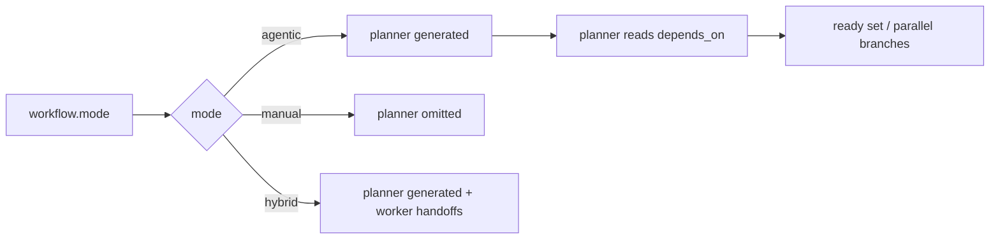

# vstack — agents

> Maintained by: **designer** role\
> Last updated: 2026-05-14\
> VS Code docs: [custom agents](https://code.visualstudio.com/docs/copilot/customization/custom-agents) · [agents overview](https://code.visualstudio.com/docs/copilot/agents/overview)

## what are agents?

Agents are VS Code custom agents (`.agent.md`) that adopt a specific role or persona in GitHub Copilot Chat. Each agent has:

- A **set of tools** it may use (read, edit, execute, …)
- **Instructions** in the file body (role, responsibilities, how to work)
- Optional **handoffs** to transition the user to the next agent in a workflow

In vstack, agents include six delivery roles (`product`, `architect`, `designer`,
`engineer`, `tester`, `release`) plus a coordinator role (`planner`).

Generation is mode-aware via `.vstack/config.yaml` `workflow.mode`:

- `agentic` (default): planner is generated; worker handoff buttons are omitted.
- `manual`: planner is not generated; worker handoff buttons are generated.
- `hybrid`: planner is generated; worker handoff buttons are also generated.

In `hybrid`, the UI exposes both progression paths (planner and handoff buttons).
Use it only when your process explicitly allows both.

Planner orchestration also reads `workflow.stages[*].depends_on` when deciding which
roles are ready. The generated agents remain VS Code custom agents, but the workflow
controller can fan out independent stages in parallel when the DAG permits it.



Canonical names are the source of truth. Historical or compatibility aliases should
remain exceptional and temporary. See `docs/architecture/adr/002-artifact-naming-and-compatibility-policy.md`.

______________________________________________________________________

## file locations

| Path                                              | Purpose                                           |
| ------------------------------------------------- | ------------------------------------------------- |
| `src/vstack/_templates/agents/<name>/config.yaml` | Source of truth — metadata and frontmatter fields |
| `src/vstack/_templates/agents/<name>/template.md` | Agent instructions (body only, no frontmatter)    |
| `.github/agents/<name>.agent.md`                  | Generated output — what VS Code loads             |

**Never edit `.github/agents/` directly.** Regenerate after every change:

```bash
vstack install
```

______________________________________________________________________

## config.yaml fields

`config.yaml` is plain YAML (no `---` markers). vstack reads it at generation time and emits only recognised schema fields to the `.agent.md` frontmatter. Unknown fields (for example `version`) are silently dropped from output.

Style rule: long `description` and `handoffs.prompt` values should use YAML block scalars (`>`). A test enforces this when inline text exceeds 100 characters.

### emitted to frontmatter

| Field                      | Type        | Required | Notes                                                                                                                                                                         |
| -------------------------- | ----------- | -------- | ----------------------------------------------------------------------------------------------------------------------------------------------------------------------------- |
| `name`                     | string      | no       | Overrides filename as picker label                                                                                                                                            |
| `description`              | string      | no       | Shown as placeholder text in chat input                                                                                                                                       |
| `argument-hint`            | string      | no       | Hint text shown after `@agent` in chat                                                                                                                                        |
| `tools`                    | list        | no       | Tools available to this agent (see below)                                                                                                                                     |
| `agents`                   | list        | no       | Subagents this agent may invoke; wildcard delegation (`["*"]`) is rejected by source verification, so use an explicit allowlist                                               |
| `model`                    | list        | no       | Optional model override. Omit by default so VS Code uses the currently selected model picker value. If present, use a prioritized fallback list only for explicit exceptions. |
| `user-invocable`           | bool        | no       | `true` = show in agents dropdown (default)                                                                                                                                    |
| `disable-model-invocation` | bool        | no       | `true` = prevent other agents from calling this one                                                                                                                           |
| `target`                   | string      | no       | `vscode` (default) or `github-copilot`                                                                                                                                        |
| `handoffs`                 | object-list | no       | Sequential workflow handoffs — see [handoffs](#handoffs) below                                                                                                                |
| `mcp-servers`              | raw YAML    | no       | MCP server config (`github-copilot` target only)                                                                                                                              |
| `hooks`                    | raw YAML    | no       | Chat hooks (Preview — requires `chat.useCustomAgentHooks` setting)                                                                                                            |
| `metadata`                 | raw YAML    | no       | String key/value annotations (`github-copilot` target only)                                                                                                                   |

### vstack-internal only (not emitted)

| Field     | Notes                                                                          |
| --------- | ------------------------------------------------------------------------------ |
| `version` | Semantic version for vstack change tracking — never reaches the generated file |
| `items`   | Declares work-item ownership for this agent — see [items](#items) below        |

Frontmatter multiline rendering is configured in generator code (`ArtifactTypeConfig.preserve_multiline_frontmatter`), not per-agent `config.yaml`.

Model policy: keep `model` out of source templates unless a role needs an explicit, justified override. That keeps the generated agents portable across users and orgs with different model access or cost policy.

______________________________________________________________________

## items

The optional `items:` block declares which paths an agent reads and writes.
This field is **vstack-internal** — it is not emitted to the generated `.agent.md`
frontmatter; instead it drives the rendered `## work items` section in the
template body.
See [ADR-021](../architecture/adr/021-config-driven-artifact-paths.md) for rationale.

Backward compatibility: legacy `artifacts:` blocks are still accepted.

```yaml
items:
  dir: architecture               # subdirectory within the global docs root (no root prefix)
  input:                          # paths this agent reads (glob patterns, relative to docs root)
    - product/**/*.md
  output:                         # files this agent produces
    - overview.md                 # simple string: resolved as <docs_root>/<dir>/<path>
    - path: ux.md                 # dict form: required for entries with notes
      notes: frontend/fullstack scope only
    - path: ./src/**/*            # ./ prefix: verbatim path, dir prefix not applied
```

### path resolution rules

| Form                                                  | Resolution                                                          |
| ----------------------------------------------------- | ------------------------------------------------------------------- |
| `input` item                                          | `<ARTIFACTS_DOCS_ROOT>/<item>` (e.g. `docs/product/**/*.md`)        |
| `output` string or `path` — no `./` prefix, `dir` set | `<ARTIFACTS_DOCS_ROOT>/<dir>/<path>`                                |
| `output` string or `path` — no `./` prefix, no `dir`  | `<path>` verbatim                                                   |
| `output` `path` with `./` prefix                      | strip `./`, use remainder verbatim (e.g. `./src/**/*` → `src/**/*`) |

`ARTIFACTS_DOCS_ROOT` defaults to `docs`. It is a global constant in
`src/vstack/constants.py` and can be overridden per project via `items.root`
in `.vstack/config.yaml`. Individual agent configs must never embed the root
prefix; set only the subdirectory in `dir`.

### field reference

| Field             | Required | Type                     | Notes                                                                |
| ----------------- | -------- | ------------------------ | -------------------------------------------------------------------- |
| `dir`             | no       | string                   | Subdirectory this agent writes to, relative to `ARTIFACTS_DOCS_ROOT` |
| `input`           | no       | list of strings          | Glob patterns for files the agent reads as context                   |
| `output`          | no       | list of strings or dicts | Paths the agent produces; use dict form to add `notes`               |
| `input_comments`  | no       | string                   | Optional free-text appended below the input table                    |
| `output_comments` | no       | string                   | Optional free-text appended below the output table                   |

### generated template tokens

The `## work items` section in each `template.md` uses four placeholder
tokens that are resolved by `AgentGenerator` at install time:

| Token                                 | Rendered as                                     |
| ------------------------------------- | ----------------------------------------------- |
| `{{AGENT_ARTIFACTS_INPUT}}`           | Markdown table of input items, or empty string  |
| `{{AGENT_ARTIFACTS_OUTPUT}}`          | Markdown table of output items, or empty string |
| `{{AGENT_ARTIFACTS_INPUT_COMMENTS}}`  | Value of `input_comments`, or empty string      |
| `{{AGENT_ARTIFACTS_OUTPUT_COMMENTS}}` | Value of `output_comments`, or empty string     |

Tables use a single `Item` column when no entry has notes, and two columns
(`Item`, `Notes`) when any entry has a non-empty `notes` value.

______________________________________________________________________

## tools

Use the following tool names in the `tools` list:

| Tool      | Access                                        |
| --------- | --------------------------------------------- |
| `read`    | Read files, search workspace, terminal output |
| `search`  | Semantic and text search                      |
| `edit`    | Create and modify files                       |
| `execute` | Run terminal commands                         |
| `web`     | Fetch web pages                               |
| `vscode`  | Open editors, run commands, access UI         |
| `todo`    | Create and manage todo lists                  |
| `agent`   | Invoke subagents (requires `agents` field)    |

Include `agent` in `tools` when you set `agents`. Omit `execute` for read-only roles (e.g. `product`).

______________________________________________________________________

## handoffs

Handoffs create guided sequential workflows. After a response completes, VS Code shows a button that switches to the target agent with a pre-filled prompt.

`handoffs` is fully supported in `AGENT_SCHEMA` and is emitted by the generator. Define handoffs in `config.yaml` and they will appear in the generated `.agent.md` frontmatter.

### handoff policy

Handoffs are UI accelerators for the happy path only, not orchestration logic:

- Each non-terminal role defines **exactly one** forward handoff with label `Go to next stage: <stage>`.
- The `release` role is terminal — it has **no handoffs**. Opening a PR is a release action, not a handoff.
- Back, side, and escalation handoff buttons are not allowed. Non-happy paths remain explicit user decisions.

See [workflow.md](./workflow.md#handoff-button-convention) for the full stage-gated model and gate moment definitions.

Structure:

```yaml
handoffs:
  - label: Start implementation
    agent: engineer
    prompt: Design is complete in docs/design/overview.md. Please implement.
    send: false        # true = auto-submit the prompt
    model: ""          # optional override; use only a verified model ID
```

______________________________________________________________________

## template body

`template.md` contains only the agent instructions — no frontmatter. The generator adds frontmatter from `config.yaml` at build time.

## canonical template structure (required)

All role templates in `src/vstack/_templates/agents/<name>/template.md` must follow this high-level section order:

1. `# <role>`
1. `## identity and purpose`
1. `## responsibilities`
1. `## scope and boundaries`
1. `## limitations and do not do`
1. `## working principles`
1. `## decision guidelines`
1. `## communication style`
1. `## workflow and handoffs`
1. Role-specific deep-dive sections (e.g. `how you work`, `scope detection`, `artifact checklist`, `verification tracks`)
1. `## success criteria`
1. `## failure and escalation rules`
1. `## work items`
1. `## completion checklist`
1. `## skills you use`

Rules:

- Keep the canonical sections present and in this order for every role.
- Role-specific sections are allowed, but they must not replace canonical sections.
- Keep role boundaries explicit; do not let one role absorb another role's ownership.

Minimal shape:

```markdown
# <role>

## identity and purpose

You are a **<title>** acting as the **<role> role**. <one-line purpose>.

## responsibilities

- …

## scope and boundaries

- …

## limitations and do not do

- …

## working principles

- …

## decision guidelines

- …

## communication style

- …

## workflow and handoffs

- …

## success criteria

- …

## failure and escalation rules

- …

## work items

{{AGENT_ARTIFACTS_INPUT}}

{{AGENT_ARTIFACTS_OUTPUT}}

Agents do not write to artifacts owned by other roles. If you discover something
that requires changes to upstream artifacts, flag it and trigger a reverse handoff.

## completion checklist

- …

## skills you use

- …
```

To reference a tool in body text, use `#tool:<name>`, e.g. `#tool:web/fetch`.\
To reference other files (e.g. instruction files), use Markdown links.

______________________________________________________________________

## adding a new agent

1. Create `src/vstack/_templates/agents/<name>/config.yaml` with at minimum `name` and `description`.
1. Create `src/vstack/_templates/agents/<name>/template.md` with the agent instructions.
1. Regenerate: `vstack install`
1. Verify: `vstack verify` or `python3 -m pytest tests/ -q`

______________________________________________________________________

## example config.yaml

```yaml
name: architect
version: 1.0.1
description: "Senior software architect. Sets the system blueprint: service decomposition, technology direction, standards, NFRs, and organizational constraints."
argument-hint: "[design architecture | write ADR | review architecture | check implementation alignment]"
tools:
  - read
  - search
  - edit
  - web
  - vscode
  - todo
  - agent
agents:
  - architect
items:
  dir: architecture
  input:
    - product/*.md
  output:
    - overview.md
    - adr/*.md
target: vscode
user-invocable: true
```
