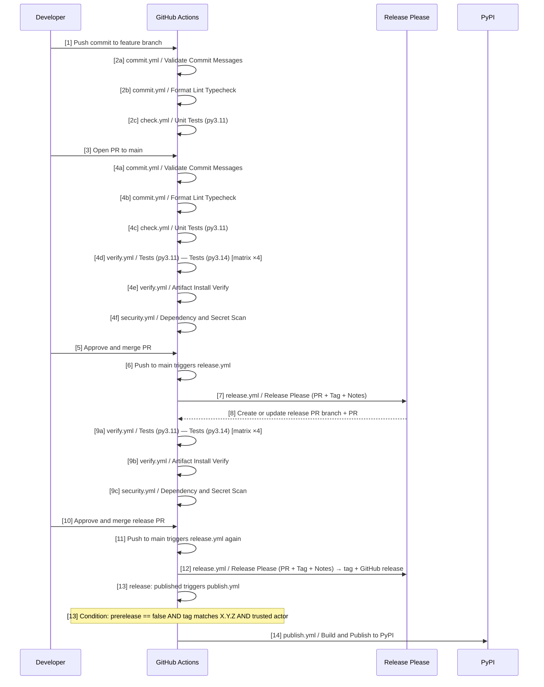
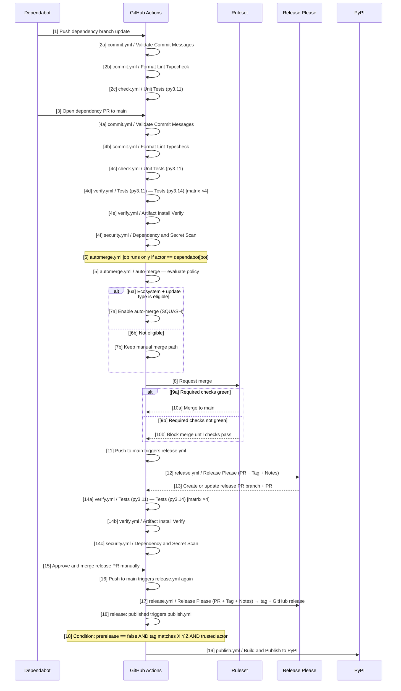

# vstack CI/CD Pipeline

> Maintained by: **designer** role\
> Last updated: 2026-04-27

## Overview

This is the canonical CI/CD execution model for this repository.

Key rule: work starts on a non-main branch. Nothing is committed directly to `main`.

Note: `.github/workflows/commit.yml` and `.github/workflows/check.yml` run on branch pushes and PRs to `main`.
Their jobs are merge-blocking when configured as required status checks in the `main` branch Ruleset.

## Step Label Legend

- `[N]`: deterministic linear step in the sequence.
- `[Na]` / `[Nb]`: alternate branches of the same decision point.

## What Runs On Which Event

| Workflow                          | Trigger                                           | Responsibility                                                                     |
| --------------------------------- | ------------------------------------------------- | ---------------------------------------------------------------------------------- |
| `.github/workflows/commit.yml`    | push to non-main branches, pull_request to `main` | Commit policy and lint/typecheck (branch-name policy on push)                      |
| `.github/workflows/check.yml`     | push to non-main branches, pull_request to `main` | Single-version unit tests (py3.11)                                                 |
| `.github/workflows/verify.yml`    | pull_request to `main`                            | Cross-version test matrix (py3.11–3.14) and artifact install verify                |
| `.github/workflows/security.yml`  | pull_request to `main`                            | Dependency vulnerability scan and secret scan                                      |
| `.github/workflows/automerge.yml` | pull_request_target to `main`                     | Dependabot auto-approve/auto-merge policy gate                                     |
| `.github/workflows/release.yml`   | push to `main`, workflow_dispatch                 | Release Please orchestration: release PR lifecycle, changelog, tag, GitHub release |
| `.github/workflows/publish.yml`   | release `published`                               | Build artifacts from release tag and publish to PyPI                               |

## Human Sequence (Primary)

The human path below is the primary reference for timing and execution order.
Checklist numbers map to the `[N]` labels in sequence messages.

## Human Checklist

1. `[1]` Push commit to feature branch.
1. `[2a]` `commit.yml / Validate Commit Messages` — checks commit format, branch name, and reserved scope policy.
1. `[2b]` `commit.yml / Format Lint Typecheck` — runs `make format-check`, `make lint`, `make typecheck` on py3.11.
1. `[2c]` `check.yml / Unit Tests` — runs `make test-local` on py3.11.
1. `[3]` Open PR to `main`.
1. `[4a]` `commit.yml / Validate Commit Messages` — validates commit messages and reserved `docs(changelog)` scope (branch-name policy runs on push).
1. `[4b]` `commit.yml / Format Lint Typecheck` — runs `make format-check`, `make lint`, `make typecheck` on py3.11.
1. `[4c]` `check.yml / Unit Tests` — runs `make test-local` on py3.11.
1. `[4d]` `verify.yml / Tests (py3.11)` through `Tests (py3.14)` — 4 parallel matrix jobs run `make test-local`.
1. `[4e]` `verify.yml / Artifact Install Verify` — installs vstack into a temp dir and runs `vstack verify`.
1. `[4f]` `security.yml / Dependency and Secret Scan` — pip-audit + trufflehog diff scan.
1. `[5]` Approve and merge PR.
1. `[6]` Push to `main` triggers `release.yml`.
1. `[7]` `release.yml / Release Please (PR + Tag + Notes)` runs.
1. `[8]` Release Please creates or updates the release PR branch + PR.
1. `[9a]`–`[9c]` `verify.yml` and `security.yml` run on the release PR — release-please uses the GitHub App token, which triggers `pull_request` events normally.
1. `[10]` Approve and merge release PR.
1. `[11]` Push to `main` triggers `release.yml` again.
1. `[12]` `release.yml / Release Please (PR + Tag + Notes)` creates the tag and GitHub release.
1. `[13]` `release: published` triggers `publish.yml`. Job runs only if `prerelease == false`, tag matches `X.Y.Z`, and release actor is trusted.
1. `[14]` `publish.yml / Build and Publish to PyPI` — builds wheel + sdist, smoke tests, validates artifact version, publishes via OIDC.

## Dependabot Sequence

## Dependabot Checklist

1. `[1]` Dependabot pushes dependency update branch.
1. `[2a]` `commit.yml / Validate Commit Messages` — commit format and branch name validated (`chore(deps)` / `chore(ci)` prefix, `dependabot/` branch).
1. `[2b]` `commit.yml / Format Lint Typecheck` — lint/typecheck on py3.11.
1. `[2c]` `check.yml / Unit Tests` — `make test-local` on py3.11.
1. `[3]` Dependabot opens PR to `main`.
1. `[4a]` `commit.yml / Validate Commit Messages` — commit message policy on PR commits.
1. `[4b]` `commit.yml / Format Lint Typecheck`.
1. `[4c]` `check.yml / Unit Tests`.
1. `[4d]` `verify.yml / Tests (py3.11)` through `Tests (py3.14)` — 4 parallel matrix jobs.
1. `[4e]` `verify.yml / Artifact Install Verify`.
1. `[4f]` `security.yml / Dependency and Secret Scan`.
1. `[5]` `automerge.yml` job runs only when `github.actor == 'dependabot[bot]'`.
1. `[6a]/[7a]` Eligible (pip patch or GHA patch/minor): auto-merge enabled with SQUASH method.
1. `[6b]/[7b]` Not eligible: manual merge path stays active.
1. `[8]` Merge requested against Ruleset.
1. `[9a]/[10a]` Required checks green → merge to `main`.
1. `[9b]/[10b]` Required checks not green → merge blocked until fixed.
1. `[11]-[13]` Push to `main` triggers `release.yml / Release Please (PR + Tag + Notes)`, release PR created/updated.
1. `[14a]`–`[14c]` `verify.yml` and `security.yml` run on the release PR — GitHub App token triggers `pull_request` events normally.
1. `[15]-[17]` Release PR manually approved and merged, then tag and GitHub release created.
1. `[18]-[19]` `publish.yml / Build and Publish to PyPI` runs if `prerelease == false`, SemVer tag, and trusted actor.

## Failure and Retry Behavior

1. If `commit.yml` or `check.yml` fails, fix branch and push again.
1. If `commit.yml`, `check.yml`, `verify.yml`, or `security.yml` fails on a PR, merge is blocked.
1. If `release.yml` fails due to manifest/tag drift, align `.release-please-manifest.json` with latest SemVer tag and rerun.
1. If `publish.yml` fails, fix publish issue and rerun publish from the same release/tag context.

## Required Repository Configuration

### Ruleset: `main` branch

Configure via **Settings → Rules → Rulesets** on GitHub.

- **Require a pull request before merging**: enabled.
- **Required approvals**: at least 1.
- **Require status checks to pass**: add the following checks:
  - `Commit / Validate Commit Messages`
  - `Commit / Format Lint Typecheck`
  - `Check / Unit Tests`
  - `Verify / Tests (py3.11)`, `Verify / Tests (py3.12)`, `Verify / Tests (py3.13)`, `Verify / Tests (py3.14)`
  - `Verify / Artifact Install Verify`
  - `Security / Dependency and Secret Scan`
- Release PRs created by the GitHub App token (`vstack-release-bot[bot]`) trigger `pull_request`
  events normally — these checks run on release PRs the same as on any other PR.
- **Allowed merge methods**: must include **Squash** — required for `automerge.yml` to enable auto-merge for Dependabot PRs.
- **Restrict force pushes**: enabled.

### Actions permissions

Configure via **Settings → Actions → General**.

- Allow workflows to create pull requests.
- Allow workflows to approve pull requests.

### Repository auto-merge

Configure via **Settings → General**.

- Enabled at repository level (required for Dependabot auto-merge path).

### PyPI environment

Configure via **Settings → Environments**.

- `pypi` environment exists.
- OIDC trusted publishing configured.
- Reviewer policy aligns with release expectations.

## Design Notes

### Release PR checks (`verify.yml` / `security.yml`)

Release-please uses a GitHub App token (`APP_ID` + `APP_PRIVATE_KEY` secrets in `release.yml`).
PRs created via a GitHub App token are treated by GitHub as external-actor events, so
`pull_request` triggers fire normally. As a result, `verify.yml` and `security.yml` run on
release PRs the same as on any other PR to `main`.

Release PRs only modify `CHANGELOG.md` and version metadata (e.g. version in `pyproject.toml`).
The test matrix and artifact verify will pass as normal; the security diff scan will cover only
the changelog and version file changes. No special Ruleset bypass configuration is needed.

### `pypa/gh-action-pypi-publish@release/v1`

This action intentionally uses a rolling `release/v1` branch reference, as PyPA's own
documented recommendation. Security patches (OIDC, attestation fixes) are delivered via
this rolling branch without requiring a separately versioned release from PyPA. Dependabot
monitors the `github-actions` ecosystem and opens a PR when the branch advances to a newer
commit. No manual tracking is needed.

## Related Files

- `.github/workflows/README.md`
- `.github/workflows/commit.yml`
- `.github/workflows/check.yml`
- `.github/workflows/verify.yml`
- `.github/workflows/security.yml`
- `.github/workflows/automerge.yml`
- `.github/workflows/release.yml`
- `.github/workflows/publish.yml`
- `docs/design/workflow.md`
