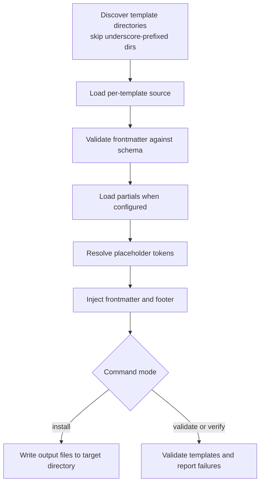

# vstack — design

> Maintained by: **designer** role\
> Last updated: 2026-04-21

## overview

This document describes the internal component design of vstack: how the generator
works, how frontmatter is structured, how the resolver pipeline operates, and how
output artifacts are built.

______________________________________________________________________

## generator design (`src/vstack/artifacts/generator.py`)

`GenericArtifactGenerator` renders, writes, and validates any family of prompt
artifacts (skills, agents). All type-specific behaviour — output filename pattern,
frontmatter injection, partial loading, auto-generated footer, required tokens — is
expressed through an `ArtifactTypeConfig` descriptor rather than subclass overrides.

### execution flow



### frontmatter architecture (`src/vstack/frontmatter/`)

Frontmatter is handled by a dedicated package:

| Module          | Responsibility                                                                       |
| --------------- | ------------------------------------------------------------------------------------ |
| `schema.py`     | `FrontmatterSchema` — ordered field specs, types, and constraints                    |
| `parser.py`     | `FrontmatterParser` — parse YAML frontmatter from Markdown + standalone YAML         |
| `serializer.py` | `FrontmatterSerializer` — serialize schema-validated fields back to YAML frontmatter |

Supported field types: `string`, `list`, `bool`, `object-list`, `raw`

______________________________________________________________________

## skill design

### template structure (`src/vstack/_templates/skills/<name>/`)

Each skill is a directory containing two files:

- `config.yaml` — skill frontmatter fields (metadata)
- `template.md` — skill instructions body (no frontmatter)

```markdown
{{SKILL_CONTEXT}}

## Your skill instructions here
```

```yaml
name: architecture
version: 1.0.1
description: |
   Engineering-lead plan review. Lock in the execution plan — service boundaries,
   data models, API contracts, error handling, test strategy, ...
argument-hint: '[plan or system to review]'
```

The `{{SKILL_CONTEXT}}` token is replaced with the shared `_partials/skill-context.md`
at generation time.

### skill frontmatter schema

| Field                      | Type   | Required | Notes                                                                  |
| -------------------------- | ------ | -------- | ---------------------------------------------------------------------- |
| `name`                     | string | **yes**  | Lowercase kebab-case. Must match the directory name. Max 64 chars.     |
| `version`                  | string | **yes**  | Semantic version for vstack change tracking.                           |
| `description`              | string | **yes**  | What the skill does and when to use it. Max 1024 chars (vstack limit). |
| `argument-hint`            | string | no       | Shown after `/skill-name` in the chat input.                           |
| `user-invocable`           | bool   | no       | `true` (default) = appears in the `/` slash command menu.              |
| `disable-model-invocation` | bool   | no       | `true` = Copilot will never auto-load this skill.                      |

______________________________________________________________________

## agent design

### template structure (`src/vstack/_templates/agents/<name>/`)

Each agent is a directory containing two files:

- `config.yaml` — frontmatter fields (the agent metadata)
- `template.md` — agent instructions body (no frontmatter in this file)

The generator reads `config.yaml`, validates fields against `AGENT_SCHEMA`, and emits
them as YAML frontmatter in the output `.agent.md`.

### agent frontmatter schema

| Field                      | Type        | Required | Notes                                                       |
| -------------------------- | ----------- | -------- | ----------------------------------------------------------- |
| `name`                     | string      | no       | Overrides filename as picker label                          |
| `description`              | string      | no       | Shown as placeholder text in chat input                     |
| `argument-hint`            | string      | no       | Hint text shown after `@agent` in chat                      |
| `tools`                    | list        | no       | Tools available to this agent                               |
| `agents`                   | list        | no       | Subagents this agent may invoke; `["*"]` = all              |
| `model`                    | string      | no       | Force a specific model; omit to use picker selection        |
| `user-invocable`           | bool        | no       | `true` = show in agents dropdown (default)                  |
| `disable-model-invocation` | bool        | no       | `true` = prevent other agents from calling this one         |
| `target`                   | string      | no       | `vscode` (default) or `github-copilot`                      |
| `handoffs`                 | object-list | no       | Sequential workflow handoffs (see `docs/design/agents.md`)  |
| `mcp-servers`              | raw         | no       | MCP server config (`github-copilot` target only)            |
| `hooks`                    | raw         | no       | Chat hooks (Preview feature)                                |
| `metadata`                 | raw         | no       | String key/value annotations (`github-copilot` target only) |

### agent-internal fields (not emitted)

| Field     | Notes                                                                          |
| --------- | ------------------------------------------------------------------------------ |
| `version` | Semantic version for vstack change tracking — never reaches the generated file |

Multiline frontmatter output for agents is controlled centrally by
`ArtifactTypeConfig.preserve_multiline_frontmatter`.

______________________________________________________________________

## placeholder resolver

Placeholders use `{{TOKEN}}` syntax. Partials are loaded from
`src/vstack/_templates/skills/_partials/*.md`. Each file stem is converted from lowercase-kebab
to UPPER_SNAKE to form the token: `skill-context.md` → `SKILL_CONTEXT`.

Resolution is literal string substitution — no logic, no loops in templates.
Unresolved tokens are left unchanged and flagged as errors by `validate` and `install`.

Current partials:

| Token                         | Source file                                                                           |
| ----------------------------- | ------------------------------------------------------------------------------------- |
| `{{SKILL_CONTEXT}}`           | `skill-context.md` — shared opening: context, completeness principle, question format |
| `{{BASE_BRANCH}}`             | `base-branch.md` — shell snippet to detect git base branch                            |
| `{{RUN_TESTS}}`               | `run-tests.md` — test framework detection + run command                               |
| `{{OBSERVABILITY_CHECKLIST}}` | `observability-checklist.md` — observability coverage checklist                       |

______________________________________________________________________

## auto-gen footer

Every generated file ends with a footer line (when `auto_gen_footer=True` on the type config):

```text
<!-- AUTO-GENERATED — maintained by vstack, do not edit directly -->
<!-- VSTACK-META: {"artifact_name":"...","artifact_type":"...","artifact_version":"...","generator":"vstack","vstack_version":"..."} -->
```

The human-readable footer text lives in `src/vstack/artifacts/constants.py` and is shared across all artifact types.
The machine-readable `VSTACK-META` footer is emitted by `GenericArtifactGenerator._build_footer`.
Currently skills, agents, instructions, and prompts all have `auto_gen_footer=True`.

______________________________________________________________________

## CLI pipeline (`src/vstack/cli/`)

```bash
vstack [--version] [--help] <command> [options]
```

### `validate`

Render all templates in memory and report unresolved tokens. No files written. Exits 1 on error.

| Flag               | Description                                              |
| ------------------ | -------------------------------------------------------- |
| `--only <type>...` | Restrict to specific artifact types, e.g. `--only skill` |

### `verify`

Validate source templates and/or installed output (schema checks, required tokens, file presence).

| Flag             | Description                                                |
| ---------------- | ---------------------------------------------------------- |
| `--target <dir>` | Check output in `<dir>/.github/` instead of the repo's own |
| `--global`       | Check the VS Code user profile directory                   |
| `--no-source`    | Skip source template checks                                |
| `--no-output`    | Skip installed output checks                               |

### `install`

Install artifacts into the target `.github/` directory. Skips artifacts already at the current version by default.

| Flag               | Description                                                                             |
| ------------------ | --------------------------------------------------------------------------------------- |
| `--target <dir>`   | Install into `<dir>/.github/` instead of the repo's own                                 |
| `--global`         | Install into the VS Code user profile directory                                         |
| `--only <type>...` | Restrict to specific artifact types, e.g. `--only skill agent`                          |
| `--force`          | Overwrite all artifacts regardless of installed version                                 |
| `--update`         | Overwrite only when the template version is newer *(mutually exclusive with `--force`)* |
| `--dry-run`        | Print what would change without writing any files                                       |

### `uninstall`

Remove all artifacts tracked in `vstack.json`. User-placed files are not touched.

| Flag             | Description                                               |
| ---------------- | --------------------------------------------------------- |
| `--target <dir>` | Uninstall from `<dir>/.github/` instead of the repo's own |
| `--global`       | Uninstall from the VS Code user profile directory         |

______________________________________________________________________

The manifest (`vstack.json`) tracks every artifact installed by `install` so that
`uninstall` can remove exactly those files without touching anything placed there
manually.

______________________________________________________________________

## design principles

1. **stdlib only at runtime.** No runtime dependencies beyond Python ≥ 3.11 stdlib — `pyyaml`, `jinja2`, etc. are intentionally absent. Dev dependencies (pytest, ruff, mypy) are install-time only.
1. **Templates are source of truth.** No generated files live in `src/vstack/_templates/`.
1. **Flat resolver.** No template inheritance, no conditionals — keep it simple.
1. **Install-time output.** Generated artifacts belong in `.github/skills/` and `.github/agents/`,
   never committed to the vstack source repo.
1. **Idempotent.** Running the generator twice with the same `--target` produces identical output.
