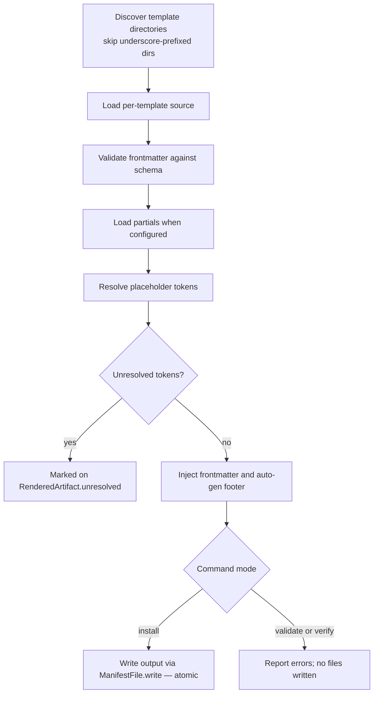

# vstack — design

> Maintained by: **designer** role\
> Last updated: 2026-05-14

## overview

This document is the concrete design baseline for vstack — a `platform` artifact: a
standalone CLI tool and SDK that installs structured role artifacts into a project's
`.github/` directory for use with GitHub Copilot Agent Mode.

It translates the architecture blueprint in `docs/architecture/overview.md` into
implementable interfaces, data schemas, state models, validation rules, and error
contracts. Implementation follows this document; architecture decisions are recorded in
`docs/architecture/adr/`.

Coordinated runs may also use a disposable handoff cache under
`.vstack/memories/session/<RUN_ID>/`. This cache exists only to reduce duplicated
prompt context between delegated stages; it never replaces role-owned artifacts
or `.vstack/vstack.json`.

______________________________________________________________________

## 1. domain model

### 1.1 artifact lifecycle states

An artifact (skill, agent, instruction, prompt, hook) exists in one of these states relative
to the target `.github/` directory:

```text
absent         — not in manifest AND not on disk
untracked      — not in manifest, but a file exists at the expected path
clean          — in manifest; on-disk checksum matches manifest checksum
modified       — in manifest; on-disk checksum differs from manifest checksum
missing        — in manifest; expected file does not exist on disk
managed-legacy — in manifest; checksum absent; file exists but drift cannot be determined
unknown        — state cannot be determined (I/O error)
```

State machine:

```mermaid
stateDiagram-v2
    [*] --> absent     : not installed
    [*] --> untracked  : file exists, not in manifest

    absent    --> clean           : install writes file + records checksum
    absent    --> managed-legacy   : legacy entry promoted (no checksum recorded)
    untracked --> clean            : install --force or --adopt-name
    clean     --> modified         : user edits file
    clean     --> missing          : user deletes file
    clean     --> clean            : install --update rewrites file (same or newer version)
    modified  --> clean            : install --force rewrites file
    missing   --> clean            : install (re)writes file
    clean     --> absent           : uninstall removes file
    modified  --> modified         : uninstall skips (checksum drift; no --force)

    managed-legacy --> clean           : manifest upgrade --backfill (VSTACK-META footer present)
    managed-legacy --> managed-legacy  : manifest upgrade --backfill (no footer; entry unchanged)
    managed-legacy --> clean           : install --force or --force-name rewrites file + records checksum
```

### 1.2 manifest JSON schema

`.vstack/vstack.json` — written by `install`, read by all other commands.

```json
{
  "manifest_version": 2,
  "hash_algorithm": "sha256",
  "vstack_version": "1.3.0",
  "installed_at": "2026-04-26T12:34:56.000000+00:00",
  "artifacts": {
    "skills": [
      {
        "name": "architecture",
        "file": "skills/architecture/SKILL.md",
        "version": "1.0.1",
        "checksum": "a1b2c3...",
        "checksum_algorithm": "sha256"
      }
    ],
    "agents": [],
    "hooks": [],
    "instructions": [],
    "prompts": []
  }
}
```

Top-level field contracts:

| Field              | Type    | Required | Notes                                                         |
| ------------------ | ------- | -------- | ------------------------------------------------------------- |
| `manifest_version` | integer | yes      | Must equal `CURRENT_MANIFEST_VERSION` (2) for most operations |
| `hash_algorithm`   | string  | yes      | Current default: `sha256`                                     |
| `vstack_version`   | string  | yes      | vstack version that last wrote the manifest                   |
| `installed_at`     | string  | yes      | ISO-8601 timestamp of last write                              |
| `artifacts`        | object  | yes      | Dict keyed by manifest type key (`skills`, `agents`, …)       |

Per-artifact entry (`ArtifactEntry`) field contracts:

| Field                | Type   | Required | Notes                                                                                    |
| -------------------- | ------ | -------- | ---------------------------------------------------------------------------------------- |
| `name`               | string | yes      | Canonical artifact name                                                                  |
| `file`               | string | yes      | Relative file path under install root (for example `skills/x/SKILL.md`)                  |
| `version`            | string | no       | Template revision token (current policy: `YYYYMMDDNNN`); may be absent on legacy entries |
| `checksum`           | string | no       | May be absent on legacy entries                                                          |
| `checksum_algorithm` | string | no       | May be absent on legacy entries                                                          |

### 1.3 manifest version gate

`manifest_version` is read before any operation that consumes manifest state. If the
value differs from `CURRENT_MANIFEST_VERSION`, the operation fails with:

```text
ERROR: Legacy manifest schema detected in .vstack/vstack.json.
  Run: vstack manifest upgrade --target <project-root>.
```

`ManifestFile.read(allow_legacy=True)` bypasses this gate — it is called only by
`ManifestCommand` when executing `manifest upgrade`.

______________________________________________________________________

## 2. Python interfaces

### 2.1 manifest domain (`src/vstack/manifest/`)

```python
CURRENT_MANIFEST_VERSION: int = 2


@dataclass
class ArtifactEntry:
  name: str
  file: str
  version: str | None = None
  checksum: str | None = None
  checksum_algorithm: str | None = None


@dataclass
class Manifest:
  vstack_version: str
  installed_at: str
  manifest_version: int = CURRENT_MANIFEST_VERSION
  hash_algorithm: str = CURRENT_HASH_ALGORITHM
  artifacts: dict[str, list[ArtifactEntry]] = field(default_factory=dict)

  def entries_for(self, type_name: str) -> list[ArtifactEntry]: ...
  def names_for(self, type_name: str) -> list[str]: ...
  def files_for(self, type_name: str) -> list[str]: ...
  def to_dict(self) -> dict: ...
  def needs_upgrade(self) -> bool: ...

    @classmethod
  def from_dict(cls, data: dict) -> "Manifest": ...

    def upgraded(self) -> "Manifest": ...
    # Returns a new Manifest at CURRENT_MANIFEST_VERSION.
    # Infers missing checksum_algorithm via _infer_algorithm_for_legacy_entry.

  def with_backfilled_checksums(
    self,
    install_dir: Path,
  ) -> tuple["Manifest", list[str], list[str]]: ...
  # Returns (updated_manifest, backfilled_names, skipped_names).
  # For each entry with checksum=None:
  #   - Reads the on-disk file at install_dir / entry.file.
  #   - Computes SHA-256 and stores it only when the file contains a VSTACK-META footer.
  #   - If the file exists but lacks the footer: entry is unchanged; name added to skipped_names.
  #   - If the file does not exist: silently skipped (entry is already missing).
  # The returned manifest is a new instance; self is not mutated.

  @staticmethod
  def _infer_algorithm(*, entry: dict, fallback_algorithm: str, manifest_version: int) -> str | None: ...

  @staticmethod
  def _infer_algorithm_for_legacy_entry(checksum: str, fallback_algorithm: str) -> str | None: ...


class ManifestFile:
  def __init__(self, parent_dir: Path) -> None: ...
  read_error: str | None

  def read(self, *, allow_legacy: bool = False) -> Manifest | None: ...
  # Returns None for missing/invalid/legacy (unless allow_legacy=True).
  # Stores message in read_error for user-facing diagnostics.

    def write(self, manifest: Manifest) -> None: ...
    # Atomic write: stages to <path>.tmp, then os.replace -> <path>.
    # Never leaves .vstack/vstack.json in a partially-written state on POSIX.

    def exists(self) -> bool: ...
```

### 2.2 generator domain (`src/vstack/artifacts/`)

```python
@dataclass
class ArtifactTypeConfig:
  type_name: str
  templates_dir: str
  output_subdir: str
  output_pattern: str
  add_frontmatter: bool
  artifact_is_dir: bool = False
  partials_subdir: str | None = "_partials"
  template_filename: str = "template.md"
  config_filename: str = "config.yaml"
  auto_gen_footer: bool = False
  placeholders: dict[str, str] = field(default_factory=dict)
  fail_on_unresolved: bool = False
  frontmatter_schema: FrontmatterSchema | None = None
  preserve_multiline_frontmatter: bool = False
  manifest_key: str = ""


@dataclass
class RenderedArtifact:
  name: str
  content: str
  source_path: Path
  frontmatter: dict | None = None
  unresolved: list[str] = field(default_factory=list)


@dataclass
class ArtifactResult:
  artifacts: list[RenderedArtifact]
  unresolved_warnings: list[str]
  verification: ValidationResult

  @property
  def ok(self) -> bool: ...


class GenericArtifactGenerator:
  def __init__(self, type_config: ArtifactTypeConfig, templates_root: Path) -> None: ...

  # Static helpers
  @staticmethod
  def resolve_placeholders(text: str, resolvers: dict[str, str]) -> str: ...
  @staticmethod
  def find_unresolved(text: str) -> list[str]: ...
  @staticmethod
  def parse_generation_metadata(text: str) -> dict[str, str] | None: ...

  # Discovery + loading
  def load_partials(self) -> dict[str, str]: ...
  def find_templates(self) -> list[Path]: ...
  def find_extra_files(self, tmpl_dir: Path) -> list[Path]: ...
  def load_artifact_config(self, tmpl_dir: Path) -> dict: ...

  # Rendering + output
  def render(self, tmpl_dir: Path) -> RenderedArtifact: ...
  def render_all(self) -> list[RenderedArtifact]: ...
  def output_path(self, name: str) -> str: ...
  def install_relative_path(self, name: str) -> str: ...
  def generate(self, output_dir: Path) -> ArtifactResult: ...

  # Validation
  def verify_input(self, expected_names: list[str] | None = None) -> ValidationResult: ...
  def verify_output(self, output_dir: Path, expected_names: list[str] | None = None) -> ValidationResult: ...
```

### 2.3 CLI domain (`src/vstack/cli/`)

```python
class CommandLineInterface:
  def __init__(
    self,
    *,
    parser_cls: type[CommandLineParser] = CommandLineParser,
    service_cls: type[CommandService] = CommandService,
    templates_root,
  ) -> None: ...
  @classmethod
  def resolve_only_for_scope(cls, args: object) -> list[str] | None: ...
  def run(self) -> int: ...
  # Parses argv via argparse and dispatches selected command.
  # Top-level ValueError handling is in src/vstack/main.py.


class CommandService:
    def __init__(
      self,
      templates_root: Path,
      *,
      items_root: str = ARTIFACTS_DOCS_ROOT,
      workflow_stages: list[dict[str, str]] | None = None,
      workflow_mode: str = "agentic",
      hook_default_mode: str = "audit",
      hook_default_log_level: str = "minimal",
      hook_log_retention_days: int = 7,
      hook_log_dir: str = ".vstack/logs",
      ...
    ) -> None: ...

  generators: list[GenericArtifactGenerator]

  def label(self, path: Path) -> str: ...
  # Returns path relative to template root when possible.

    def manifest_for(self, install_dir: Path) -> ManifestFile: ...
    # Returns ManifestFile handle for .vstack/vstack.json in project installs.

    def artifact_control_state(
    self,
    *,
    out_file: Path,
    existing_entry,
    ) -> tuple[str, str]: ...
    # Returns (state, detail_message).
  # state: "managed" | "managed-legacy" | "modified" | "missing"
  #        | "untracked" | "absent" | "unknown"
    # On OSError: returns ("unknown", str(error)) — never raises.

  def gen_for(self, artifact_type: str) -> GenericArtifactGenerator | None: ...


class BaseCommand(ABC):
    @abstractmethod
    def run(
        self,
    *,
    context: CommandContext,
    ) -> int: ...
  # Returns 0 on success, non-zero on errors.
  # CommandContext carries args, install_dir, and only.


COMMAND_CATALOG: dict[str, CommandConfig]
# Declares parser registration and command factories for install/verify/status/...
```

______________________________________________________________________

## 3. frontmatter schemas

The tables below are the authoritative quick-reference for implementers. For full authoring
guidance, field semantics, examples, and template structure, see the dedicated docs:

- Agents → [agents.md](./agents.md)
- Hooks → [hooks.md](./hooks.md)
- Skills → [skills.md](./skills.md)
- Instructions → [instructions.md](./instructions.md)

### 3.1 skill frontmatter (`config.yaml`)

| Field                      | Type   | Required | Constraints                                                                                                  |
| -------------------------- | ------ | -------- | ------------------------------------------------------------------------------------------------------------ |
| `name`                     | string | **yes**  | Lowercase kebab-case; max 64 chars; must match directory name                                                |
| `version`                  | string | **yes**  | Template revision token (`YYYYMMDDNNN`); used for manifest tracking only — not emitted to generated SKILL.md |
| `description`              | string | **yes**  | Max 1024 chars; what the skill does and when to invoke it                                                    |
| `license`                  | string | no       | SPDX identifier                                                                                              |
| `compatibility`            | string | no       | Free text compatibility note                                                                                 |
| `metadata.owner`           | string | no       | —                                                                                                            |
| `metadata.maturity`        | string | no       | `"stable"` \| `"beta"` \| `"experimental"`                                                                   |
| `argument-hint`            | string | no       | Shown after `/skill-name` in chat input                                                                      |
| `user-invocable`           | bool   | no       | Default `true`; `false` hides skill from slash-command menu                                                  |
| `disable-model-invocation` | bool   | no       | Default `false`; `true` prevents Copilot from auto-loading this skill                                        |

### 3.2 agent frontmatter (`config.yaml`)

| Field                      | Type           | Required | Notes                                                                  |
| -------------------------- | -------------- | -------- | ---------------------------------------------------------------------- |
| `name`                     | string         | no       | Overrides filename as picker label                                     |
| `description`              | string         | no       | Placeholder text in chat input                                         |
| `argument-hint`            | string         | no       | Hint text shown after `@agent` in chat                                 |
| `tools`                    | list           | no       | `read`, `search`, `edit`, `execute`, `web`, `vscode`, `todo`, `agent`  |
| `agents`                   | list           | no       | Subagents this agent may invoke; `["*"]` = all                         |
| `model`                    | string or list | no       | Force a specific model or list of models; omit to allow user selection |
| `user-invocable`           | bool           | no       | Default `true`                                                         |
| `disable-model-invocation` | bool           | no       | Default `false`; `true` prevents other agents calling this one         |
| `target`                   | string         | no       | `"vscode"` (default) or `"github-copilot"`                             |
| `handoffs`                 | object-list    | no       | Sequential workflow handoff steps                                      |
| `mcp-servers`              | raw            | no       | MCP server config — `github-copilot` target only                       |
| `hooks`                    | raw            | no       | Chat hooks (preview feature)                                           |
| `metadata`                 | raw            | no       | String key/value annotations — `github-copilot` target only            |
| `version`                  | string         | no       | **Internal only — never emitted.** vstack change-tracking only         |

### 3.3 instruction frontmatter (`config.yaml`)

| Field         | Type   | Required | Notes                                     |
| ------------- | ------ | -------- | ----------------------------------------- |
| `name`        | string | **yes**  | Matches directory name; kebab-case        |
| `description` | string | **yes**  | When this instruction applies             |
| `applyTo`     | string | no       | Glob pattern e.g. `"**/*.py"` or `"**/*"` |

### 3.4 prompt frontmatter (`config.yaml`)

| Field         | Type   | Required | Notes                               |
| ------------- | ------ | -------- | ----------------------------------- |
| `name`        | string | **yes**  | Matches directory name; kebab-case  |
| `description` | string | **yes**  | What this prompt does               |
| `mode`        | string | no       | `"ask"` \| `"edit"` \| `"generate"` |

______________________________________________________________________

## 4. placeholder resolver

Placeholders use `{{TOKEN}}` syntax. Resolution is literal string substitution — no
logic, no loops. Unresolved tokens are errors in `validate` and in output verification
for types with `fail_on_unresolved=true`; install logs unresolved tokens as warnings.

Partials live in `src/vstack/_templates/skills/_partials/*.md`. File stem is converted
from lowercase-kebab to `UPPER_SNAKE` to form the token:
`skill-context.md` → `{{SKILL_CONTEXT}}`.

| Token                         | Source file                  | Used by                           |
| ----------------------------- | ---------------------------- | --------------------------------- |
| `{{SKILL_CONTEXT}}`           | `skill-context.md`           | All skills — shared opening block |
| `{{BASE_BRANCH}}`             | `base-branch.md`             | Skills that reference git diff    |
| `{{RUN_TESTS}}`               | `run-tests.md`               | Skills that run tests             |
| `{{OBSERVABILITY_CHECKLIST}}` | `observability-checklist.md` | `verify`, `architecture`          |

**Resolution rules:**

1. Load all partial files for the artifact type (skills only).
1. For each partial, substitute all occurrences of `{{STEM_AS_UPPER_SNAKE}}` in the
   template body.
1. After all substitutions, scan for any remaining `{{...}}` patterns.
1. Remaining unresolved tokens are attached to `RenderedArtifact.unresolved` and are
   reported by `validate`, `install`, and `verify` flows.

______________________________________________________________________

## 5. auto-gen footer

Every generated artifact ends with this block when `auto_gen_footer=True`:

```text
<!-- AUTO-GENERATED — maintained by vstack, do not edit directly -->
<!-- VSTACK-META: {"artifact_name":"…","artifact_type":"…","artifact_version":"…","generator":"vstack","vstack_version":"…"} -->
```

- Human-readable line: constant in `src/vstack/artifacts/constants.py`
- Machine-readable `VSTACK-META` line: emitted by `GenericArtifactGenerator._build_footer`
- Markdown artifact types (`skill`, `agent`, `instruction`, `prompt`) use
  `auto_gen_footer=True`; JSON hooks use `auto_gen_footer=False`

______________________________________________________________________

## 6. CLI command contracts

```bash
vstack [--version] [--help] <command> [options]
```

Exit codes across all commands:

| Code | Meaning                                                                     |
| ---- | --------------------------------------------------------------------------- |
| `0`  | Success; all requested operations completed without conflict                |
| `1`  | Operational failure: validation error, conflict, schema mismatch, I/O error |
| `2`  | Invalid argument syntax (raised by `argparse`, not vstack)                  |

Error and warning output is command-specific:

```text
stdout: status summaries, install/uninstall progress, verify checks
stderr: parser errors and selected command failures (for example legacy manifest read errors)
```

`--no-color` suppresses ANSI codes.

### `validate`

Render all templates in memory; report unresolved tokens. No files written.

```bash
vstack validate [--only <type>...]
```

| Flag               | Description                                              |
| ------------------ | -------------------------------------------------------- |
| `--only <type>...` | Restrict to specific artifact types, e.g. `--only skill` |

Output: one line per error. Exit 0 = all valid, exit 1 = one or more errors.

### `verify`

Validate source templates and/or installed output (schema, tokens, presence, checksum
drift).

```bash
vstack verify [--target <dir>] [--global] [--no-source] [--no-output]
```

Checks in order:

1. Source template schema validation (unless `--no-source`)
1. Source template token resolution (unless `--no-source`)
1. Output file presence against manifest (unless `--no-output`)
1. Checksum drift against manifest (unless `--no-output`)

### `status`

Read-only artifact state report. No files written.

```bash
vstack status [--target <dir>] [--global] [--only <type>]
              [--format text|json|yaml] [--verbose] [--no-color]
```

`text` output (default) contains per-type summary lines and optional entry lines:

```text
skill:architecture    clean
skill:debug           modified  (checksum drift)
agent:engineer        missing
```

`json` output shape:

```json
{
  "ok": true,
  "install_dir": "/path/to/.github",
  "types": [
    {
      "type": "skill",
      "counts": {
        "managed": 27,
        "managed_legacy": 0,
        "modified": 0,
        "missing": 0,
        "unknown": 0,
        "untracked": 0,
        "absent": 0
      },
      "issues": 0,
      "warnings": 0,
      "entries": []
    }
  ],
  "summary": {
    "issues": 0,
    "warnings": 0,
    "types_checked": 1
  }
}
```

Exit 0 = all artifacts clean; exit 1 = any artifact not clean.

### `install`

Write artifact files to the target directory and record checksums in `.vstack/vstack.json`.

```bash
vstack install [--target <dir>] [--global] [--only <type>...]
               [--force] [--force-name <name>] [--adopt-name <name>]
               [--update] [--dry-run]
```

Install decision matrix per artifact:

| File state | default | `--force` | `--update` | `--force-name <n>` | `--adopt-name <n>` |
| ---------- | ------- | --------- | ---------- | ------------------ | ------------------ |
| absent     | write ✓ | write ✓   | write ✓    | write ✓            | write ✓            |
| untracked  | skip    | overwrite | skip       | overwrite (named)  | adopt (named)      |
| clean      | write ✓ | write ✓   | write ✓    | overwrite (named)  | —                  |
| modified   | skip    | overwrite | skip       | overwrite (named)  | —                  |
| missing    | write ✓ | write ✓   | write ✓    | write ✓            | —                  |

`--force` and `--update` are mutually exclusive.
`--dry-run` prints what would change without writing any files; exit code reflects what
would have happened.

### `uninstall`

Remove artifacts recorded in `.vstack/vstack.json`. Modified files are preserved by default.

```bash
vstack uninstall [--target <dir>] [--global] [--only <type>...]
                 [--force] [--force-name <name>]
```

Removal rules:

- `clean` → deleted
- `modified` → skipped (unless `--force` or `--force-name`)
- `missing` → entry removed from manifest, no file operation

### `manifest status` / `manifest verify`

Same contracts as top-level `status` and `verify`, scoped to manifest-tracked artifacts.

### `manifest upgrade`

Migrate legacy `.vstack/vstack.json` (version < 2) to `manifest_version: 2`.

```bash
vstack manifest upgrade [--target <dir>] [--backfill]
```

This is the only command that calls `ManifestFile.read(allow_legacy=True)`.

| Flag         | Description                                                                                                                          |
| ------------ | ------------------------------------------------------------------------------------------------------------------------------------ |
| `--backfill` | Compute and store SHA-256 checksums for tracked entries with no checksum, gated by `VSTACK-META` identity check. Opt-in; no default. |

Without `--backfill`, `manifest upgrade` performs a schema-only migration: `manifest_version` is promoted to `2`, `hash_algorithm` is set, and missing `checksum_algorithm` values are inferred for entries that already carry a checksum. No checksums are computed or written.

With `--backfill`, the call sequence after schema migration is:

1. `manifest.upgraded()` — schema migration (always).
1. `manifest.with_backfilled_checksums(install_dir)` — checksum backfill (only when `--backfill` is set).
1. `manifest_file.write(result)` — atomic write of the final manifest (ADR-016).

`--backfill` is a one-way operation: current on-disk content becomes the canonical checksum baseline for backfilled entries. Entries whose files contain the `VSTACK-META` footer are promoted from `managed-legacy` to `clean`. Entries whose files exist but lack the footer remain `managed-legacy`; a warning is emitted for each. Entries whose files are absent are silently skipped.

| Exit code | Meaning                                                                    |
| --------- | -------------------------------------------------------------------------- |
| `0`       | Manifest upgraded (and backfilled if `--backfill`; partial backfill is OK) |
| `1`       | Manifest missing, unreadable, or parse error                               |

______________________________________________________________________

## 7. error contract

### 7.1 exception table

| Condition                          | Runtime behavior                                                            |
| ---------------------------------- | --------------------------------------------------------------------------- |
| Missing `.vstack/vstack.json`      | `ManifestFile.read()` returns `None`; `read_error` is `None`                |
| Invalid `.vstack/vstack.json` JSON | `ManifestFile.read()` returns `None`; `read_error` = invalid format message |
| Legacy schema on read              | `ManifestFile.read()` returns `None`; `read_error` = upgrade guidance       |
| Unknown artifact type lookup       | `CommandService.gen_for()` returns `None`                                   |
| File I/O during state checks       | `artifact_control_state()` returns `("unknown", message)`                   |
| CLI scope validation failures      | `ValueError` raised in scope resolver; handled in `src/vstack/main.py`      |

Top-level error mapping for CLI process exit lives in `src/vstack/main.py`.

### 7.2 validation errors vs operational errors

- **Validation results** are typically collected in `ValidationResult` / `CheckMessage`
  and rendered at command level.
- **Operational failures** are reported either through return codes and stderr output or
  via `read_error` diagnostics on manifest reads.

______________________________________________________________________

## 8. generator execution flow



______________________________________________________________________

## 9. CLI command dispatch flow

```mermaid
flowchart TD
  A[sys.argv] --> B[CommandLineParser.build]
  B --> C[args = parser.parse_args]
  C --> D[CommandService created with templates_root]
  D --> E[COMMAND_CATALOG → name→BaseCommand map]
  C --> F[resolve install_dir and only scope]
  E --> G[command.run&#40;&#42;, context=CommandContext&#40;args, install_dir, only&#41;&#41;]
  F --> G
  G --> H[BaseCommand subclass executes]
  H --> I[service.generators / service.label / service.manifest_for / service.artifact_control_state]
```



______________________________________________________________________

## 10. CLI component table

| Module         | Class / function           | Responsibility                                                                          |
| -------------- | -------------------------- | --------------------------------------------------------------------------------------- |
| `interface.py` | `CommandLineInterface`     | Facade: parser construction, service creation, target/scope resolution, dispatch        |
| `catalog.py`   | `COMMAND_CATALOG`          | Maps command names to parser metadata and `BaseCommand` factories                       |
| `service.py`   | `CommandService`           | Shared coordinator: generators, path labelling, manifest access, artifact state         |
| `base.py`      | `BaseCommand`              | ABC: all handlers implement `run(*, context: CommandContext) → int`                     |
| `install.py`   | `InstallCommand`           | Install flow: per-artifact write, checksum recording, dry-run, force/adopt/update modes |
| `verify.py`    | `VerifyCommand`            | Source + output verification: schema, tokens, presence, checksum drift                  |
| `status.py`    | `StatusCommand`            | Read-only report across text, JSON, and YAML output formats                             |
| `uninstall.py` | `UninstallCommand`         | Remove tracked artifacts; preserve modified files unless explicitly forced              |
| `validate.py`  | `ValidateCommand`          | In-memory template render and token resolution check; no files written                  |
| `manifest.py`  | `ManifestCommand`          | Dispatch `manifest status / verify / upgrade` subcommands                               |
| `parser.py`    | `CommandLineParser`        | Build and configure the `argparse` argument tree                                        |
| `helpers.py`   | Module-level functions     | Shared install/uninstall helpers: name normalization, manifest preservation utilities   |
| `constants.py` | `Colors`, `KNOWN_TYPES`, … | ANSI codes, artifact-type registry, canonical name lists, expected-name guards          |

______________________________________________________________________

## 11. design principles

1. **Minimal runtime dependencies.** Runtime uses Python >= 3.11 stdlib plus one external dependency: `pyyaml>=6.0`.
1. **Templates are source of truth.** No generated files live in `src/vstack/_templates/`.
1. **Flat resolver.** No template inheritance, no conditionals — literal substitution only.
1. **Install-time output.** Generated artifacts belong under `.github/`; never committed to the vstack source repo.
1. **Idempotent.** Running the generator twice with the same `--target` produces identical output.
1. **Conservative by default.** Untracked and modified files are never overwritten without an explicit escape-hatch flag.
1. **Atomic manifest writes.** `.vstack/vstack.json` is never left in a partially-written state (staged via `.tmp` + `os.replace`).
1. **Explicit upgrade gate.** Legacy manifest schemas are rejected with an actionable hint; never silently migrated.
