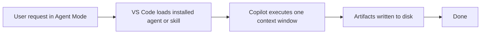
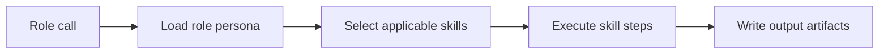

# vstack — workflow

> Maintained by: **designer** role\
> Last updated: 2026-04-21

## overview

This document describes how vstack workflows execute today (single-call execution)
and a possible future orchestrated role pipeline.

For a precise GitHub Actions CI/CD and release pipeline specification, see
`docs/design/cicd.md`.

It also documents the repository-level GitHub Actions automation used for quality,
security, commit policy, and releases.

For authoring boundaries between reusable guidance mechanisms:

- [instructions.md](./instructions.md)
- [skills.md](./skills.md)
- [013-instructions-vs-skills-boundary.md](../architecture/adr/013-instructions-vs-skills-boundary.md)

______________________________________________________________________

## repository automation (GitHub Actions)

The repository uses a split workflow model so each automation concern is isolated
and easy to reason about.

| Workflow                          | Trigger                                               | Responsibility                                                                   |
| --------------------------------- | ----------------------------------------------------- | -------------------------------------------------------------------------------- |
| `.github/workflows/commit.yml`    | Push to non-main branches and pull requests to `main` | Commit policy and lint/typecheck gate (branch-name policy on push).              |
| `.github/workflows/check.yml`     | Push to non-main branches and pull requests to `main` | Single-version unit tests (py3.11) for fast feedback.                            |
| `.github/workflows/verify.yml`    | Pull request to `main`                                | Cross-version test matrix (py3.11–3.14) and artifact install/verify flow.        |
| `.github/workflows/security.yml`  | Pull request to `main`                                | Dependency vulnerability audit and secret scan.                                  |
| `.github/workflows/automerge.yml` | Pull request target to `main`                         | Dependabot safe auto-merge policy for eligible updates.                          |
| `.github/workflows/release.yml`   | Push to `main`                                        | Run release-please to maintain release PRs and create tags/releases when merged. |
| `.github/workflows/publish.yml`   | GitHub release published                              | Build package artifacts from the release tag and publish to PyPI.                |

### commit policy enforcement model

Commit policy is defined in `cchk.toml` and enforced by `commit-check`:

1. `.github/workflows/commit.yml` runs `commit-check/commit-check-action@v2` on branch pushes and PRs.
1. Local hooks in `.pre-commit-config.yaml` run the same checks at `commit-msg` and `pre-push` stages.

Additional commit workflow policy:

- Maximum commit subject length is 100 characters.
- Branch names are validated against Conventional Branch format (`type/description`).
- Allowed branch types: `feature`, `bugfix`, `hotfix`, `release`, `chore`, `feat`, `fix`, `docs`, `refactor`, `perf`, `test`, `ci`, `build`, `style`, `opt`, `patch`, `dependabot`.
- Commit scopes are not hard-enforced by CI; scope naming is guidance-level in documentation.

This keeps CI and local checks aligned through one policy source of truth.

### release versioning model

`release.yml` uses release-please as the source of truth for version calculation,
CHANGELOG updates, and GitHub release notes based on conventional commits.

`publish.yml` only builds and publishes artifacts for already created release tags.

Repository tag policy remains strict `X.Y.Z` (no `v` prefix).

______________________________________________________________________

## current execution model — single-call

The user invokes a role or skill from Copilot Agent Mode. Copilot loads the
relevant installed artifact and executes the full workflow in a single model call.



**Characteristics:**

- Fast, low friction
- All context fits in one call
- Limited to skills the user explicitly invokes
- No automatic hand-off between roles

______________________________________________________________________

## possible future model — orchestrated role pipeline

Each role becomes a separate model call. Output artifacts from one role become
the input context for the next.

```mermaid
flowchart TD
  P[product<br>vision.md<br>requirements.md<br>roadmap.md] --> A[architect<br>architecture.md<br>adr/*.md]
  A --> D[designer<br>design.md]
  D --> G1{User gate 1<br>requirements and design}
  D -. backend-only path .-> G1
  G1 --> E[engineer<br>code and unit tests]
  E --> T[tester<br>test-report.md<br>security-report.md<br>performance-baseline.md]
  T --> G2{User gate 2<br>pre-prod sign-off}
  G2 --> G3{User gate 3<br>final merge approval}
  G3 --> R[release<br>releases/{date}.md<br>CHANGELOG.md<br>PR]
```

**Characteristics:**

- Each role is scoped to its domain
- Each role reads its inputs from disk (artifacts from upstream roles)
- User gates are explicit pauses for human review

______________________________________________________________________

## artifact hand-off protocol

Roles communicate through files on disk. Each role:

1. Reads upstream artifacts (defined by its role contract)
1. Executes its workflow
1. Writes its output artifacts

Neither roles nor skills maintain in-memory state between calls.
If an upstream artifact is missing, the role reports what it needs before proceeding.

### required reads per role

| Role      | Must read before starting                                                                                                   |
| --------- | --------------------------------------------------------------------------------------------------------------------------- |
| product   | (none — initiates pipeline)                                                                                                 |
| architect | `docs/product/vision.md`, `docs/product/requirements.md`                                                                    |
| designer  | `docs/product/vision.md`, `docs/product/requirements.md`, `docs/architecture/architecture.md`, `docs/architecture/adr/*.md` |
| engineer  | `docs/product/requirements.md`, `docs/design/design.md`, `docs/architecture/architecture.md`, `docs/architecture/adr/*.md`  |
| tester    | `docs/product/requirements.md`, relevant source files                                                                       |
| release   | `docs/test-report.md`, `docs/security-report.md`, user sign-off                                                             |

______________________________________________________________________

## user gate moments

There are **4 explicit user gate moments** where the pipeline pauses for human input:

| Gate                         | When                                                         | Who signs off |
| ---------------------------- | ------------------------------------------------------------ | ------------- |
| **1. Requirements approval** | After product writes requirements.md                         | User          |
| **2. Design approval**       | After architect writes architecture + designer writes design | User          |
| **3. Pre-prod sign-off**     | After tester reports are ready                               | User          |
| **4. Merge approval**        | Before release creates PR                                    | User          |

Gates prevent automated pipelines from deploying without human review.
In the current model, the user implicitly gates by choosing which skill to invoke next.
In the orchestrated model, the orchestrator pauses and waits for explicit confirmation.

______________________________________________________________________

## skill execution within a role

Skills are the HOW inside a role call.



A role may use multiple skills in sequence within one model call. For example,
the architect role uses the `adr` skill to write decision records and the
`architecture` skill to produce the architecture document.

## authoring decision rule

Use this rule when deciding where reusable guidance belongs:

1. If it is a baseline rule or standard, put it in instructions.
1. If it is a task workflow or method, put it in skills.

Instructions are policy. Skills are procedure.

______________________________________________________________________

## forward compatibility

The move from the current model to an orchestrated role pipeline was designed to require minimal refactoring:

- All artifacts are files — no in-memory state to migrate
- Skill steps are already self-contained and idempotent
- Role boundaries are already defined (see `docs/architecture/adr/009-role-model.md`)
- Pipeline ordering is documented here and in `docs/architecture/adr/010-artifact-flow.md`

See `docs/product/roadmap.md` for the optional orchestration milestone.
