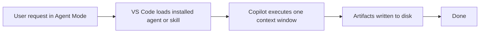
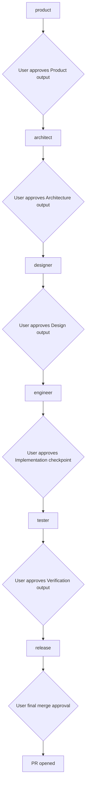
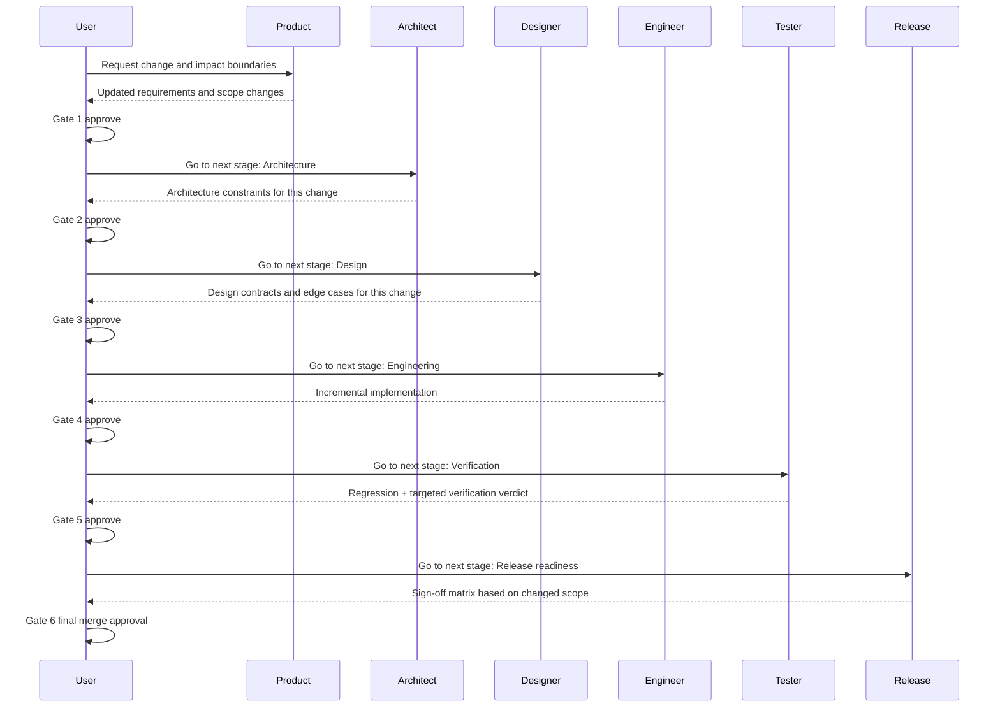
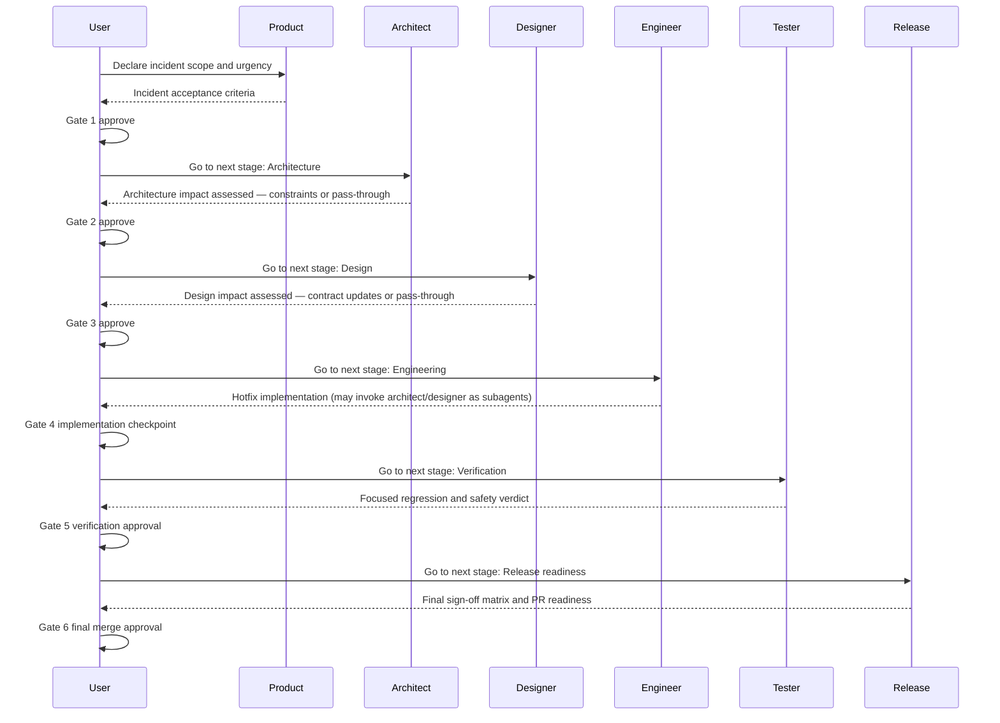
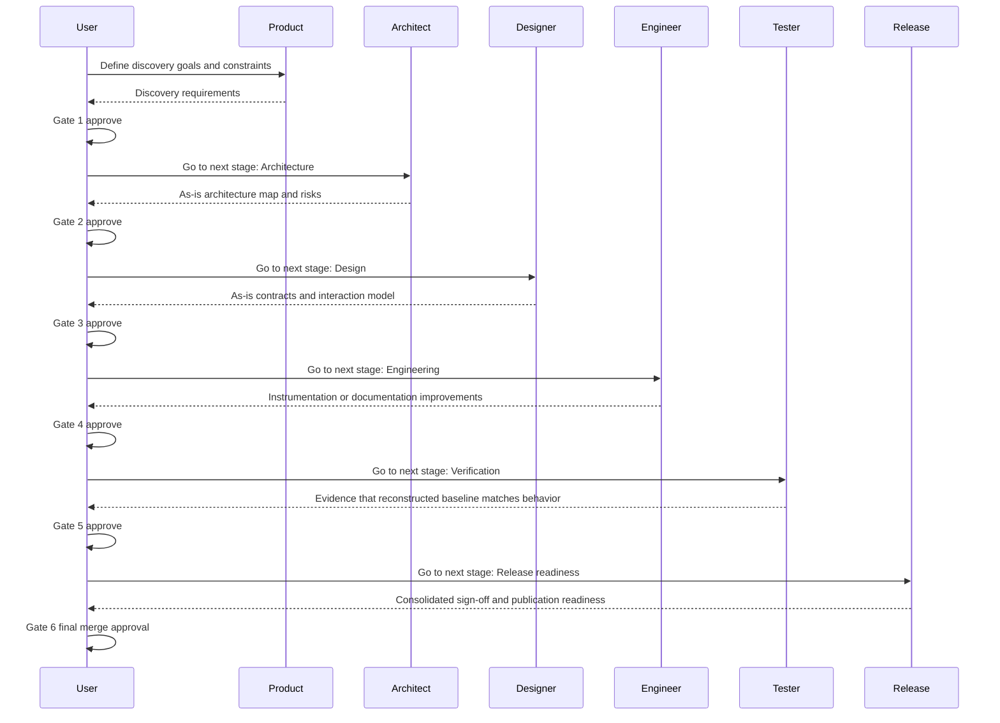
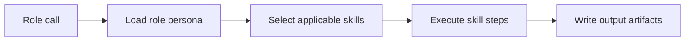

# vstack — workflow

> Maintained by: **designer** role\
> Last updated: 2026-05-03

## overview

This document describes how vstack workflows execute today (single-call execution)
and the target operating model: a stage-gated role pipeline.

For the full GitHub Actions CI/CD and release pipeline specification, including the
human and Dependabot sequences with step-by-step checklists, see `docs/design/cicd.md`.

For authoring boundaries between reusable guidance mechanisms:

- [instructions.md](./instructions.md)
- [skills.md](./skills.md)
- [013-instructions-vs-skills-boundary.md](../architecture/adr/013-instructions-vs-skills-boundary.md)

______________________________________________________________________

## repository automation (GitHub Actions)

The repository uses a split workflow model so each automation concern is isolated
and easy to reason about.

| Workflow                          | Trigger                                               | Responsibility                                                                   |
| --------------------------------- | ----------------------------------------------------- | -------------------------------------------------------------------------------- |
| `.github/workflows/commit.yml`    | Push to non-main branches and pull requests to `main` | Commit/branch policy and lint/typecheck gate.                                    |
| `.github/workflows/check.yml`     | Push to non-main branches and pull requests to `main` | Single-version unit tests (py3.11) for fast feedback.                            |
| `.github/workflows/verify.yml`    | Pull request to `main`                                | Cross-version test matrix (py3.11–3.14) and artifact install/verify flow.        |
| `.github/workflows/security.yml`  | Pull request to `main`                                | Dependency vulnerability audit and secret scan.                                  |
| `.github/workflows/automerge.yml` | Pull request target to `main`                         | Dependabot safe auto-merge policy for eligible updates.                          |
| `.github/workflows/release.yml`   | Push to `main`                                        | Run release-please to maintain release PRs and create tags/releases when merged. |
| `.github/workflows/publish.yml`   | GitHub release published                              | Build package artifacts from the release tag and publish to PyPI.                |

For trigger conditions, execution sequences, commit policy details, and release versioning
rules, see `docs/design/cicd.md`.

______________________________________________________________________

## current execution model — single-call

The user invokes a role or skill from Copilot Agent Mode. Copilot loads the
relevant installed artifact and executes the full workflow in a single model call.

**Characteristics:**

- Fast, low friction
- All context fits in one call
- Limited to skills the user explicitly invokes
- No automatic hand-off between roles

______________________________________________________________________

## stage-gated role pipeline (target operating model)

Each role is a separate model call. Output artifacts from one role become the
input context for the next role, and progression only happens after explicit
user approval.

**Characteristics:**

- Each role is scoped to its domain
- Each role reads its inputs from disk (artifacts from upstream roles)
- User approval is required after each stage output
- Handoffs are only for happy-path continuation

### flow principles

1. **User-gated progression:** every stage output is reviewed by the user before the next stage starts.
1. **All roles in every pipeline:** every use case runs through all six roles. Roles that are not affected by a change assess impact and pass through explicitly rather than being skipped.
1. **Happy-path handoffs only:** handoff buttons are limited to one forward action named `Go to next stage: <stage>`.
1. **No automatic backtracking:** non-happy paths (`NOK`, blockers, missing artifacts) do not use handoff buttons; the user decides the next action.
1. **Subagent delegation mid-role:** engineer may invoke architect or designer as subagents to clarify constraints or contracts during implementation without going back to a full gate cycle.
1. **Release owns sign-off orchestration:** release remains the final orchestrator and gathers `OK`/`NOK` review outcomes from prior role perspectives.
1. **Deterministic sign-off contract:** every sign-off review returns the same structure: verdict, reviewed scope, gaps, impact, and required next action.

______________________________________________________________________

## artifact hand-off protocol

Roles communicate through files on disk. Each role:

1. Reads upstream artifacts (defined by its role contract)
1. Executes its workflow
1. Writes its output artifacts

Neither roles nor skills maintain in-memory state between calls.
If an upstream artifact is missing, the role reports what it needs before proceeding.

### required reads per role

Default artifact paths are defined in ADR-021 and configured per-project in each
agent's `config.yaml`.

- **`product`** — *(none — initiates pipeline)*
- **`architect`** — product artifacts
- **`designer`** — product artifacts, architecture artifacts
- **`engineer`** — product artifacts, architecture artifacts, design artifacts
- **`tester`** — architecture artifacts, design artifacts, relevant source files
- **`release`** — product artifacts, architecture artifacts, design artifacts, tester reports, user sign-off

______________________________________________________________________

## user gate moments

There are **6 explicit user gate moments** where the pipeline pauses for human input:

| Gate                             | When                                  | Who signs off |
| -------------------------------- | ------------------------------------- | ------------- |
| **1. Product approval**          | After product updates scope artifacts | User          |
| **2. Architecture approval**     | After architect updates architecture  | User          |
| **3. Design approval**           | After designer updates design         | User          |
| **4. Implementation checkpoint** | After engineer implements changes     | User          |
| **5. Verification approval**     | After tester reports are ready        | User          |
| **6. Final merge approval**      | After release readiness is complete   | User          |

Gates prevent automated pipelines from deploying without human review.
In the current model, the user implicitly gates by choosing which skill to invoke next.
In the orchestrated model, the orchestrator pauses and waits for explicit confirmation.

### handoff button convention

For role UIs that expose handoffs, use exactly one continuation button per stage:

- `Go to next stage: Architecture`
- `Go to next stage: Design`
- `Go to next stage: Engineering`
- `Go to next stage: Verification`
- `Go to next stage: Release readiness`

Release is the final role stage; opening the PR is a release action, not a
handoff to another role.

Do not add back, side, or escalation handoff buttons. Those paths remain
explicit user decisions.

______________________________________________________________________

## use-case flow examples

The following examples apply the same stage-gated model to common scenarios.

### use case 1 — new project

### use case 2 — update existing project (change)

### use case 3 — incident fix

All roles remain in the pipeline. Architect and designer each assess whether
their domain is affected and either contribute or pass through explicitly.
Engineer can invoke architect or designer as subagents to clarify constraints
or contracts mid-implementation.

### use case 4 — reverse engineering and baseline reconstruction

______________________________________________________________________

## skill execution within a role

Skills are the HOW inside a role call.

A role may use multiple skills in sequence within one model call. For example,
the architect role uses the `adr` skill to write decision records and the
`architecture` skill to produce the architecture document.

## authoring decision rule

Use this rule when deciding where reusable guidance belongs:

1. If it is a baseline rule or standard, put it in instructions.
1. If it is a task workflow or method, put it in skills.

Instructions are policy. Skills are procedure.

______________________________________________________________________

## forward compatibility

The move from the current model to an orchestrated role pipeline was designed to require minimal refactoring:

- All artifacts are files — no in-memory state to migrate
- Skill steps are already self-contained and idempotent
- Role boundaries are already defined (see `docs/architecture/adr/009-role-model.md`)
- Pipeline ordering is documented here and in `docs/architecture/adr/010-artifact-flow.md`

See `docs/product/roadmap.md` for the optional orchestration milestone.
