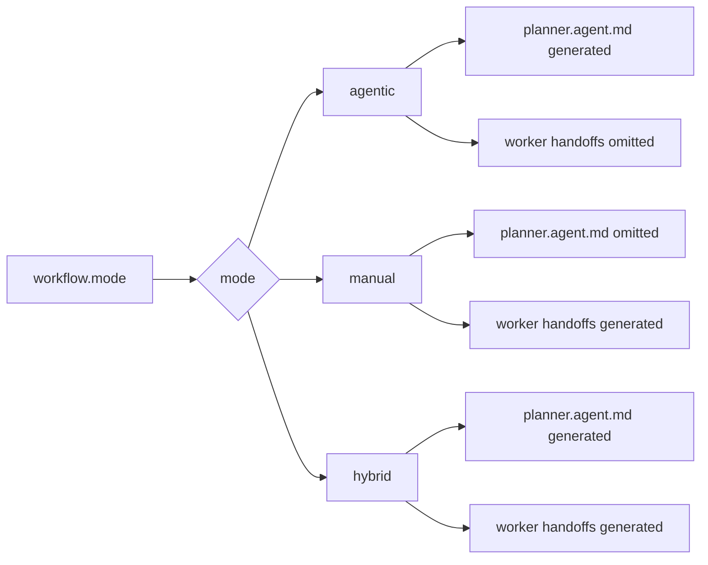
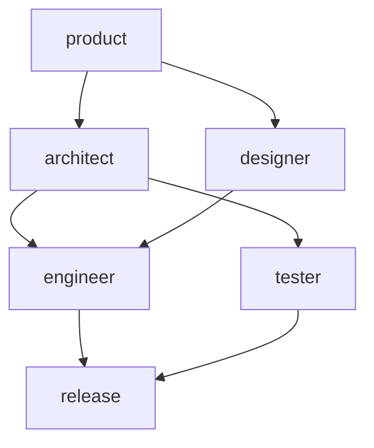
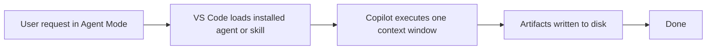
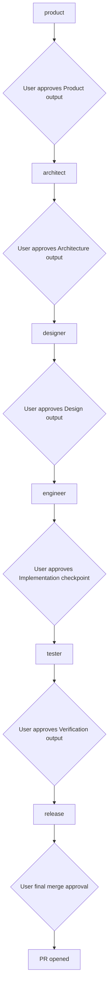
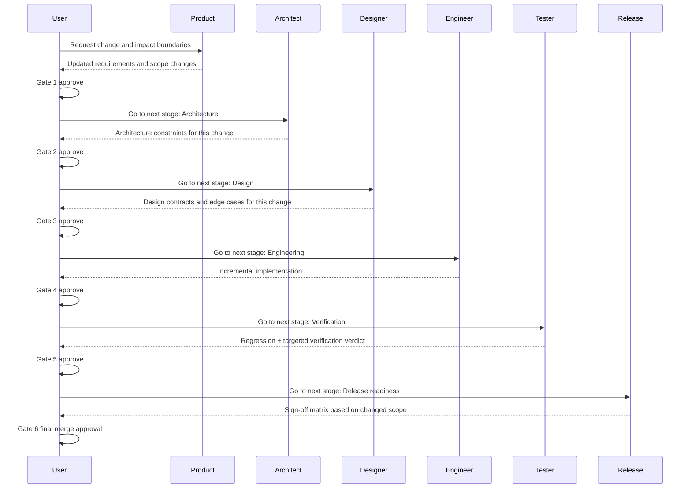
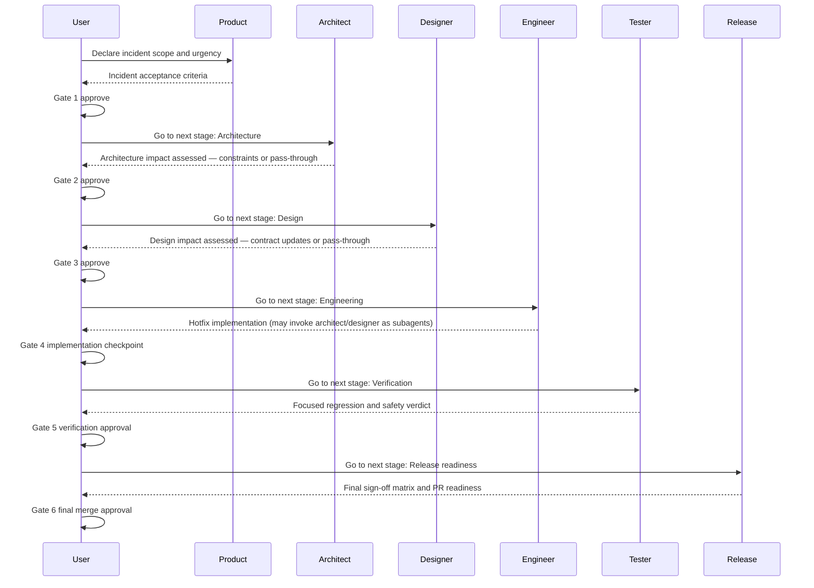
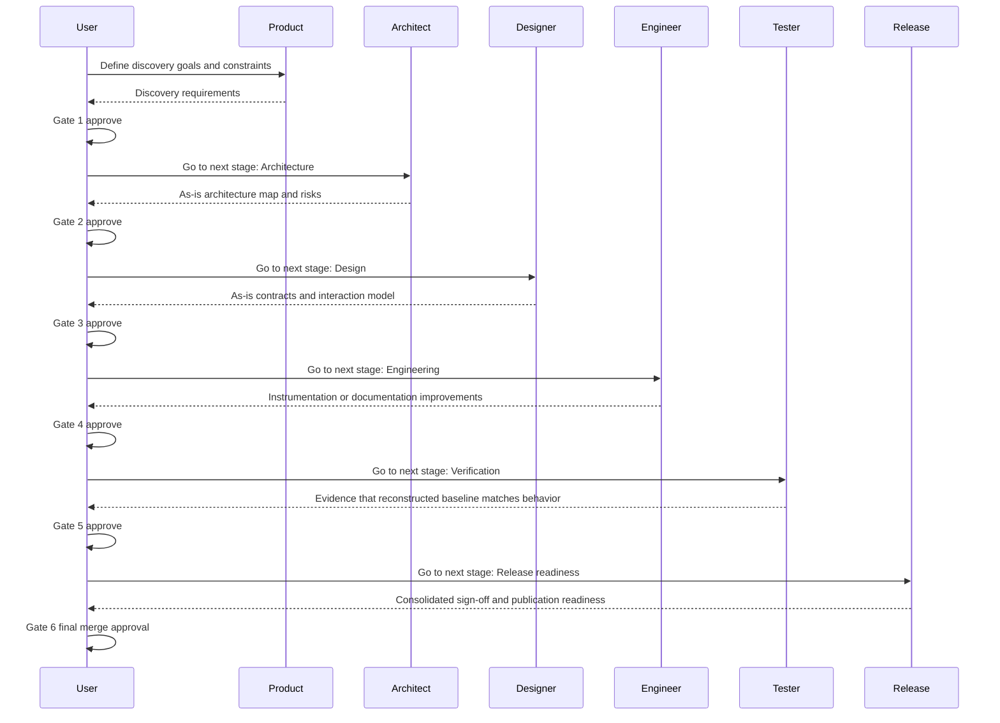
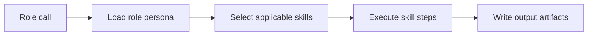

# vstack — workflow

> Maintained by: **designer** role\
> Last updated: 2026-05-12

## overview

This document describes how vstack workflows execute today (single-call execution)
and the target operating model: a stage-gated role pipeline.

For the full GitHub Actions CI/CD and release pipeline specification, including the
human and Dependabot sequences with step-by-step checklists, see `docs/design/cicd.md`.

For authoring boundaries between reusable guidance mechanisms:

- [instructions.md](./instructions.md)
- [skills.md](./skills.md)
- [013-instructions-vs-skills-boundary.md](../architecture/adr/013-instructions-vs-skills-boundary.md)
- [028-dag-dependency-semantics.md](../architecture/adr/028-dag-dependency-semantics.md)

______________________________________________________________________

## workflow modes

Workflow mode is configured in `.vstack/config.yaml` at `workflow.mode`.

Default mode:

- `agentic`

Mode semantics:

| Mode      | Primary progression model                      | Planner generated | Worker handoff buttons |
| --------- | ---------------------------------------------- | ----------------- | ---------------------- |
| `agentic` | Planner coordinates stage execution            | yes               | no                     |
| `manual`  | User manually advances between role stages     | no                | yes                    |
| `hybrid`  | Both planner orchestration and manual handoffs | yes               | yes                    |

Execution semantics:

- `workflow.stages` order is the canonical progression order.
- `depends_on` is optional per stage.
- When `depends_on` is omitted, the stage implicitly depends on the previous stage.
- When `depends_on` is set, it is the source of truth for stage prerequisites.
- A stage becomes ready only when all dependencies are complete.
- Multiple ready stages can be orchestrated in parallel by the planner in `agentic` mode.

Dependency semantics (`depends_on`):

- `depends_on` must reference existing stage role names.
- `depends_on` cannot include the stage role itself.
- The resulting stage graph must be acyclic.
- Empty or blank dependency entries are ignored.

Backward compatibility:

- Existing configs without `depends_on` continue to run in the same sequential order.
- DAG behavior is opt-in by adding `depends_on` explicitly.

Handoff target semantics:

- `handoffs.prompt` defines the transition prompt text.
- If `handoffs.agent` is omitted, the target defaults to the primary downstream dependent role.
- `handoffs.agent` may be set explicitly to override default targeting in `manual`/`hybrid`.
- In `agentic`, worker handoff buttons are omitted; planner controls progression.

For branching DAGs:

- When a stage has no explicit handoff entries and has multiple downstream dependents,
  fallback handoffs are emitted for each downstream dependent in configured stage order.
- When a stage has explicit handoff entries with no `agent`, the target defaults to the
  first downstream dependent in configured stage order.

Hybrid caution:

- Hybrid intentionally exposes two progression paths in the UI.
- Users can trigger stage changes via planner orchestration and via role handoff buttons.
- If your team wants one strict path, use `agentic` instead of `hybrid`.

______________________________________________________________________

## multi-agentic coordination model

vstack uses a **DAG (directed acyclic graph)** as its coordination model for stage
dependencies. This section describes why, and how alternative models compare.

### models compared

| Property                                  | Sequential | DAG | Event-driven | Orchestration tree |
| ----------------------------------------- | ---------- | --- | ------------ | ------------------ |
| Explicit dependency declaration           | No         | Yes | No           | Partial            |
| Cycle detection at install time           | N/A        | Yes | No (runtime) | Partial            |
| Compatible with VS Code chat-turn model   | Yes        | Yes | No           | Partial            |
| Backward compatible with existing configs | Yes        | Yes | No           | No                 |
| Enables future parallel scheduling        | No         | Yes | Yes          | Yes                |
| Debuggable by reading config alone        | Yes        | Yes | No           | Partial            |
| Supports role-variant invocation          | No         | No  | Yes          | Yes                |

### why not event-driven

In an event-driven model, agents react to artifact changes — the engineer would start
when `architecture.md` appears on disk; the tester would start when new code is committed.

This model does not fit VS Code Agent Mode for two reasons:

1. **No ambient trigger mechanism.** Agents are invoked explicitly in chat turns. There
   is no file-watcher or event bus. The engineer has no signal to start building; the tester
   has no signal to start testing. Coordination collapses back to the planner invoking agents
   explicitly — which is the DAG model in practice.

1. **Debugging requires inspecting artifact state.** "Why did the tester not start?" cannot
   be answered by reading a config file; it requires tracing which artifacts were written and
   which triggers fired. DAG config answers this directly.

Event-driven coordination remains a useful pattern for *external integrations* — for example,
triggering a vstack stage from a CI artifact upload event — but it is not the right default
for the VS Code-native execution model.

### why not orchestration tree

In an orchestration tree, a root planner spawns sub-planners, which in turn spawn leaf
agents. This enables recursive decomposition: a `tester-planner` could spawn
`tester(security)`, `tester(performance)`, and `tester(functional)` as separate agents.

This is architecturally possible but not adopted as the primary model because:

1. Each sub-agent receives only a slice of the full project context. Deeper trees lose
   context rapidly and may produce incoherent outputs.
1. Cost and latency scale with tree depth.
1. Error propagation requires explicit join and failure-handling policy at every tree node.
1. The current VS Code execution model does not support recursive agent spawning natively.

### role-variant invocation (tester(security), tester(performance))

When a single role must run in multiple contexts within one workflow, two strategies apply:

This is not limited to `tester`; the same pattern can be used for architect, product,
designer, engineer, or release when that role prompt explicitly allows self-decomposition.

1. **Internal orchestration (recommended):** The agent orchestrates its own sub-specializations
   using skill invocations in a single turn. The `tester` agent calls the `security`,
   `performance`, and functional verification skills in sequence internally. No config change
   required.

1. **Stage variants (future):** A `variant` field alongside `role` creates distinct stage
   identities (`tester/security`, `tester/performance`). This requires extending the stage
   identity key, updating duplicate-role validation, and an ADR before implementation.

The current duplicate-role validation rejects configs where the same role appears more than
once. This is intentional: it prevents ambiguous dependency edges until stage variants are
formally defined.

### evolution path

The DAG model does not block future evolution:

- **Parallel scheduling:** planner reads `depends_on` to compute ready stages and dispatches
  them concurrently. No config migration required.
- **Event-driven integration:** external CI events can trigger planner invocations that then
  follow the DAG execution model internally.
- **Orchestration tree:** role-variant support, once specified via ADR, extends the current
  DAG model with variant-qualified stage identities.

See [ADR-029](../architecture/adr/029-multi-agentic-execution-model.md) for the full
decision rationale and alternatives analysis.

______________________________________________________________________

## repository automation (GitHub Actions)

The repository uses a split workflow model so each automation concern is isolated
and easy to reason about.

| Workflow                          | Trigger                                               | Responsibility                                                                   |
| --------------------------------- | ----------------------------------------------------- | -------------------------------------------------------------------------------- |
| `.github/workflows/commit.yml`    | Push to non-main branches and pull requests to `main` | Commit/branch policy and lint/typecheck gate.                                    |
| `.github/workflows/check.yml`     | Push to non-main branches and pull requests to `main` | Single-version unit tests (py3.11) for fast feedback.                            |
| `.github/workflows/verify.yml`    | Pull request to `main`                                | Cross-version test matrix (py3.11–3.14) and artifact install/verify flow.        |
| `.github/workflows/security.yml`  | Pull request to `main`                                | Dependency vulnerability audit and secret scan.                                  |
| `.github/workflows/codeql.yml`    | Push/pull request to `main` + weekly schedule         | Code scanning for GitHub Actions and Python.                                     |
| `.github/workflows/automerge.yml` | Pull request target to `main`                         | Dependabot safe auto-merge policy for eligible updates.                          |
| `.github/workflows/release.yml`   | Push to `main`                                        | Run release-please to maintain release PRs and create tags/releases when merged. |
| `.github/workflows/publish.yml`   | GitHub release published                              | Build package artifacts from the release tag and publish to PyPI.                |

For trigger conditions, execution sequences, commit policy details, and release versioning
rules, see `docs/design/cicd.md`.

______________________________________________________________________

## manual execution model — single-call

The user invokes a role or skill from Copilot Agent Mode and manually progresses.
Copilot loads the relevant installed artifact and executes in a single model call.

**Characteristics:**

- Fast, low friction
- All context fits in one call
- Limited to skills the user explicitly invokes
- Progression is user-driven between role calls

______________________________________________________________________

## stage-gated role pipeline (planner orchestration)

Each role is a separate model call dispatched by the planner. Output artifacts
from one role become the input context for the next role, and progression only
happens after explicit user approval according to gate policy.

**Characteristics:**

- Each role is scoped to its domain
- Each role reads its inputs from disk (artifacts from upstream roles)
- User approval is required after each stage output
- Handoffs are only for happy-path continuation

### flow principles

1. **User-gated progression:** every stage output is reviewed by the user before the next stage starts.
1. **All roles in every pipeline:** every use case runs through all six roles. Roles that are not affected by a change assess impact and pass through explicitly rather than being skipped.
1. **Happy-path handoffs only:** handoff buttons are limited to one forward action named `Go to next stage: <stage>`.
1. **No automatic backtracking:** non-happy paths (`NOK`, blockers, missing artifacts) do not use handoff buttons; the user decides the next action.
1. **Subagent delegation mid-role:** engineer may invoke architect or designer as subagents to clarify constraints or contracts during implementation without going back to a full gate cycle.
1. **Release owns sign-off orchestration:** release remains the final orchestrator and gathers `OK`/`NOK` review outcomes from prior role perspectives.
1. **Deterministic sign-off contract:** every sign-off review returns the same structure: verdict, reviewed scope, gaps, impact, and required next action.

______________________________________________________________________

## artifact hand-off protocol

Roles communicate through files on disk. Each role:

1. Reads upstream artifacts (defined by its role contract)
1. Executes its workflow
1. Writes its output artifacts

Neither roles nor skills maintain in-memory state between calls.
If an upstream artifact is missing, the role reports what it needs before proceeding.

### required reads per role

Default artifact paths are defined in ADR-021 and configured per-project in each
agent's `config.yaml`.

- **`product`** — *(none — initiates pipeline)*
- **`architect`** — product artifacts
- **`designer`** — product artifacts, architecture artifacts
- **`engineer`** — product artifacts, architecture artifacts, design artifacts
- **`tester`** — architecture artifacts, design artifacts, relevant source files
- **`release`** — product artifacts, architecture artifacts, design artifacts, tester reports, user sign-off

______________________________________________________________________

## user gate moments

There are **6 explicit user gate moments** where the pipeline pauses for human input:

| Gate                             | When                                  | Who signs off |
| -------------------------------- | ------------------------------------- | ------------- |
| **1. Product approval**          | After product updates scope artifacts | User          |
| **2. Architecture approval**     | After architect updates architecture  | User          |
| **3. Design approval**           | After designer updates design         | User          |
| **4. Implementation checkpoint** | After engineer implements changes     | User          |
| **5. Verification approval**     | After tester reports are ready        | User          |
| **6. Final merge approval**      | After release readiness is complete   | User          |

Gates prevent automated pipelines from deploying without human review.
In the current model, the user implicitly gates by choosing which skill to invoke next.
In the orchestrated model, the orchestrator pauses and waits for explicit confirmation.

### handoff button convention

For role UIs that expose handoffs, use exactly one continuation button per stage:

- `Go to next stage: Architecture`
- `Go to next stage: Design`
- `Go to next stage: Engineering`
- `Go to next stage: Verification`
- `Go to next stage: Release readiness`

Release is the final role stage; opening the PR is a release action, not a
handoff to another role.

Do not add back, side, or escalation handoff buttons. Those paths remain
explicit user decisions.

______________________________________________________________________

## use-case flow examples

The following examples apply the same stage-gated model to common scenarios.

### use case 1 — new project

### use case 2 — update existing project (change)

### use case 3 — incident fix

All roles remain in the pipeline. Architect and designer each assess whether
their domain is affected and either contribute or pass through explicitly.
Engineer can invoke architect or designer as subagents to clarify constraints
or contracts mid-implementation.

### use case 4 — reverse engineering and baseline reconstruction

______________________________________________________________________

## skill execution within a role

Skills are the HOW inside a role call.

A role may use multiple skills in sequence within one model call. For example,
the architect role uses the `adr` skill to write decision records and the
`architecture` skill to produce the architecture document.

## authoring decision rule

Use this rule when deciding where reusable guidance belongs:

1. If it is a baseline rule or standard, put it in instructions.
1. If it is a task workflow or method, put it in skills.

Instructions are policy. Skills are procedure.

______________________________________________________________________

## forward compatibility

The move from the current model to an orchestrated role pipeline was designed to require minimal refactoring:

- All artifacts are files — no in-memory state to migrate
- Skill steps are already self-contained and idempotent
- Role boundaries are already defined (see `docs/architecture/adr/009-role-model.md`)
- Pipeline ordering is documented here and in `docs/architecture/adr/010-artifact-flow.md`

See `docs/product/roadmap.md` for the optional orchestration milestone.
